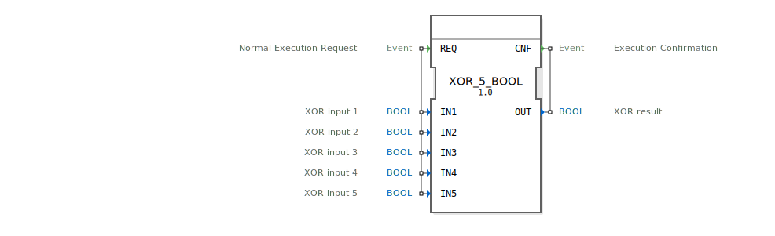

# XOR_5_BOOL

```{index} single: XOR_5_BOOL
```


* * * * * * * * * *
## Einleitung
Der Funktionsblock `XOR_5_BOOL` ist ein Standardbaustein zur Berechnung der logischen Exklusiv-ODER-Verknüpfung (XOR) für fünf boolesche Eingangswerte. Er folgt dem IEC 61131-3 Standard und ist als generischer Baustein implementiert. Die Operation wird bei jedem eingehenden Ausführungsereignis durchgeführt und das Ergebnis über ein Bestätigungsereignis ausgegeben.



## Schnittstellenstruktur
### **Ereignis-Eingänge**
*   **REQ (Normal Execution Request):** Löst die Berechnung der XOR-Verknüpfung aus. Das Ereignis ist mit allen fünf Dateneingängen (`IN1` bis `IN5`) verknüpft.

### **Ereignis-Ausgänge**
*   **CNF (Execution Confirmation):** Signalisiert den Abschluss der Berechnung. Dieses Ereignis ist mit dem Datenausgang `OUT` verknüpft und liefert das Ergebnis.

### **Daten-Eingänge**
*   **IN1 (XOR input 1):** Erster boolescher Operand (BOOL).
*   **IN2 (XOR input 2):** Zweiter boolescher Operand (BOOL).
*   **IN3 (XOR input 3):** Dritter boolescher Operand (BOOL).
*   **IN4 (XOR input 4):** Vierter boolescher Operand (BOOL).
*   **IN5 (XOR input 5):** Fünfter boolescher Operand (BOOL).

### **Daten-Ausgänge**
*   **OUT (XOR result):** Das boolesche Ergebnis der XOR-Verknüpfung aller fünf Eingänge (BOOL).

### **Adapter**
Dieser Funktionsblock verfügt über keine Adapter-Schnittstellen.

## Funktionsweise
Bei jedem Eintreffen des Ereignisses `REQ` führt der Baustein die logische XOR-Operation auf seinen fünf booleschen Eingängen `IN1` bis `IN5` durch. Das Ergebnis wird an den Ausgang `OUT` gelegt und gleichzeitig wird das Bestätigungsereignis `CNF` ausgelöst.

Die logische Funktion ist definiert als: `OUT = IN1 XOR IN2 XOR IN3 XOR IN4 XOR IN5`.
Das Ergebnis ist genau dann `TRUE` (1), wenn eine ungerade Anzahl der Eingänge den Wert `TRUE` (1) aufweist. Bei einer geraden Anzahl von `TRUE`-Eingängen ist das Ergebnis `FALSE` (0).

## Technische Besonderheiten
*   **Generischer Baustein:** Der Block ist durch das Attribut `eclipse4diac::core::GenericClassName` als generische Implementierung (`'GEN_XOR'`) gekennzeichnet. Dies ermöglicht eine flexible Wiederverwendung der Kernlogik.
*   **Ereignisgesteuert:** Die Berechnung erfolgt ausschließlich ereignisgesteuert durch `REQ` und nicht zyklisch.
*   **Fünf Eingänge:** Im Gegensatz zu Standard-XOR-Bausteinen mit typischerweise zwei Eingängen bietet dieser Block fünf fest verdrahtete Eingänge, was die Verkettung mehrerer Blöcke für eine höhere Anzahl von Operanden erspart.

## Zustandsübersicht
Der Baustein besitzt keinen internen Zustand (speicherfrei). Seine Ausgabe hängt ausschließlich von den aktuellen Werten der Eingänge zum Zeitpunkt des `REQ`-Ereignisses ab.

## Anwendungsszenarien
*   **Paritätsprüfung:** Überprüfung, ob eine ungerade Anzahl von Bedingungen (z.B. Fehlersignalen, Grenzwertüberschreitungen) in einer Gruppe von fünf Signalen aktiv ist.
*   **Steuerungslogik:** Implementierung von speziellen Verknüpfungslogiken in SPS-Programmen, bei denen genau eine oder drei oder fünf von fünf möglichen Einzelbedingungen erfüllt sein müssen.
*   **Signalvergleich:** Feststellen von Ungleichheit in einer Gruppe von fünf binären Signalen.

## ⚖️ Vergleich mit ähnlichen Bausteinen
*   **Standard XOR (2 Eingänge):** Bibliotheksbausteine bieten oft nur die XOR-Verknüpfung für zwei Operanden. Für fünf Operanden müssten mehrere dieser Blöcke verkettet werden (z.B. `((IN1 XOR IN2) XOR (IN3 XOR IN4)) XOR IN5`). `XOR_5_BOOL` fasst diese Logik in einem einzigen, übersichtlichen Block zusammen. Siehe: [XOR_5](../../../StandardLibraries/iec61131-3/bitwiseOperators/XOR_5.md)
*   **ODER / UND Bausteine:** Während ODER (`OR`) `TRUE` bei mindestens einem `TRUE`-Eingang liefert und UND (`AND`) nur bei allen `TRUE`-Eingängen, reagiert XOR spezifisch auf eine ungerade Anzahl von `TRUE`-Werten.
*   **Generische XOR-Blöcke:** Es könnten generische Blöcke existieren, die eine variable Anzahl von Eingängen über Arrays oder wiederholte Eingänge handhaben. `XOR_5_BOOL` ist eine fest konfigurierte, spezifische Instanz für genau fünf Eingänge.

## Fazit
Der `XOR_5_BOOL` Funktionsblock ist ein spezialisierter und effizienter Baustein zur Berechnung der Exklusiv-ODER-Verknüpfung über genau fünf boolesche Signale. Seine ereignisgesteuerte, zustandslose Arbeitsweise und die klare Schnittstelle machen ihn zu einem zuverlässigen Werkzeug für Steuerungsanwendungen, die diese spezielle Logikfunktion benötigen, insbesondere im Bereich der Paritätskontrolle und komplexen Bedingungsverknüpfung.