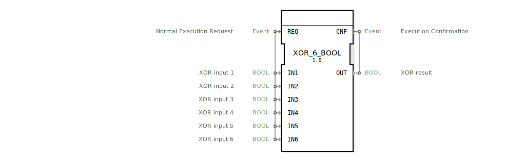

# XOR_6_BOOL

```{index} single: XOR_6_BOOL
```


* * * * * * * * * *
## Einleitung
Der Funktionsblock `XOR_6_BOOL` ist ein generischer Baustein zur Berechnung der logischen Exklusiv-ODER-Verknüpfung (XOR) für bis zu sechs boolesche Eingangswerte. Er folgt dem IEC 61131-3 Standard und ist für den Einsatz in Steuerungs- und Automatisierungsanwendungen konzipiert. Der Baustein wartet auf ein Auslöseereignis, berechnet das Ergebnis der XOR-Operation über alle aktiven Eingänge und gibt dieses zusammen mit einem Bestätigungsereignis aus.



## Schnittstellenstruktur
Der FB besitzt einen ereignisgesteuerten Ein-/Ausgangsmechanismus mit sechs booleschen Dateneingängen und einem booleschen Datenausgang.

### **Ereignis-Eingänge**
*   **REQ** (Normal Execution Request): Dieses Ereignis löst die Berechnung aus. Beim Eintreffen von `REQ` werden die Werte an den Eingängen `IN1` bis `IN6` gelesen und die XOR-Operation durchgeführt.

### **Ereignis-Ausgänge**
*   **CNF** (Execution Confirmation): Dieses Ereignis wird nach Abschluss der Berechnung ausgelöst und signalisiert, dass das Ergebnis am Ausgang `OUT` bereitsteht.

### **Daten-Eingänge**
*   **IN1** (BOOL): XOR-Eingang 1.
*   **IN2** (BOOL): XOR-Eingang 2.
*   **IN3** (BOOL): XOR-Eingang 3.
*   **IN4** (BOOL): XOR-Eingang 4.
*   **IN5** (BOOL): XOR-Eingang 5.
*   **IN6** (BOOL): XOR-Eingang 6.

### **Daten-Ausgänge**
*   **OUT** (BOOL): Das Ergebnis der XOR-Verknüpfung aller sechs Eingänge.

### **Adapter**
Dieser Funktionsblock verfügt über keine Adapterschnittstellen.

## Funktionsweise
Bei Auslösung durch das `REQ`-Ereignis berechnet der Baustein den logischen XOR-Wert über alle sechs Eingänge `IN1` bis `IN6`. Die XOR-Operation ergibt genau dann `TRUE` (1), wenn eine ungerade Anzahl der Eingänge den Wert `TRUE` hat. Sind null, zwei, vier oder sechs Eingänge `TRUE`, ist das Ergebnis `FALSE` (0). Formal entspricht dies der Berechnung: `OUT = IN1 XOR IN2 XOR IN3 XOR IN4 XOR IN5 XOR IN6`. Nach der Berechnung wird das Ergebnis am Datenausgang `OUT` ausgegeben und gleichzeitig das Bestätigungsereignis `CNF` aktiviert.

## Technische Besonderheiten
*   **Generischer Baustein:** Der FB ist als generischer Baustein gekennzeichnet (`GEN_XOR`). Dies ermöglicht es, ihn in verschiedenen Kontexten wiederzuverwenden oder als Basis für spezialisierte Versionen zu nutzen.
*   **Feste Eingangsanzahl:** Im Gegensatz zu Bausteinen mit variabler Eingangsanzahl besitzt `XOR_6_BOOL` genau sechs fest definierte Eingänge. Nicht benötigte Eingänge sollten auf einen definierten Logikpegel (z.B. `FALSE`) gesetzt werden.
*   **Package-Zuordnung:** Der Baustein ist dem Package `iec61131::bitwiseOperators` zugeordnet, was seine Einordnung als bitweise/logische Operation unterstreicht.

## Zustandsübersicht
Der Funktionsblock ist zustandslos (kombinatorisch). Er besitzt keinen internen Speicher. Die Ausgabe `OUT` ist eine reine Funktion der aktuellen Eingangswerte zum Zeitpunkt des `REQ`-Ereignisses. Es gibt keine Abhängigkeit von vorherigen Berechnungen oder Zuständen.

## Anwendungsszenarien
*   **Paritätsprüfung:** Erkennung, ob eine ungerade Anzahl von Bedingungen in einer Gruppe von sechs Signalen aktiv ist.
*   **Sicherheitskritische Logik:** In Schaltungen, wo ein Zustand nur dann aktiv sein darf, wenn exklusive Bedingungen vorliegen (z.B. Auswahl zwischen verschiedenen, sich gegenseitig ausschließenden Betriebsmodi).
*   **Verknüpfung von Statusbits:** Kombination mehrerer Status- oder Fehlerflags zu einem zusammenfassenden "Ungerade-Paritäts"-Signal.

## ⚖️ Vergleich mit ähnlichen Bausteinen
*   **`XOR` (2 Eingänge):** Der Standard-XOR-Baustein mit nur zwei Eingängen. `XOR_6_BOOL` erweitert diese Funktionalität auf sechs Eingänge ohne die Notwendigkeit, mehrere 2-Eingangs-XOR-Blöcke zu verschalten. Siehe: [XOR_6](../../../StandardLibraries/iec61131-3/bitwiseOperators/XOR_6.md)
*   **`AND_6_BOOL` / `OR_6_BOOL`:** Ähnliche Blöcke für die logischen UND- bzw. ODER-Verknüpfungen mit sechs Eingängen. Während diese Blöcke auf "Alle" bzw. "Mindestens eines" testen, testet `XOR_6_BOOL` auf "Ungerade Anzahl".
*   **Bausteine mit variabler Eingangsanzahl:** Einige Implementierungen bieten möglicherweise einen `XOR`-Block an, dem eine beliebige Anzahl von Eingängen zugewiesen werden kann. `XOR_6_BOOL` bietet hingegen eine explizite und feste Schnittstelle.

## Fazit
Der `XOR_6_BOOL` ist ein spezialisierter und einfach anzuwendender Funktionsblock für die exklusive ODER-Verknüpfung von bis zu sechs booleschen Signalen. Seine fest definierte Schnittstelle und die ereignisgesteuerte Abarbeitung machen ihn gut integrierbar in 4diac IDE-basierte Applikationen. Er ist besonders nützlich in Szenarien, die eine Paritätsprüfung oder die Auswertung exklusiver Bedingungen über eine kleine, feste Anzahl von Signalen erfordern. Für Anwendungen mit einer variablen oder deutlich höheren Anzahl an Eingängen sollten alternative Lösungen in Betracht gezogen werden.