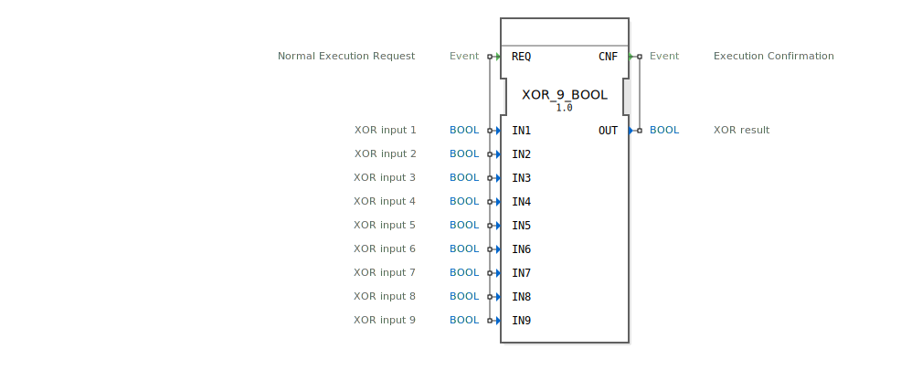

# XOR_9_BOOL

* * * * * * * * * *
## Einleitung
Der Funktionsblock `XOR_9_BOOL` ist ein generischer Baustein zur Berechnung der logischen Exklusiv-ODER-Verknüpfung (XOR) für bis zu neun boolesche Eingangssignale. Er realisiert eine n-stellige XOR-Funktion, bei der der Ausgang genau dann `TRUE` ist, wenn eine ungerade Anzahl der aktiven Eingänge `TRUE` ist. Der Baustein folgt dem Standard IEC 61131-3 und ist für den Einsatz in Steuerungsanwendungen konzipiert, die eine Prüfung auf ungerade Parität oder eine spezielle Auswahl- bzw. Überwachungslogik erfordern.

## Schnittstellenstruktur
Der Funktionsblock verfügt über ein einfaches ereignisgesteuertes Interface mit einem Anforderungs- und einem Bestätigungsereignis.

### **Ereignis-Eingänge**
*   **REQ (Normal Execution Request):** Dieses Ereignis löst die Berechnung der XOR-Funktion aus. Es ist mit allen neun Dateneingängen (`IN1` bis `IN9`) verknüpft.

### **Ereignis-Ausgänge**
*   **CNF (Execution Confirmation):** Dieses Ereignis signalisiert den Abschluss der Berechnung. Es wird zusammen mit dem berechneten Ergebnis am Datenausgang `OUT` ausgegeben.

### **Daten-Eingänge**
*   **IN1 (XOR input 1):** Boolescher Eingang 1.
*   **IN2 (XOR input 2):** Boolescher Eingang 2.
*   **IN3 (XOR input 3):** Boolescher Eingang 3.
*   **IN4 (XOR input 4):** Boolescher Eingang 4.
*   **IN5 (XOR input 5):** Boolescher Eingang 5.
*   **IN6 (XOR input 6):** Boolescher Eingang 6.
*   **IN7 (XOR input 7):** Boolescher Eingang 7.
*   **IN8 (XOR input 8):** Boolescher Eingang 8.
*   **IN9 (XOR input 9):** Boolescher Eingang 9.

### **Daten-Ausgänge**
*   **OUT (XOR result):** Boolesches Ergebnis der n-stelligen XOR-Verknüpfung aller aktiven Eingänge.

### **Adapter**
Dieser Funktionsblock verwendet keine Adapter.

## Funktionsweise
Bei Eintreffen des Ereignisses `REQ` wird die logische Operation ausgeführt. Der Ausgang `OUT` wird auf `TRUE` gesetzt, wenn die Anzahl der Eingänge mit dem Wert `TRUE` ungerade ist. Ist die Anzahl der `TRUE`-Eingänge gerade (oder null), wird `OUT` auf `FALSE` gesetzt. Unmittelbar nach der Berechnung wird das Bestätigungsereignis `CNF` zusammen mit dem aktuellen Wert von `OUT` ausgegeben.

Die mathematische Beschreibung lautet: `OUT = IN1 XOR IN2 XOR IN3 XOR IN4 XOR IN5 XOR IN6 XOR IN7 XOR IN8 XOR IN9`.

## Technische Besonderheiten
*   **Generischer Baustein:** Der FB ist als generische Funktion (`GEN_XOR`) gekennzeichnet, was bedeutet, dass er als Basis für die Ableitung spezifischer XOR-Bausteine mit einer festen Anzahl von Eingängen dienen kann.
*   **Fest verdrahtete Logik:** Die Verknüpfung erfolgt über alle neun Eingänge. Für Anwendungen mit weniger benötigten Eingängen müssen die nicht genutzten Eingänge auf einen definierten Wert (typischerweise `FALSE`) gesetzt werden.
*   **Ereignisgesteuerte Ausführung:** Die Berechnung erfolgt nur bei Auftreten des `REQ`-Ereignisses, was eine ressourcenschonende und deterministische Abarbeitung ermöglicht.

## Zustandsübersicht
Der Funktionsblock besitzt keinen internen Zustand im Sinne eines Speichers. Sein Verhalten ist rein kombinatorisch und ausschließlich von den aktuellen Werten an den Dateneingängen zum Zeitpunkt des `REQ`-Ereignisses abhängig. Der Zustand "Berechnung läuft" ist transient und endet sofort mit der Ausgabe von `CNF`.

## Anwendungsszenarien
*   **Paritätsprüfung:** Überwachung, ob eine ungerade Anzahl von Sensoren (z.B. Grenzwertüberwachungen, Sicherheitsschaltern) einen Alarmzustand meldet.
*   **Auswahl- oder Wechsellogik:** Steuerung, bei der eine Aktion genau dann ausgeführt werden soll, wenn sich der Zustand einer ungeraden Anzahl von Bedingungen geändert hat.
*   **Fehlererkennung in redundanten Systemen:** Einfache Plausibilitätskontrolle bei Systemen mit mehreren redundanten Kanälen.
*   **Verschlüsselungs- und Codierungsverfahren:** Als grundlegende Komponente in einfachen kryptografischen oder fehlerkorrigierenden Codes.

## ⚖️ Vergleich mit ähnlichen Bausteinen
*   **Standard XOR-Bausteine (z.B., XOR, E_XOR):** Diese haben typischerweise nur zwei Eingänge. `XOR_9_BOOL` erweitert diese Funktion auf bis zu neun Eingänge in einem einzigen Baustein.
*   **ODER-Bausteine (OR) / UND-Bausteine (AND):** Liefern ein `TRUE`, wenn mindestens ein bzw. alle Eingänge `TRUE` sind. Die XOR-Logik ist spezifischer (ungerade Anzahl).
*   **Paritätsbausteine:** Spezialisierte Blöcke zur Paritätsberechnung, die oft direkt für Datenworte (BYTE, WORD) arbeiten. `XOR_9_BOOL` arbeitet auf einzelnen Booleschen Bits und ist flexibler in der Eingangsanzahl.
*   **Kombinatorische Logikbausteine (GEN_AND, GEN_OR):** Ähnliche generische Bausteine für andere logische Grundverknüpfungen.

## Fazit
Der `XOR_9_BOOL` ist ein spezialisierter, generischer Funktionsblock, der die logische XOR-Verknüpfung für bis zu neun Signale in einer einzigen, ereignisgesteuerten Komponente bereitstellt. Seine Stärke liegt in der klaren Schnittstelle und der direkten Implementierung der n-stelligen XOR-Funktion, was ihn ideal für Paritätsprüfungen und spezielle Steuerungslogiken macht. Für Anwendungen mit variabler oder sehr großer Eingangsanzahl muss die Logik möglicherweise aus mehreren Basiskomponenten aufgebaut werden.