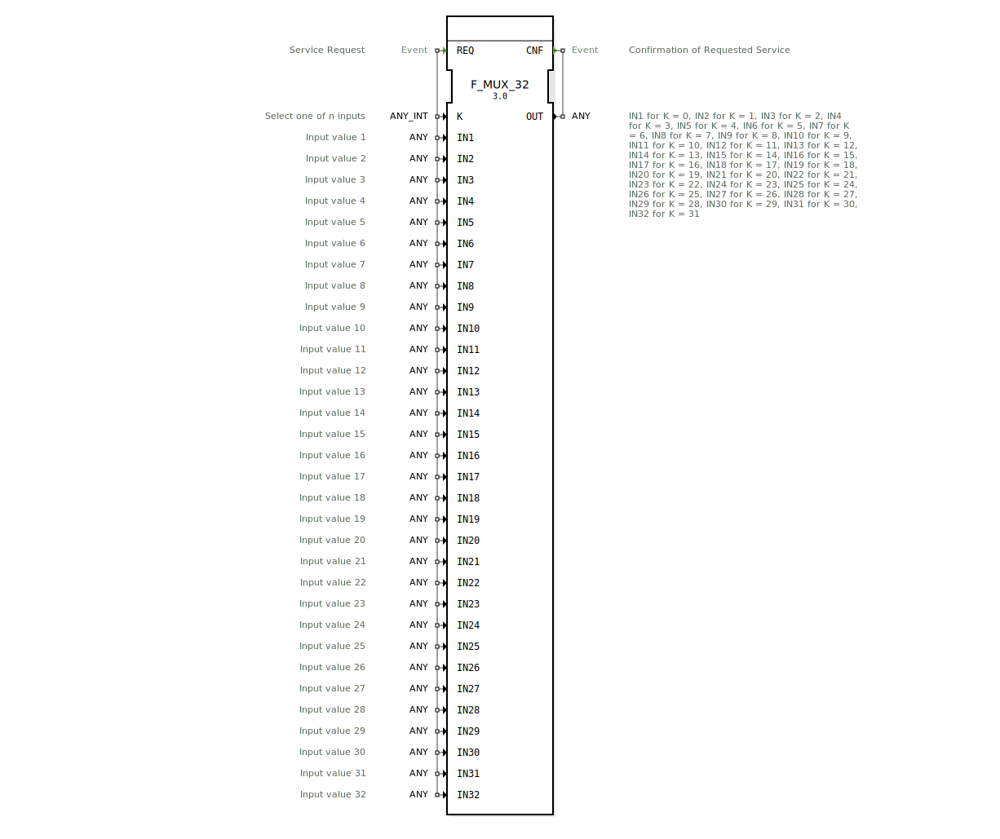

# F_MUX_32

* * * * * * * * * *
## Einleitung

Der Funktionsblock **F_MUX_32** ist ein generischer Multiplexer (Auswahlfunktion) gemäß IEC 61131-3. Er ermöglicht die Auswahl eines von 32 Eingangswerten (IN1 … IN32) und gibt diesen am Ausgang OUT weiter. Die Auswahl erfolgt über den ganzzahligen Selektor K. Der Baustein ist ereignisgesteuert: Bei einem Ereignis am Eingang REQ wird der aktuelle Wert von K ausgewertet und der entsprechende Eingangswert übernommen.

## Schnittstellenstruktur

### **Ereignis-Eingänge**

| Name | Typ   | Kommentar                                                  |
|------|-------|------------------------------------------------------------|
| REQ  | Event | Service Request – löst die Auswahl aus                    |

### **Ereignis-Ausgänge**

| Name | Typ   | Kommentar                                                 |
|------|-------|-----------------------------------------------------------|
| CNF  | Event | Confirmation – bestätigt die Durchführung der Auswahl    |

### **Daten-Eingänge**

| Name | Typ        | Kommentar                                            |
|------|------------|------------------------------------------------------|
| K    | ANY_INT    | Selektionswert (0 … 31), wählt einen der 32 Eingänge |
| IN1  | ANY        | Eingangswert 1                                       |
| IN2  | ANY        | Eingangswert 2                                       |
| …    | …          | …                                                    |
| IN32 | ANY        | Eingangswert 32                                      |

### **Daten-Ausgänge**

| Name | Typ | Kommentar                                                |
|------|-----|----------------------------------------------------------|
| OUT  | ANY | Ausgangswert: IN1 , wenn K=0; IN2, wenn K=1; …; IN32, wenn K=31 |

### **Adapter**

Keine Adapter vorhanden.

## Funktionsweise

Der FB `F_MUX_32` arbeitet ereignisgesteuert:
1. Ein Ereignis am Eingang **REQ** triggert die Verarbeitung.
2. Der Selektor **K** (ganzzahliger Wert) wird ausgewertet.
3. Abhängig vom Wert von K wird der entsprechende Daten-Eingang ausgewählt:
   - K = 0 → **IN1**
   - K = 1 → **IN2**
   - …
   - K = 31 → **IN32**
4. Der ausgewählte Wert wird an den Ausgang **OUT** übergeben.
5. Ein Ereignis am Ausgang **CNF** signalisiert den Abschluss der Operation.

Werte außerhalb des gültigen Bereichs (0 … 31) führen zu undefiniertem Verhalten; der Baustein bietet keine Bereichsprüfung.

## Technische Besonderheiten

- **Generischer Datentyp (ANY):** Alle Daten-Eingänge und der Ausgang sind mit `ANY` deklariert. Der Baustein kann daher mit verschiedenen Datentypen (BOOL, INT, REAL, etc.) verwendet werden. Alle beteiligten Eingänge und der Ausgang müssen jedoch denselben konkreten Typ besitzen.
- **Ereignis-Assoziation:** Das Ereignis **REQ** ist mit allen Daten-Eingängen (IN1 … IN32 und K) assoziiert. Bei einem REQ-Ereignis werden alle diese Eingänge gleichzeitig gelesen.
- **Mangelnde Bereichsprüfung:** Der Baustein prüft nicht, ob K im Bereich 0 … 31 liegt. Ein ungültiger Wert kann zu unerwarteten Ergebnissen führen (z. B. Auswahl eines nicht vorhandenen Kanals). Dies muss in der Anwendung sichergestellt werden.
- **Standardkonformität:** Der FB implementiert die `SELECT`-Funktionalität aus IEC 61131-3 und ist als „standard selection function“ klassifiziert.

## Zustandsübersicht

Der Baustein besitzt keine explizite Zustandsmaschine in der XML-Definition. Er verhält sich wie eine ereignisgesteuerte Funktion: Nach dem Ereignis **REQ** wird der Ausgang sofort aktualisiert und **CNF** ausgelöst. Es gibt keine internen Zustände.

## Anwendungsszenarien

- **Umschaltung zwischen mehreren Sensorwerten** in einer Steuerung (z. B. Temperatur-, Druck- oder Füllstandssensoren).
- **Parametrierbare Konfiguration:** Auswahl unterschiedlicher Betriebsmodi oder Sollwerte über einen Index.
- **Test- und Diagnosefunktionen**, bei denen verschiedene Signalquellen an einen Analysepunkt geschaltet werden.
- **Erweiterung von bestehenden Multiplexer-Lösungen** mit weniger Kanälen auf 32 Eingänge.

## Vergleich mit ähnlichen Bausteinen

- **F_MUX_2, F_MUX_3, … F_MUX_n:** Diese Bausteine besitzen eine geringere Anzahl an Eingängen (2, 3, …). `F_MUX_32` deckt den maximalen Bedarf für 32 Kanäle ab. Wird nur eine kleinere Anzahl benötigt, sind kleinere Varianten platzsparender und übersichtlicher.
- **CASE-Anweisung (ST):** Eine `CASE`-Struktur in Structured Text kann das gleiche Verhalten abbilden, ist aber nicht als wiederverwendbarer FB gekapselt. Der FB bietet ereignisgesteuerte Kapselung für grafische und textuelle Programmierung.
- **MUX-Funktion in IEC 61131-3:** Die integrierte `MUX`-Funktion ist typischerweise auf kleinere Anzahlen (z. B. 8) beschränkt. Der FB erweitert dies auf 32 Kanäle.

## Fazit

Der **F_MUX_32** ist ein leistungsfähiger und flexibler Multiplexer-Baustein für den Einsatz in der Automatisierungstechnik. Durch seine generische Typisierung und die große Anzahl von 32 Eingängen eignet er sich für vielfältige Auswahlaufgaben. Die einfache Ereignissteuerung und die saubere Trennung von Ereignis- und Datenpfaden machen ihn in IEC 61131-3 Umgebungen gut integrierbar. Anwender sollten jedoch auf die Sicherstellung des gültigen Selektionsbereichs achten, um Fehler zu vermeiden.