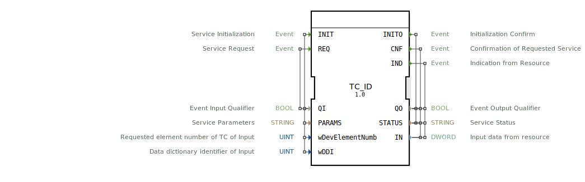

# TC_ID

```{index} single: TC_ID
```


* * * * * * * * * *

## Einleitung
Der TC_ID Funktionsblock ist ein Eingabe-Service-Interface-Baustein für Doppelwort-Eingabedaten (Double Word Input). Er dient als Schnittstelle zur Kommunikation mit TC-Eingabegeräten (Tractor Control) und ermöglicht den Zugriff auf spezifische Eingabedaten über definierte Datenwörter.



## Schnittstellenstruktur

### **Ereignis-Eingänge**
- **INIT**: Service-Initialisierung
  - Verknüpft mit: QI, PARAMS, wDevElementNumb, wDDI
- **REQ**: Service-Anfrage
  - Verknüpft mit: QI

### **Ereignis-Ausgänge**
- **INITO**: Initialisierungsbestätigung
  - Verknüpft mit: QO, STATUS
- **CNF**: Bestätigung der angeforderten Service-Anfrage
  - Verknüpft mit: QO, STATUS, IN
- **IND**: Indikation von der Ressource
  - Verknüpft mit: QO, STATUS, IN

### **Daten-Eingänge**
- **QI** (BOOL): Ereignis-Eingangsqualifizierer
- **PARAMS** (STRING): Service-Parameter
- **wDevElementNumb** (UINT): Angeforderte Elementnummer des TC-Eingangs
- **wDDI** (UINT): Data Dictionary Identifier des Eingangs

### **Daten-Ausgänge**
- **QO** (BOOL): Ereignis-Ausgangsqualifizierer
- **STATUS** (STRING): Service-Status
- **IN** (DWORD): Eingabedaten von der Ressource

### **Adapter**
Keine Adapter-Schnittstellen vorhanden.

## Funktionsweise
Der TC_ID-Block ermöglicht den Zugriff auf TC-Eingabedaten über standardisierte Service-Schnittstellen. Bei der Initialisierung (INIT) werden die Geräteparameter konfiguriert. Service-Anfragen (REQ) lösen die Datenerfassung aus, wobei die Ergebnisse über CNF- oder IND-Ereignisse zurückgemeldet werden. Der Block unterstützt sowohl angeforderte als auch spontane Datenlieferungen von der angeschlossenen Ressource.

## Technische Besonderheiten
- Verarbeitet Doppelwort-Daten (DWORD, 32 Bit)
- Unterstützt Data Dictionary Identifiers (DDI) für standardisierte Datenzugriffe
- Bietet sowohl angeforderte (CNF) als auch spontane (IND) Datenlieferungen
- Enthält umfangreiche Statusrückmeldungen über STRING-Parameter

## Zustandsübersicht
Der Block durchläuft typische Service-Interface-Zustände:
1. **Nicht initialisiert**: Vor INIT-Ereignis
2. **Initialisiert**: Nach erfolgreicher INITO-Rückmeldung
3. **Bereit**: Für REQ-Anfragen
4. **Aktiv**: Während Datenabfrage und -verarbeitung

## Anwendungsszenarien
- Landwirtschaftliche Steuerungssysteme (ISOBUS-Umgebung)
- Traktorsteuerung und -überwachung
- Datenerfassung von TC-Eingabegeräten
- Automatisierte Agrarsysteme mit standardisierten Datenformaten

## ⚖️ Vergleich mit ähnlichen Bausteinen
Im Vergleich zu einfachen Eingabeblöcken bietet TC_ID:
- Standardisierte ISOBUS-Schnittstelle
- DDI-basierte Datenidentifikation
- Umfangreiches Status- und Fehlermanagement
- Sowohl angeforderte als auch spontane Datenübertragung


## 🛠️ Zugehörige Übungen

* [Uebung_060](../../../../../training1/Ventilsteuerung/4diacIDE-workspace/test_B/Uebungen_doc/Uebung_060.md)

## Fazit
Der TC_ID Funktionsblock stellt eine robuste und standardisierte Schnittstelle für TC-Eingabedaten in ISOBUS-Umgebungen bereit. Durch seine flexible Architektur mit sowohl angefragten als auch spontanen Datenübertragungsmechanismen eignet er sich ideal für komplexe Agraranwendungen, die zuverlässigen Zugriff auf spezifische Eingabedaten erfordern.