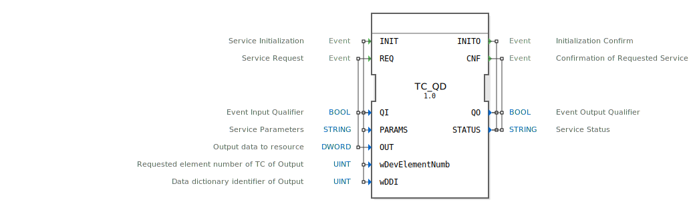

# TC_QD

```{index} single: TC_QD
```


* * * * * * * * * *

## Einleitung
Der TC_QD Funktionsblock ist ein Ausgabeservice-Interface-Funktionsblock für Double-Word-Ausgabedaten. Er dient als Schnittstelle zur Kommunikation mit externen Ressourcen und ermöglicht die Ausgabe von 32-Bit-Datenwerten über spezifizierte Geräteelemente.



## Schnittstellenstruktur

### **Ereignis-Eingänge**
- **INIT**: Service-Initialisierungsereignis
- **REQ**: Service-Anfrageereignis

### **Ereignis-Ausgänge**
- **INITO**: Initialisierungsbestätigung
- **CNF**: Bestätigung der angeforderten Service-Operation

### **Daten-Eingänge**
- **QI** (BOOL): Ereignis-Eingangsqualifizierer
- **PARAMS** (STRING): Service-Parameter
- **OUT** (DWORD): Ausgabedaten für die Ressource
- **wDevElementNumb** (UINT): Angeforderte Elementnummer des TC für die Ausgabe
- **wDDI** (UINT): Data-Dictionary-Identifier der Ausgabe

### **Daten-Ausgänge**
- **QO** (BOOL): Ereignis-Ausgangsqualifizierer
- **STATUS** (STRING): Service-Status

### **Adapter**
Keine Adapter-Schnittstellen vorhanden.

## Funktionsweise
Der TC_QD Funktionsblock initialisiert und verwaltet die Kommunikation mit externen Ausgabegeräten. Bei Aktivierung des INIT-Ereignisses wird der Service initialisiert, wobei die Parameter PARAMS, wDevElementNumb und wDDI konfiguriert werden. Das REQ-Ereignis löst die tatsächliche Datenausgabe aus, wobei der im OUT-Eingang bereitgestellte Double-Word-Wert an die spezifizierte Ressource gesendet wird.

## Technische Besonderheiten
- Verarbeitet 32-Bit-Datenwerte (DWORD)
- Unterstützt Data-Dictionary-Identifikatoren (DDI) für standardisierte Datenreferenzierung
- Bietet Geräteelementnummern-Spezifikation für präzise Gerätesteuerung
- Liefert detaillierte Statusinformationen über den STRING-Ausgang STATUS

## Zustandsübersicht
Der Funktionsblock verfügt über zwei Hauptbetriebszustände:
1. **Initialisierungszustand**: Wird durch INIT-Ereignis aktiviert und durch INITO bestätigt
2. **Service-Betriebszustand**: Wird durch REQ-Ereignis aktiviert und durch CNF abgeschlossen

## Anwendungsszenarien
- Steuerung von ISOBUS-kompatiblen Landmaschinen
- Ausgabe von Steuerbefehlen an industrielle Aktoren
- Kommunikation mit TC (Tractor-Controller) Ausgabegeräten
- Anwendungen in der Agrartechnik und mobilen Arbeitsmaschinen

## Vergleich mit ähnlichen Bausteinen
Im Vergleich zu einfacheren Ausgabeblöcken bietet TC_QD erweiterte Funktionalität durch:
- DDI-basierte Datenidentifikation
- Parametrierbare Geräteelementnummern
- ISOBUS-Spezifikation-Kompatibilität
- Umfangreiche Statusrückmeldungen


## Zugehörige Übungen

* [Uebung_060](../../../../../training1/Ventilsteuerung/4diacIDE-workspace/test_B/Uebungen_doc/Uebung_060.md)

## Fazit
Der TC_QD Funktionsblock stellt eine leistungsstarke und flexible Lösung für die Ausgabe von Double-Word-Daten in ISOBUS-Umgebungen dar. Seine strukturierte Schnittstelle und umfangreiche Parametrierungsmöglichkeiten machen ihn besonders geeignet für anspruchsvolle Steuerungsanwendungen in der mobilen Automation.