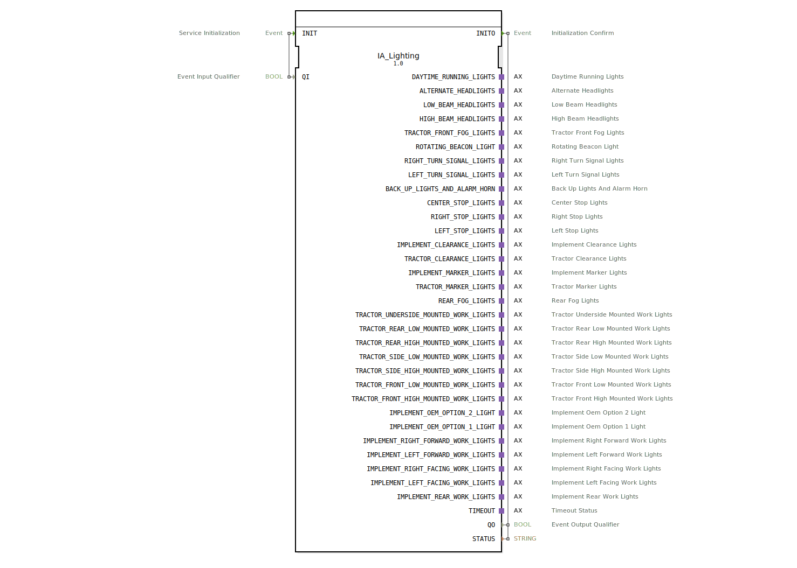

# IA_Lighting

* * * * * * * * * *
## Einleitung
Der Funktionsblock **IA_Lighting** dient als ISOBUS-Adapter für Beleuchtungsdaten (Lighting Data, LD) gemäß ISO 11783-7 (PGN 65088). Er kapselt einen internen `I_Lighting`-Kern und wandelt dessen 32-Bit-Integer-Ausgänge für jede Lichtfunktion in boolesche Einzelsignale um. Über eine Vielzahl von Adapter-Plugs werden die einzelnen Lichtfunktionen wie Tagfahrlicht, Abblendlicht, Blinker, Arbeitsleuchten usw. als getrennte logische Signale an die Applikation weitergegeben.

* * * * * * * * * *
## Schnittstellenstruktur
### **Ereignis-Eingänge**

| Ereignis | Typ | Beschreibung |
|----------|-----|-----------------------------|
| INIT | EInit | Initialisierung des Bausteins. Wird mit `QI` ausgelöst. |

### **Ereignis-Ausgänge**

| Ereignis | Typ | Beschreibung |
|----------|-----|-----------------------------|
| INITO | EInit | Bestätigung der erfolgreichen Initialisierung. Wird zusammen mit `QO` und `STATUS` ausgegeben. |

### **Daten-Eingänge**

| Name | Typ | Beschreibung |
|------|-----|-----------------------------|
| QI | BOOL | Qualifizierer für die Initialisierung (Freigabe). |

### **Daten-Ausgänge**

| Name | Typ | Beschreibung |
|------|-----|-----------------------------|
| QO | BOOL | Ausgangsqualifizierer – zeigt an, ob der Baustein betriebsbereit ist. |
| STATUS | STRING | Statusmeldung (z. B. Fehlertext oder Erfolgsmeldung). |

### **Adapter**
Der Baustein besitzt **32 unidirektionale Adapter-Plugs** (Typ `adapter::types::unidirectional::AX`). Jeder Adapter repräsentiert eine spezifische Lichtfunktion nach ISO 11783-7 und stellt einen Ereignisausgang (`E1`) sowie einen Datenausgang (`D1`) vom Typ `BOOL` bereit:

| Adapter-Name | Beschreibung |
|--------------|--------------|
| DAYTIME_RUNNING_LIGHTS | Tagfahrlicht |
| ALTERNATE_HEADLIGHTS | Alternatives Fernlicht (z. B. Fernlichtassistent) |
| LOW_BEAM_HEADLIGHTS | Abblendlicht |
| HIGH_BEAM_HEADLIGHTS | Fernlicht |
| TRACTOR_FRONT_FOG_LIGHTS | Zugfahrzeug-Frontnebelscheinwerfer |
| ROTATING_BEACON_LIGHT | Rundumkennleuchte |
| RIGHT_TURN_SIGNAL_LIGHTS | Rechter Blinker |
| LEFT_TURN_SIGNAL_LIGHTS | Linker Blinker |
| BACK_UP_LIGHTS_AND_ALARM_HORN | Rückfahrleuchte und Alarmhorn |
| CENTER_STOP_LIGHTS | Mittleres Bremslicht |
| RIGHT_STOP_LIGHTS | Rechtes Bremslicht |
| LEFT_STOP_LIGHTS | Linkes Bremslicht |
| IMPLEMENT_CLEARANCE_LIGHTS | Anbaugerät-Begrenzungsleuchten |
| TRACTOR_CLEARANCE_LIGHTS | Zugfahrzeug-Begrenzungsleuchten |
| IMPLEMENT_MARKER_LIGHTS | Anbaugerät-Markierungsleuchten |
| TRACTOR_MARKER_LIGHTS | Zugfahrzeug-Markierungsleuchten |
| REAR_FOG_LIGHTS | Rücknebel-Schlussleuchten |
| TRACTOR_UNDERSIDE_MOUNTED_WORK_LIGHTS | Zugfahrzeug-Arbeitsscheinwerfer (unten montiert) |
| TRACTOR_REAR_LOW_MOUNTED_WORK_LIGHTS | Zugfahrzeug-Arbeitsscheinwerfer (hinten, niedrig) |
| TRACTOR_REAR_HIGH_MOUNTED_WORK_LIGHTS | Zugfahrzeug-Arbeitsscheinwerfer (hinten, hoch) |
| TRACTOR_SIDE_LOW_MOUNTED_WORK_LIGHTS | Zugfahrzeug-Arbeitsscheinwerfer (seitlich, niedrig) |
| TRACTOR_SIDE_HIGH_MOUNTED_WORK_LIGHTS | Zugfahrzeug-Arbeitsscheinwerfer (seitlich, hoch) |
| TRACTOR_FRONT_LOW_MOUNTED_WORK_LIGHTS | Zugfahrzeug-Arbeitsscheinwerfer (vorn, niedrig) |
| TRACTOR_FRONT_HIGH_MOUNTED_WORK_LIGHTS | Zugfahrzeug-Arbeitsscheinwerfer (vorn, hoch) |
| IMPLEMENT_OEM_OPTION_2_LIGHT | Anbaugerät-OEM-Option 2 Licht |
| IMPLEMENT_OEM_OPTION_1_LIGHT | Anbaugerät-OEM-Option 1 Licht |
| IMPLEMENT_RIGHT_FORWARD_WORK_LIGHTS | Anbaugerät-Arbeitsscheinwerfer (rechts vorne) |
| IMPLEMENT_LEFT_FORWARD_WORK_LIGHTS | Anbaugerät-Arbeitsscheinwerfer (links vorne) |
| IMPLEMENT_RIGHT_FACING_WORK_LIGHTS | Anbaugerät-Arbeitsscheinwerfer (rechts seitlich) |
| IMPLEMENT_LEFT_FACING_WORK_LIGHTS | Anbaugerät-Arbeitsscheinwerfer (links seitlich) |
| IMPLEMENT_REAR_WORK_LIGHTS | Anbaugerät-Arbeitsscheinwerfer (hinten) |
| TIMEOUT | Timeout-Status des internen Kerns (Bool-Signal). |

* * * * * * * * * *
## Funktionsweise
Der Baustein wird über den Ereigniseingang `INIT` mit dem Datenwert `QI` initialisiert. Bei erfolgreicher Initialisierung wird das Ereignis `INITO` ausgegeben und die Daten `QO = TRUE` sowie `STATUS` mit einer Erfolgsmeldung gesetzt.

Intern enthält der Baustein einen Kern vom Typ `isobus::tecu::I_Lighting`, welcher die ISOBUS-Kommunikation für das Beleuchtungs-PGN (Parameter Group Number 65088) abwickelt. Der Kern stellt die 32 Lichtfunktionen als 32‑Bit‑Integer-Werte bereit. Diese Integer-Werte werden überinstanzen des Bausteins `logiBUS::utils::quarter::QUARTER_TO_BOOL` in einzelne Boolesche Signale aufgeteilt. Jede `QUARTER_TO_BOOL`-Instanz extrahiert vermutlich jeweils 4 Bits aus dem Eingangswert und gibt die entsprechenden vier Bool-Ausgänge weiter – der genaue Aufbau ist jedoch applikationsspezifisch.

Die so gewonnenen Bool-Signale werden über die Adapter-Plugs zeitgleich mit einem Ereignis (`E1`) auf den zugehörigen Datenausgängen (`D1`) angeboten. Somit liefert der Baustein bei Aktualisierung der ISOBUS-Daten einen synchronen Ereignisstrom für jede einzelne Lichtfunktion.

* * * * * * * * * *
## Technische Besonderheiten
- **ISOBUS‑Konformität**: Der Baustein setzt das standardisierte PGN 65088 (Lighting Data) nach ISO 11783-7 um und kann direkt mit einem ISOBUS‑Bus gekoppelt werden.
- **Bit‑Aufteilung**: Die internen 32‑Bit‑Werte aus dem ISOBUS-Telegramm werden mit Hilfe von `QUARTER_TO_BOOL`-Bausteinen in einzelne Bool‑Signale zerlegt. Der Begriff „Quarter“ deutet auf eine Aufteilung in Gruppen von je 4 Bits hin.
- **Unidirektionale Adapter**: Jeder Adapter-Plug ist unidirektional (nur Ausgang) und liefert sowohl ein Ereignis (`E1`) als auch einen Bool‑Wert (`D1`). Dies ermöglicht eine einfache Weiterverarbeitung in IEC 61499‑Anwendungen, z. B. zum Ansteuern von Aktoren.
- **Status‑Ausgabe**: Neben dem eigentlichen Lichtstatus gibt es einen speziellen Adapter `TIMEOUT`, der den Timeout‑Status des ISOBUS‑Kerns signalisiert.

* * * * * * * * * *
## Zustandsübersicht
Der Baustein selbst besitzt keine explizite Zustandsmaschine, da er im Wesentlichen ein Datenkonverter ist. Sein Verhalten wird durch den internen Kern `I_Lighting` gesteuert:

- **Initialisierung**: Nach einem `INIT`-Ereignis wechselt der Kern in den Betriebszustand (sofern `QI = TRUE`). Der Abschluss wird mit `INITO` quittiert.
- **Datenbereitstellung**: Solange der Kern aktiv ist, aktualisiert er bei jedem eingehenden ISOBUS-Telegramm die Ausgangsdaten und erzeugt für jede Lichtfunktion ein Ereignis auf dem zugehörigen Adapter.
- **Timeout**: Bei Ausbleiben von ISOBUS‑Nachrichten wird der Timeout-Adapter gesetzt.

* * * * * * * * * *
## Anwendungsszenarien
- **Landwirtschaftliche Steuerungen**: Einbindung der gesamten Fahrzeugbeleuchtung (Traktor und Anbaugerät) in eine IEC 61499‑basierte Steuerung, z. B. für automatische Lichtsteuerung nach ISO 11783.
- **ISOBUS‑Gateway‑Module**: Der Baustein eignet sich als Zwischenschicht, um ISOBUS‑Beleuchtungsdaten in ein einfacheres binäres Signalformat zu wandeln und damit an speicherprogrammierbare Steuerungen oder Visualisierungssysteme weiterzugeben.
- **Nachrüstung**: Alte Traktoren ohne CAN‑Bus können durch diesen Adapter mit moderner ISOBUS‑Lichtsteuerung ausgestattet werden.

* * * * * * * * * *
## Vergleich mit ähnlichen Bausteinen
Es existieren weitere ISOBUS‑Adapter‑Wrapper für andere PGNs (z. B. für Arbeitshydraulik, Sitzsteuerung oder Zapfwellensteuerung). Diese Bausteine folgen dem gleichen Prinzip: Ein interner spezialisierter Kern wird über einen Adapter mit dem Applikationscode verbunden. Der wesentliche Unterschied liegt in der Anzahl und Art der Ausgangssignale – `IA_Lighting` bietet mit 32 Adaptern eine besonders hohe Anzahl von Lichtfunktionen an. Andere Adapter (z. B. `IA_ImplementSteer`) haben weniger Ausgänge, da sie nur wenige Zustände melden.

* * * * * * * * * *
## Fazit
Der Funktionsblock `IA_Lighting` ermöglicht eine komfortable und standardisierte Integration von ISOBUS‑Beleuchtungsdaten in IEC 61499‑Applikationen. Durch die Aufteilung der Telegramminhalte in einzelne Bool‑Signale über Adapter wird eine einfache Weiterverarbeitung in der Anwendungslogik erreicht. Der Baustein ist besonders für landwirtschaftliche Steuerungssysteme geeignet, die eine vollständige Abbildung aller gängigen Lichtfunktionen nach ISO 11783-7 benötigen.