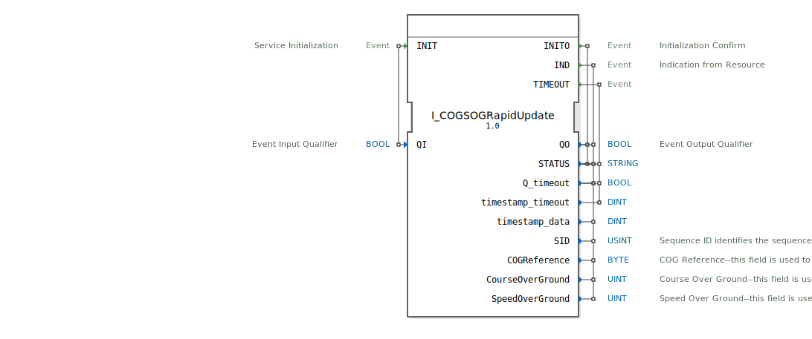

# I_COGSOGRapidUpdate

```{index} single: I_COGSOGRapidUpdate
```


* * * * * * * * * *
## Einleitung
Der Funktionsblock `I_COGSOGRapidUpdate` implementiert die Verarbeitung des NMEA 2000 Parameter Group Number (PGN) 129026 "COG & SOG, Rapid Update". Dieser Baustein dient dem Empfang und der Bereitstellung von Navigationsdaten, speziell des momentanen Kurses über Grund (Course Over Ground, COG) und der Geschwindigkeit über Grund (Speed Over Ground, SOG) mit hoher Aktualisierungsrate. Er ist für den Einsatz in maritimen oder mobilen Arbeitsmaschinen-Steuerungssystemen konzipiert, die auf dem ISOBUS-Standard basieren.



## Schnittstellenstruktur

### **Ereignis-Eingänge**
*   **INIT**: Initialisiert den Funktionsblock. Wird zusammen mit dem Qualifier `QI` ausgelöst.

### **Ereignis-Ausgänge**
*   **INITO**: Bestätigt die erfolgreiche Initialisierung. Löst die Ausgänge `QO` und `STATUS` aus.
*   **IND**: Zeigt den erfolgreichen Empfang und die Verarbeitung neuer COG/SOG-Daten an. Löst die zugehörigen Datenausgänge aus.
*   **TIMEOUT**: Wird ausgelöst, wenn ein Timeout beim Empfang der Daten auftritt.

### **Daten-Eingänge**
*   **QI** (BOOL): Qualifier für den INIT-Ereigniseingang. Steuert die Initialisierung (`TRUE` = starten).

### **Daten-Ausgänge**
*   **QO** (BOOL): Qualifier für die Ereignisausgänge INITO und IND. Zeigt den allgemeinen Betriebszustand an.
*   **STATUS** (STRING): Statusmeldung, die zusätzliche Informationen (z.B. Fehlerbeschreibungen) liefert.
*   **Q_timeout** (BOOL): Gibt an, ob das letzte empfangene Ereignis ein Timeout war (`TRUE`) oder gültige Daten (`FALSE`).
*   **timestamp_timeout** (DINT): Zeitstempel, der dem TIMEOUT-Ereignis zugeordnet ist.
*   **timestamp_data** (DINT): Zeitstempel der zuletzt empfangenen gültigen COG/SOG-Daten.
*   **SID** (USINT): Sequence Identifier. Ermöglicht die Synchronisation dieser Daten mit anderen, im selben Zyklus gesendeten PGNs des Fahrzeugs.
*   **COGReference** (BYTE): Referenzrichtung für den Kurs über Grund. Der Wert `0` steht für die Referenz "Wahre Nordrichtung" (True North).
*   **CourseOverGround** (UINT): Kurs über Grund (COG). Die Einheit ist 1x10<sup>-4</sup> Radiant.
*   **SpeedOverGround** (UINT): Geschwindigkeit über Grund (SOG). Die Einheit ist 1x10<sup>-2</sup> Meter pro Sekunde.

### **Adapter**
Dieser Funktionsblock verfügt über keine Adapterschnittstellen.

## Funktionsweise
Der Baustein agiert als passiver Empfänger für das NMEA 2000 PGN 129026. Nach der Initialisierung via `INIT` mit `QI=TRUE` wartet er auf eingehende Datenframes. Bei Empfang eines gültigen Frames werden die enthaltenen Daten (COG, SOG, Referenz, SID) dekodiert und über den `IND`-Ausgang samt den zugehörigen Datenwerten bereitgestellt. Gleichzeitig wird `Q_timeout` auf `FALSE` gesetzt. Tritt innerhalb eines konfigurierten Zeitfensters kein neuer Datenframe auf, wird ein `TIMEOUT`-Ereignis generiert und `Q_timeout` auf `TRUE` gesetzt. Der `STATUS`-Ausgang kann für Diagnosezwecke genutzt werden.

## Technische Besonderheiten
*   **NMEA 2000 Konformität**: Implementiert exakt die Spezifikation für PGN 129026.
*   **Auflösung**: Die physikalischen Werte für Kurs und Geschwindigkeit sind in den im NMEA-Standard definierten festen Auflösungen kodiert (COG: 0.0001 rad/LSB, SOG: 0.01 m/s/LSB). Eine Umrechnung in gebräuchlichere Einheiten (Grad, Knoten) muss gegebenenfalls in nachgelagerten Blöcken erfolgen.
*   **Sequenzierung**: Die `SID` unterstützt die Korrelation von Daten, die zeitgleich in verschiedenen PGNs gesendet werden.

## Zustandsübersicht
1.  **Inaktiv**: Vor der Initialisierung.
2.  **Initialisiert/Wartend**: Nach erfolgreichem `INIT`. Der Baustein lauscht auf den CAN-Bus bzw. die entsprechende Schnittstelle auf PGN 129026.
3.  **Datenempfang**: Bei Eintreffen eines Frames werden die Daten verarbeitet und ein `IND`-Ereignis generiert.
4.  **Timeout**: Wird aktiv, wenn erwartete Daten nicht innerhalb der vorgegebenen Zeit eintreffen. Löst ein `TIMEOUT`-Ereignis aus.

## Anwendungsszenarien
*   **Maritime Navigation**: Anzeige von aktuellem Kurs und Geschwindigkeit auf einem Multifunktionsdisplay (MFD).
*   **Autonome Steuerung**: Bereitstellung der grundlegenden Navigationsdaten für Autopiloten oder Routenführungsalgorithmen von Arbeitsmaschinen.
*   **Datenlogging**: Protokollierung von Fahrzeugbewegungsdaten mit hoher zeitlicher Auflösung.
*   **Sensorfusion**: Kombination der COG/SOG-Daten mit anderen Positions- und Bewegungssensoren (z.B. GNSS, Gyroskop) zur Verbesserung der Gesamtgenauigkeit.

## Vergleich mit ähnlichen Bausteinen
*   **Gegenüber generischen CAN-Empfangsblöcken**: `I_COGSOGRapidUpdate` ist spezialisiert auf PGN 129026. Er übernimmt die komplette Dekodierung der Rohdaten gemäß NMEA-Spezifikation und stellt die physikalischen Werte direkt bereit. Ein generischer Empfänger würde nur die Roh-Bytes liefern.
*   **Gegenüber PGN 129025 (COG/SOG)**: PGN 129026 ist die "Rapid Update"-Variante, die für eine höhere Update-Rate und geringere Latenz optimiert ist, während PGN 129025 zusätzliche Felder wie Zeitstempel enthalten kann. Die Wahl des Bausteins hängt von den Anforderungen der Anwendung an Aktualität und Datenumfang ab.

## Fazit
Der `I_COGSOGRapidUpdate`-Funktionsblock ist eine essentielle Komponente für jedes ISOBUS- oder NMEA 2000-basierte System, das auf präzise und schnell aktualisierte Kurs- und Geschwindigkeitsinformationen über Grund angewiesen ist. Durch seine standardkonforme Implementierung gewährleistet er zuverlässigen Datenaustausch und eine einfache Integration in übergeordnete Steuerungs- und Anzeigesysteme.