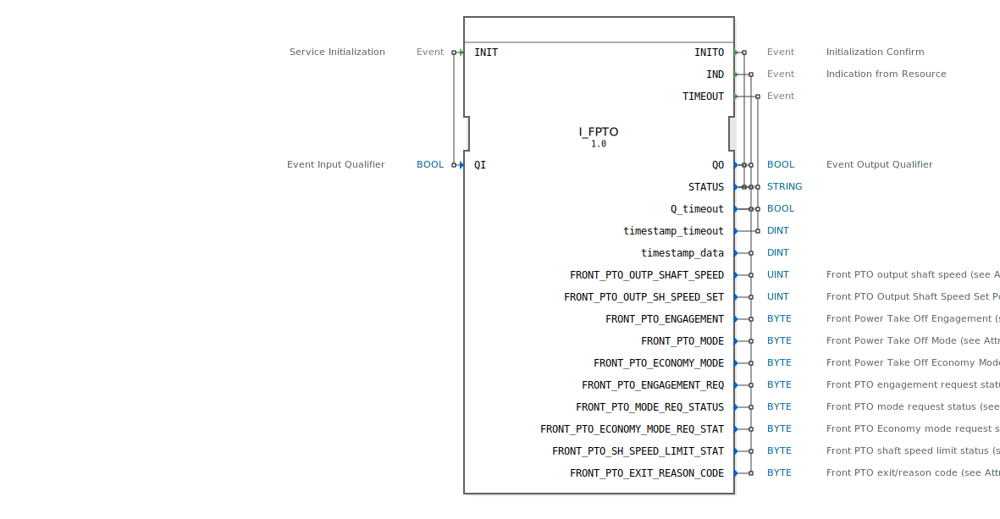

# I_FPTO

```{index} single: I_FPTO
```


* * * * * * * * * *

## Einleitung
Der **I_FPTO** ist ein standardkonformer Funktionsbaustein zur Steuerung und Überwachung der Front Power Take-Off (FPTO)-Ausgangswelle, entwickelt unter EPL-2.0 Lizenz.
Die Version 1.0 implementiert die ISO 11783-7 Spezifikation (PGN 65092) für die Messung und Steuerung von FPTO-Parametern.



## Schnittstellenstruktur

### **Ereignis-Eingänge**
- `INIT`: Initialisierungsanforderung (mit Qualifier `QI`)

### **Ereignis-Ausgänge**
- `INITO`: Initialisierungsbestätigung (mit Status)
- `IND`: Indikationsereignis mit allen FPTO-Parametern
- `TIMEOUT`: Timeout-Ereignis

### **Daten-Eingänge**
- `QI` (BOOL): Qualifier für Initialisierung

### **Daten-Ausgänge**
- `QO` (BOOL): Qualifier für Ausgangsereignisse
- `STATUS` (STRING): Betriebsstatusmeldung
- `Q_timeout` (BOOL): Timeout-Indikator
- `timestamp_timeout` (DINT): Zeitstempel für Timeout
- `timestamp_data` (DINT): Zeitstempel für Daten

## FPTO-Parameter

| Parameter | Typ | Beschreibung | SPN | Bit-Länge | Skalierung |
|-----------|------|--------------|-----|-----------|------------|
| `FRONT_PTO_OUTP_SHAFT_SPEED` | UINT | Aktuelle Drehzahl der FPTO-Welle | 1882 | 16 | 0.125 1/min/bit |
| `FRONT_PTO_OUTP_SH_SPEED_SET` | UINT | Soll-Drehzahl der FPTO-Welle | 1884 | 16 | 0.125 1/min/bit |
| `FRONT_PTO_ENGAGEMENT` | BYTE | Zustand der FPTO-Kupplung | 1888 | 2 | 4 Zustände/2 bit |
| `FRONT_PTO_MODE` | BYTE | Betriebsmodus der FPTO | 1889 | 2 | 4 Zustände/2 bit |
| `FRONT_PTO_ECONOMY_MODE` | BYTE | Economy-Modus der FPTO | 1891 | 2 | 4 Zustände/2 bit |
| `FRONT_PTO_ENGAGEMENT_REQ` | BYTE | Kupplungsanforderungsstatus | 5152 | 2 | 4 Zustände/2 bit |
| `FRONT_PTO_MODE_REQ_STATUS` | BYTE | Modusanforderungsstatus | 5153 | 2 | 4 Zustände/2 bit |
| `FRONT_PTO_ECONOMY_MODE_REQ_STAT` | BYTE | Economy-Modus-Anforderungsstatus | 5154 | 2 | 4 Zustände/2 bit |
| `FRONT_PTO_SH_SPEED_LIMIT_STAT` | BYTE | Drehzahlbegrenzungsstatus | 5155 | 3 | 8 Zustände/3 bit |
| `FRONT_PTO_EXIT_REASON_CODE` | BYTE | Grundcode für FPTO-Ausfall | 5817 | 6 | 64 Zustände/6 bit |

## Funktionsweise

1. **Initialisierung**:
   - `INIT` mit `QI`=TRUE startet Initialisierung
   - `INITO` bestätigt Betriebsbereitschaft mit `QO` und `STATUS`

2. **Datenbereitstellung**:
   - `IND` liefert alle FPTO-Parameter mit Zeitstempel
   - Automatische Aktualisierung bei Zustandsänderungen

3. **Fehlerbehandlung**:
   - `TIMEOUT` bei Kommunikationsproblemen
   - Detaillierte Statusmeldungen im `STATUS`-Feld

## Technische Besonderheiten

✔ **ISO 11783-7 konform** (PGN 65092)
✔ **16-bit Drehzahlmessung** mit 0.125 1/min Auflösung
✔ **Zustandsautomaten** für Kupplung und Betriebsmodi
✔ **Diagnosefunktionen** mit Grundcodes

## Anwendungsszenarien

- **Landmaschinen**: Steuerung von Front-PTO an Traktoren
- **Drehzahlregelung**: Präzise Geschwindigkeitskontrolle
- **Zustandsüberwachung**: Echtzeit-Diagnose des FPTO-Systems
- **Energieeffizienz**: Economy-Modus-Steuerung

## Vergleich mit ähnlichen Bausteinen

| Feature        | I_FPTO | Standard_PTO | Advanced_PTO |
|---------------|--------|--------------|--------------|
| ISO-Standard  | ✔ (ISO 11783-7) | ✔ | ✖ |
| Front-PTO     | ✔ | ✖ | ✔ |
| Economy-Modus | ✔ | ✖ | ✔ |
| Diagnosecodes | ✔ | ✖ | ✔ |

## Fazit

Der I_FPTO-Baustein bietet die Standardimplementierung für Front-PTO-Systeme:

- **Präzise**: Hochauflösende Drehzahlmessung
- **Umfassend**: Komplette Zustandsüberwachung
- **Robust**: Integrierte Fehlerdiagnose

Idealer Einsatz bei:
- Front-PTO-Systemen in Landmaschinen
- Anwendungen mit hohen Anforderungen an Drehzahlgenauigkeit
- Systemen mit erweiterten Diagnoseanforderungen