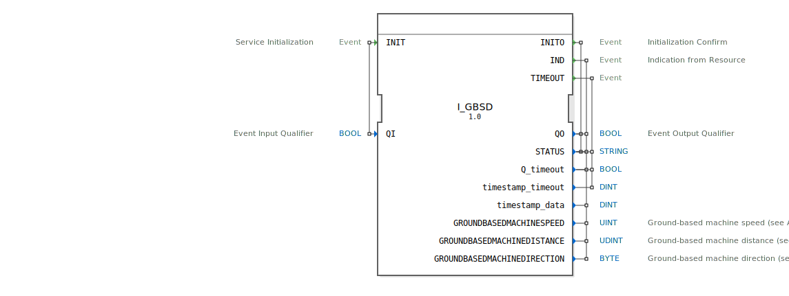

# I_GBSD

```{index} single: I_GBSD
```


* * * * * * * * * *

## Einleitung
Der **I_GBSD** (Ground-based Speed and Distance) ist ein standardkonformer Funktionsbaustein zur Messung von Fahrzeuggeschwindigkeit, Distanz und Fahrtrichtung, entwickelt unter EPL-2.0 Lizenz.
Die Version 1.0 implementiert die ISO 11783-7 Spezifikation (PGN 65097) für präzise Bewegungsdaten in landwirtschaftlichen und baulichen Maschinen.



## Schnittstellenstruktur

### **Ereignis-Eingänge**
- `INIT`: Initialisierungsanforderung (mit Qualifier `QI`)

### **Ereignis-Ausgänge**
- `INITO`: Initialisierungsbestätigung (mit Status)
- `IND`: Datenindikation mit Geschwindigkeit, Distanz und Richtung
- `TIMEOUT`: Timeout-Ereignis

### **Daten-Eingänge**
- `QI` (BOOL): Qualifier für Initialisierung

### **Daten-Ausgänge**
- `QO` (BOOL): Qualifier für Ausgangsereignisse
- `STATUS` (STRING): Betriebsstatusmeldung
- `Q_timeout` (BOOL): Timeout-Indikator
- `timestamp_timeout` (DINT): Zeitstempel für Timeout
- `timestamp_data` (DINT): Zeitstempel für Bewegungsdaten

## Bewegungsdaten-Parameter

| Parameter | Typ | Beschreibung | SPN | Bit-Länge | Skalierung | Genauigkeit |
|-----------|------|--------------|-----|-----------|------------|-------------|
| `GROUNDBASEDMACHINESPEED` | UINT | Maschinengeschwindigkeit | 1859 | 16 | 0.001 m/s pro Bit | ±0.1% bei >1 m/s |
| `GROUNDBASEDMACHINEDISTANCE` | UDINT | Zurückgelegte Distanz | 1860 | 32 | 0.001 m pro Bit | ±0.5% kumulativ |
| `GROUNDBASEDMACHINEDIRECTION` | BYTE | Fahrtrichtung | 1861 | 2 | 4 Zustände/2 Bit | - |

## Fahrtrichtungszustände

| Wert | Zustand | Beschreibung |
|------|---------|--------------|
| 0 | Stillstand | Keine Bewegung erkannt |
| 1 | Vorwärts | Bewegung in Vorwärtsrichtung |
| 2 | Rückwärts | Bewegung in Rückwärtsrichtung |
| 3 | Undefiniert | Richtung nicht bestimmbar |

## Funktionsweise

1. **Initialisierung**:
   - `INIT` mit `QI`=TRUE startet Sensorkalibrierung
   - `INITO` bestätigt Betriebsbereitschaft mit Systemstatus

2. **Datenaktualisierung**:
   - `IND` liefert alle Bewegungsdaten mit 100ms Update-Rate
   - Distanzmessung als freilaufender Zähler (32-bit)

3. **Besondere Betriebsmodi**:
   - Automatische Genauigkeitsanpassung bei niedrigen Geschwindigkeiten (<0.5 m/s)
   - Integrierte Plausibilitätsprüfung der Sensordaten

## Technische Besonderheiten

✔ **ISO 11783-7 konform** (PGN 65097)
✔ **Hochpräzise Messung** mit 1mm Auflösung
✔ **32-bit Distanzzähler** (bis zu 4,294,967km Reichweite)
✔ **Robuste Richtungserkennung** mit 4 Zuständen

## Anwendungsszenarien

- **Präzisionslandwirtschaft**: Geschwindigkeitskontrolle für Saat- und Düngemittel
- **Flächenberechnung**: Automatische Arbeitsflächenmessung
- **Fahrassistenz**: Richtungserkennung bei Rückwärtsfahrt
- **Telematik**: Betriebsdatenerfassung für Maschinenmanagement

## Genauigkeitsmerkmale

| Geschwindigkeitsbereich | Typische Genauigkeit | Update-Rate |
|------------------------|----------------------|-------------|
| > 2 m/s (7.2 km/h) | ±0.1% | 100 ms |
| 0.5 - 2 m/s | ±1% | 200 ms |
| < 0.5 m/s | ±5% | 500 ms |

## ⚖️ Vergleich mit ähnlichen Systemen

| Feature | I_GBSD | Radbasiert | GPS-basiert |
|---------|--------|------------|-------------|
| Bodenkontakt | ✔ Direkt | ✔ Indirekt | ✖ |
| Niedriggeschwindigkeit | ✔ Gut | ✖ Ungenau | ✖ Ungenau |
| Richtungserkennung | ✔ Präzise | ✔ | ✖ Mehrdeutig |
| Signalausfall | Robust | Anfällig | Störanfällig |


## 🛠️ Zugehörige Übungen

* [Uebung_072](../../../../training1/Ventilsteuerung/4diacIDE-workspace/test_B/Uebungen_doc/Uebung_072.md)
* [Uebung_072b](../../../../training1/Ventilsteuerung/4diacIDE-workspace/test_B/Uebungen_doc/Uebung_072b.md)
* [Uebung_072c](../../../../training1/Ventilsteuerung/4diacIDE-workspace/test_B/Uebungen_doc/Uebung_072c.md)
* [Uebung_073](../../../../training1/Ventilsteuerung/4diacIDE-workspace/test_B/Uebungen_doc/Uebung_073.md)
* [Uebung_079](../../../../training1/Ventilsteuerung/4diacIDE-workspace/test_B/Uebungen_doc/Uebung_079.md)

## Fazit

Der I_GBSD-Baustein bietet zuverlässige Bewegungsdaten für mobile Arbeitsmaschinen:

- **Präzision**: Submillimeter-genaue Distanzmessung
- **Zuverlässigkeit**: Funktion auch bei schlechten GPS-Bedingungen
- **Flexibilität**: Universeller Einsatz in Landwirtschaft und Baumaschinen

Idealer Einsatz bei:
- Automatischen Lenksystemen
- Arbeitsbreitenberechnungen
- Maschinen mit hohen Genauigkeitsanforderungen
- Anwendungen mit häufiger Richtungswechsel