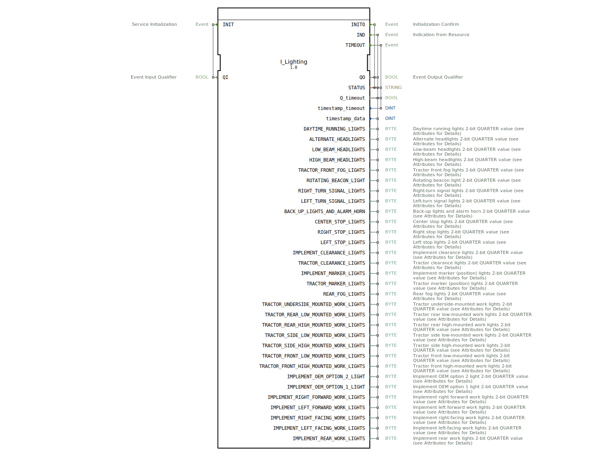

# I_Lighting

* * * * * * * * * *
## Einleitung
Der Funktionsblock **I_Lighting** verarbeitet die Beleuchtungsdaten eines landwirtschaftlichen Fahrzeugs gemäß der ISO 11783-7 (ISOBUS). Er empfängt und decodiert die Parametergruppennummer (PGN) 65088, die den Status aller Beleuchtungsfunktionen eines Traktors und angeschlossener Anbaugeräte übermittelt. Der Baustein dient als Schnittstelle zwischen dem ISOBUS-Netzwerk und der Applikationslogik zur Überwachung und Steuerung der Beleuchtung.

## Schnittstellenstruktur
### **Ereignis-Eingänge**

| Ereignis | Typ | Beschreibung | Mitgeführte Daten |
|----------|-----|--------------|-------------------|
| INIT | EInit | Initialisiert den Baustein und aktiviert die Verarbeitung. | QI |

### **Ereignis-Ausgänge**

| Ereignis | Typ | Beschreibung | Mitgeführte Daten |
|----------|-----|--------------|-------------------|
| INITO | EInit | Bestätigt die erfolgreiche Initialisierung. | QO, STATUS |
| IND | Event | Signalisierung neuer Beleuchtungsdaten vom Bus. | QO, timestamp_data, STATUS, Q_timeout sowie alle 32 Leuchtenstatus-Ausgänge |
| TIMEOUT | Event | Wird ausgelöst, wenn die erwarteten Daten ausbleiben (Zeitüberschreitung). | timestamp_timeout, STATUS, Q_timeout |

### **Daten-Eingänge**

| Name | Datentyp | Beschreibung |
|------|----------|-------------|
| QI | BOOL | Aktivierungssignal für die Initialisierung; bei TRUE wird der Baustein gestartet. |

### **Daten-Ausgänge**

| Name | Datentyp | Beschreibung |
|------|----------|-------------|
| QO | BOOL | Quittierungssignal nach erfolgreicher Initialisierung oder Datenverarbeitung. |
| STATUS | STRING | Statusmeldung (z. B. Fehlertexte oder Betriebshinweise). |
| Q_timeout | BOOL | Signalisiert, ob eine Zeitüberschreitung aufgetreten ist (TRUE = Timeout aktiv). |
| timestamp_timeout | DINT | Zeitstempel des letzten Timeout-Ereignisses. |
| timestamp_data | DINT | Zeitstempel der zuletzt empfangenen Beleuchtungsdaten. |
| *32 Leuchten-Ausgänge* | BYTE | Jeweils ein 2-Bit-Wert (QUARTER) für jede Beleuchtungsfunktion. Initialwert: 0xFF.  – DAYTIME_RUNNING_LIGHTS  – ALTERNATE_HEADLIGHTS  – LOW_BEAM_HEADLIGHTS  – HIGH_BEAM_HEADLIGHTS  – TRACTOR_FRONT_FOG_LIGHTS  – ROTATING_BEACON_LIGHT  – RIGHT_TURN_SIGNAL_LIGHTS  – LEFT_TURN_SIGNAL_LIGHTS  – BACK_UP_LIGHTS_AND_ALARM_HORN  – CENTER_STOP_LIGHTS  – RIGHT_STOP_LIGHTS  – LEFT_STOP_LIGHTS  – IMPLEMENT_CLEARANCE_LIGHTS  – TRACTOR_CLEARANCE_LIGHTS  – IMPLEMENT_MARKER_LIGHTS  – TRACTOR_MARKER_LIGHTS  – REAR_FOG_LIGHTS  – TRACTOR_UNDERSIDE_MOUNTED_WORK_LIGHTS  – TRACTOR_REAR_LOW_MOUNTED_WORK_LIGHTS  – TRACTOR_REAR_HIGH_MOUNTED_WORK_LIGHTS  – TRACTOR_SIDE_LOW_MOUNTED_WORK_LIGHTS  – TRACTOR_SIDE_HIGH_MOUNTED_WORK_LIGHTS  – TRACTOR_FRONT_LOW_MOUNTED_WORK_LIGHTS  – TRACTOR_FRONT_HIGH_MOUNTED_WORK_LIGHTS  – IMPLEMENT_OEM_OPTION_2_LIGHT  – IMPLEMENT_OEM_OPTION_1_LIGHT  – IMPLEMENT_RIGHT_FORWARD_WORK_LIGHTS  – IMPLEMENT_LEFT_FORWARD_WORK_LIGHTS  – IMPLEMENT_RIGHT_FACING_WORK_LIGHTS  – IMPLEMENT_LEFT_FACING_WORK_LIGHTS  – IMPLEMENT_REAR_WORK_LIGHTS |

### **Adapter**
Keine.

## Funktionsweise
Der **I_Lighting**-Baustein wird durch das Ereignis `INIT` aktiviert. Dabei wird die interne Verarbeitung vorbereitet. Nach erfolgreicher Initialisierung quittiert er mit `INITO`. Anschließend wartet der Baustein auf eingehende ISOBUS-Nachrichten (PGN 65088). Trifft eine gültige Nachricht ein, wird das Ereignis `IND` ausgelöst und alle Beleuchtungsausgänge mit den dekodierten 2-Bit-Werten (QUARTER) aktualisiert. Gleichzeitig wird ein Zeitstempel in `timestamp_data` abgelegt. Falls innerhalb einer konfigurierten Zeitspanne keine neuen Daten eintreffen, wird das Ereignis `TIMEOUT` ausgelöst und `Q_timeout` auf TRUE gesetzt. Der Baustein stellt somit eine zuverlässige Überwachung des Beleuchtungsstatus sicher.

## Technische Besonderheiten
- **ISO 11783-7 Konformität:** Der Baustein implementiert die Parametergruppe PGN 65088 „Lighting Data LD“ gemäß dem ISOBUS-Standard.
- **2-Bit-QUARTER-Kodierung:** Jeder Leuchtenausgang codiert vier Zustände in zwei Bits – typische Interpretation:   0 = aus, 1 = an, 2 = Fehler, 3 = nicht verfügbar. Der Initialwert `16#FF` (Dezimal 255) entspricht dem Zustand „nicht verfügbar“.
- **SPN-Attribute:** Jeder Ausgang ist mit detaillierten Metadaten (SPN, Position im Datentelegramm, Skalierung, Link zur Spezifikation) versehen, was die Rückverfolgbarkeit und Konfiguration erleichtert.
- **Timeout-Erkennung:** Der Baustein kann das Ausbleiben von Busnachrichten erkennen und darüber informieren, z. B. für Fehlerbehandlung oder redundantes Verhalten.
- **Zeitstempel:** Sowohl Datenankunft als auch Timeout werden mit einem Zeitstempel (DINT) versehen, was die Analyse im Zeitverlauf ermöglicht.

## Zustandsübersicht
Der Baustein besitzt keinen expliziten, veröffentlichten Zustandsautomaten. Das logische Verhalten lässt sich jedoch wie folgt beschreiben:
- **Initialisierung:** Nach `INIT` wechselt der Baustein in den aktiven Zustand, quittiert mit `INITO`.
- **Empfangsbereit:** Er wartet auf eingehende Nachrichten. Bei Empfang → `IND` aktualisiert alle Ausgänge und setzt `Q_timeout` zurück.
- **Timeout-Überwachung:** Läuft ein interner Timer ab, ohne dass neue Daten eintreffen, wechselt der Baustein kurz in den Timeout-Zustand und signalisiert dies über `TIMEOUT`. Danach kehrt er in den Empfangsbereit-Zustand zurück.
- **Fehlerbehandlung:** Tritt ein Fehler während der Dekodierung auf, wird `STATUS` entsprechend gesetzt.

## Anwendungsszenarien
- **Traktorbeleuchtungssteuerung:** Integration in ein Fahrzeugsteuergerät (ECU) zur Überwachung und Anzeige des Beleuchtungsstatus auf dem Terminal.
- **ISOBUS-konforme Anbaugeräte:** Verwendung in Anbaugeräten, die eigene Beleuchtung über das ISOBUS-Netzwerk melden (z. B. Frontlader, Heckanbaugeräte).
- **Diagnose und Fehlersuche:** Auslese der Leuchtenstatus und Timeouts zur Fehleranalyse oder Logging in der Servicewerkstatt.
- **Lichtsteuerung in automatisierten Systemen:** Kombination mit weiteren Bausteinen zur automatischen Anpassung der Beleuchtung an Umgebungsbedingungen (z. B. Tag/Nacht-Erkennung).

## Vergleich mit ähnlichen Bausteinen
Ähnliche ISOBUS-Bausteine gibt es für andere Parametergruppen, z. B. **I_Engine** (Motordaten), **I_Steering** (Lenkung) oder **I_WorkState** (Arbeitszustand). Im Vergleich zu diesen:
- **Spezialisierung:** **I_Lighting** ist auf die Beleuchtung fokussiert und bietet eine hohe Anzahl von 32 spezifischen Leuchtenausgängen.
- **Datenbreite:** Die Ausgänge sind BYTE (2 Bit genutzt), während andere Bausteine oft WORD oder DWORD verwenden.
- **Timeout-Behandlung:** Nicht alle Bausteine implementieren eine eigene Timeout-Erkennung – hier ist sie explizit vorgesehen.
- **Initialwert:** Die Ausgänge starten mit 0xFF („nicht verfügbar“), was eine robuste Initialisierung ohne Gültigkeitskonflikte ermöglicht.

## Fazit
Der **I_Lighting**-Funktionsblock ist ein spezialisierter, standardkonformer Baustein zur Verarbeitung von ISOBUS-Beleuchtungsdaten (PGN 65088). Er dekodiert den Status von 32 verschiedenen Leuchtenfunktionen aus dem CAN-Bus und bietet eine zuverlässige Timeout-Überwachung. Dank detaillierter SPN-Metadaten und der einfachen Schnittstelle eignet er sich ideal für die Integration in landwirtschaftliche Steuerungssysteme, die eine präzise und normgerechte Lichtsteuerung erfordern.