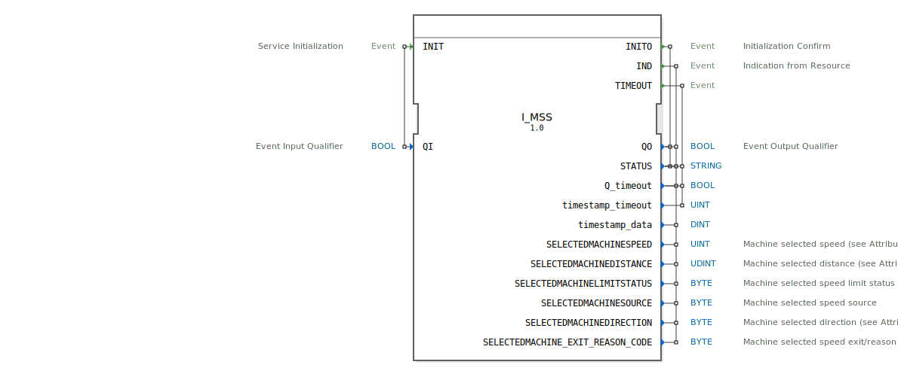

# I_MSS

```{index} single: I_MSS
```


* * * * * * * * * *

## Einleitung
Der **I_MSS** (Machine Selected Speed) ist ein standardkonformer Funktionsbaustein zur Steuerung und Überwachung der maschinengewählten Geschwindigkeit, entwickelt unter EPL-2.0 Lizenz.
Die Version 1.0 implementiert die ISO 11783-7 Spezifikation (PGN 65097) für präzise Geschwindigkeitssteuerung in landwirtschaftlichen und baulichen Maschinen.



## Schnittstellenstruktur

### **Ereignis-Eingänge**
- `INIT`: Initialisierungsanforderung (mit Qualifier `QI`)

### **Ereignis-Ausgänge**
- `INITO`: Initialisierungsbestätigung (mit Status)
- `IND`: Indikationsereignis mit allen Geschwindigkeitsparametern
- `TIMEOUT`: Timeout-Ereignis

### **Daten-Eingänge**
- `QI` (BOOL): Qualifier für Initialisierung

### **Daten-Ausgänge**
- `QO` (BOOL): Qualifier für Ausgangsereignisse
- `STATUS` (STRING): Betriebsstatusmeldung
- `Q_timeout` (BOOL): Timeout-Indikator
- `timestamp_timeout` (UINT): Zeitstempel für Timeout
- `timestamp_data` (DINT): Zeitstempel für Geschwindigkeitsdaten

## Geschwindigkeitsparameter

| Parameter | Typ | Beschreibung | SPN | Bit-Länge | Skalierung |
|-----------|------|--------------|-----|-----------|------------|
| `SELECTEDMACHINESPEED` | UINT | Maschinengeschwindigkeit | 4305 | 16 | 0.001 m/s/bit (LSB), 0.256 m/s/bit (MSB) |
| `SELECTEDMACHINEDISTANCE` | UDINT | Zurückgelegte Distanz | 4306 | 32 | 0.001 m/bit |
| `SELECTEDMACHINELIMITSTATUS` | BYTE | Geschwindigkeitsbegrenzungsstatus | 4307 | 3 | 8 Zustände/3 bit |
| `SELECTEDMACHINESOURCE` | BYTE | Geschwindigkeitsquelle | 4308 | 3 | 8 Zustände/3 bit |
| `SELECTEDMACHINEDIRECTION` | BYTE | Fahrtrichtung | 4309 | 2 | 4 Zustände/2 bit |
| `SELECTEDMACHINE_EXIT_REASON_CODE` | BYTE | Grundcode für Geschwindigkeitsausfall | 5818 | 6 | 64 Zustände/6 bit |

## Fahrtrichtungszustände

| Wert | Zustand | Beschreibung |
|------|---------|--------------|
| 0 | Stillstand | Keine Bewegung erkannt |
| 1 | Vorwärts | Bewegung in Vorwärtsrichtung |
| 2 | Rückwärts | Bewegung in Rückwärtsrichtung |
| 3 | Undefiniert | Richtung nicht bestimmbar |

## Funktionsweise

1. **Initialisierung**:
   - `INIT` mit `QI`=TRUE startet Systeminitialisierung
   - `INITO` bestätigt Betriebsbereitschaft mit `QO` und `STATUS`

2. **Datenbereitstellung**:
   - `IND` liefert alle Geschwindigkeitsparameter mit Zeitstempel
   - Automatische Aktualisierung bei Zustandsänderungen

3. **Fehlerbehandlung**:
   - `TIMEOUT` bei Kommunikationsproblemen
   - Detaillierte Fehlercodes in `SELECTEDMACHINE_EXIT_REASON_CODE`

## Technische Besonderheiten

✔ **ISO 11783-7 konform** (PGN 65097)
✔ **Duale Geschwindigkeitsskalierung** für hohe Präzision
✔ **Multiquellen-Unterstützung** (8 mögliche Geschwindigkeitsquellen)
✔ **Intelligente Limitierungserkennung** mit 3-stufigem Status

## Anwendungsszenarien

- **Traktoren**: Automatische Geschwindigkeitsanpassung für Feldarbeit
- **Erntemaschinen**: Präzise Reihenlängenberechnung
- **Baumaschinen**: Geschwindigkeitsbegrenzung in Gefahrenbereichen
- **Flottenmanagement**: Betriebsdatenerfassung und -analyse

## Geschwindigkeitsquellen

| Code | Quelle | Typische Anwendung |
|------|--------|---------------------|
| 0 | Undefiniert | Systemstart |
| 1 | Radsensor | Standardbetrieb |
| 2 | Bodensensor | Präzisionslandwirtschaft |
| 3 | GPS | Überwachung |
| 4-7 | Reserviert | Herstellerspezifisch |

## Vergleich mit ähnlichen Systemen

| Feature | I_MSS | Standard | GPS-basiert |
|---------|-------|----------|-------------|
| Genauigkeit | ±0.2% | ±1-2% | ±5-10% |
| Reaktionszeit | <100ms | 200ms | 1-2s |
| Quellenflexibilität | 8 | 1-2 | 1 |
| Niedriggeschwindigkeit | ✔ Optimal | ✖ Ungenau | ✖ Unbrauchbar |


## Zugehörige Übungen

* [Uebung_079](../../../../training1/Ventilsteuerung/4diacIDE-workspace/test_B/Uebungen_doc/Uebung_079.md)

## Fazit

Der I_MSS-Baustein bietet präzise Geschwindigkeitssteuerung für mobile Arbeitsmaschinen:

- **Flexibel**: Unterstützung mehrerer Geschwindigkeitsquellen
- **Präzise**: Duale Skalierung für hohe Genauigkeit
- **Robust**: Integrierte Fehlerdiagnose

Idealer Einsatz bei:
- Automatischen Lenksystemen
- Präzisionslandwirtschaft
- Maschinen mit hohen Geschwindigkeitsanforderungen
- Anwendungen mit wechselnden Betriebsbedingungen