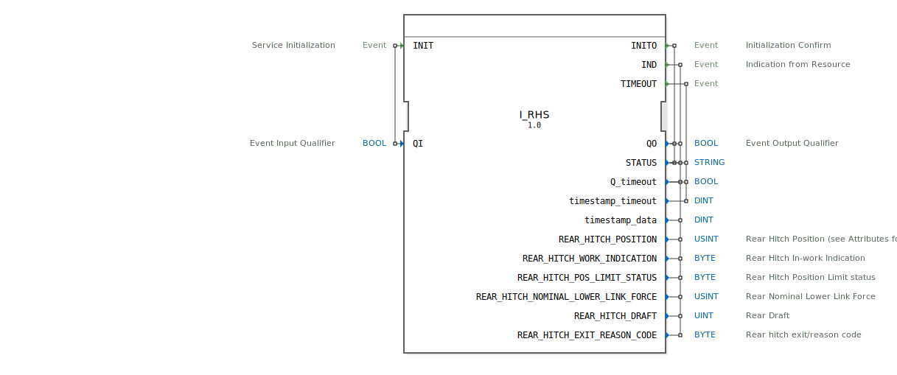

# I_RHS

```{index} single: I_RHS
```


* * * * * * * * * *

## Einleitung
Der **I_RHS** (Rear Hitch Status) ist ein standardkonformer Funktionsbaustein zur Überwachung der Heckkupplungsparameter, entwickelt unter EPL-2.0 Lizenz.
Die Version 1.0 implementiert die ISO 11783-7 Spezifikation (PGN 65093) für die präzise Erfassung von Position, Kraft und Status der Heckkupplung in Landmaschinen.



## Schnittstellenstruktur

### **Ereignis-Eingänge**
- `INIT`: Initialisierungsanforderung (mit Qualifier `QI`)

### **Ereignis-Ausgänge**
- `INITO`: Initialisierungsbestätigung (mit Status)
- `IND`: Indikationsereignis mit allen Kupplungsparametern
- `TIMEOUT`: Timeout-Ereignis

### **Daten-Eingänge**
- `QI` (BOOL): Qualifier für Initialisierung

### **Daten-Ausgänge**
- `QO` (BOOL): Qualifier für Ausgangsereignisse
- `STATUS` (STRING): Betriebsstatusmeldung
- `Q_timeout` (BOOL): Timeout-Indikator
- `timestamp_timeout` (DINT): Zeitstempel für Timeout
- `timestamp_data` (DINT): Zeitstempel für Kupplungsdaten

## Kupplungsparameter

| Parameter | Typ | Beschreibung | SPN | Bit-Länge | Skalierung |
|-----------|------|--------------|-----|-----------|------------|
| `REAR_HITCH_POSITION` | USINT | Kupplungsposition | 1873 | 8 | 0.4 %/bit |
| `REAR_HITCH_WORK_INDICATION` | BYTE | Arbeitszustand | 1877 | 2 | 4 Zustände/2 bit |
| `REAR_HITCH_POS_LIMIT_STATUS` | BYTE | Positionslimitierung | 5151 | 3 | 8 Zustände/3 bit |
| `REAR_HITCH_NOMINAL_LOWER_LINK_FORCE` | USINT | Unterlenkerkraft | 1881 | 8 | 0.8 %/bit (-100% Offset) |
| `REAR_HITCH_DRAFT` | UINT | Zugkraft | 1879 | 16 | 10 N/bit (-320kN Offset) |
| `REAR_HITCH_EXIT_REASON_CODE` | BYTE | Fehlergrundcode | 5819 | 6 | 64 Zustände/6 bit |

## Funktionsweise

1. **Initialisierung**:
   - `INIT` mit `QI`=TRUE startet Systemkalibrierung
   - `INITO` bestätigt Betriebsbereitschaft mit `QO` und `STATUS`

2. **Datenbereitstellung**:
   - `IND` liefert alle Kupplungsparameter mit Zeitstempel
   - Automatische Aktualisierung bei Zustandsänderungen

3. **Fehlerbehandlung**:
   - `TIMEOUT` bei Kommunikationsproblemen
   - Detaillierte Fehlercodes in `REAR_HITCH_EXIT_REASON_CODE`

## Technische Besonderheiten

✔ **ISO 11783-7 konform** (PGN 65093)
✔ **Bidirektionale Kraftmessung** (+/- 100% Bereich)
✔ **Präzise Positionserfassung** mit 0.4% Auflösung
✔ **64-stufige Fehlerdiagnose** mit detaillierten Codes

## Kupplungseigenschaften

| Feature | Beschreibung |
|---------|--------------|
| Positionsbereich | 0-100% (0 = ganz unten) |
| Kraftmessung | ±100% der Nennlast |
| Zugkraftbereich | -320kN bis +350kN |
| Update-Rate | 100ms im Normalbetrieb |

## Rückgabecodes (REAR_HITCH_EXIT_REASON_CODE)

| Codebereich | Bedeutung |
|------------|-----------|
| 0-15 | Systemfehler |
| 16-31 | Positionsfehler |
| 32-47 | Kraftmessfehler |
| 48-63 | Reserviert |

## Anwendungsszenarien

- **Pflugsteuerung**: Automatische Tiefenregelung
- **Lastmanagement**: Anpassung der Zugkraft
- **Diagnose**: Früherkennung von Hydraulikproblemen
- **Sicherheit**: Überwachung der Kupplungsposition

## ⚖️ Vergleich mit ähnlichen Bausteinen

| Feature | I_RHS | Standard | Premium |
|---------|-------|----------|---------|
| Genauigkeit | ±0.4% | ±2% | ±0.2% |
| Kraftmessung | Bidirektional | Nur Zug | Triaxial |
| Diagnosecodes | 64 | 8 | 128 |
| ISO-Konformität | Voll | Teilweise | Voll |


## 🛠️ Zugehörige Übungen

* [Uebung_079](../../../../training1/Ventilsteuerung/4diacIDE-workspace/test_B/Uebungen_doc/Uebung_079.md)

## Fazit

Der I_RHS-Baustein bietet umfassende Überwachung für Heckkupplungssysteme:

- **Präzise**: Hochauflösende Positions- und Kraftmessung
- **Zuverlässig**: Robuste Fehlererkennung
- **Flexibel**: Für verschiedene Anbaugeräte geeignet

Idealer Einsatz bei:
- Modernen Traktoren
- Präzisionslandwirtschaft
- Schweren Anbaugeräten
- Automatischen Lenksystemen