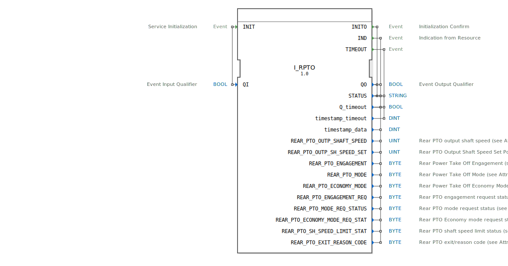

# I_RPTO

```{index} single: I_RPTO
```


* * * * * * * * * *

## Einleitung
Der **I_RPTO** (Rear Power Take-Off) ist ein standardkonformer Funktionsbaustein zur Steuerung und Überwachung der Heckzapfwelle, entwickelt unter EPL-2.0 Lizenz.
Die Version 1.0 implementiert die ISO 11783-7 Spezifikation (PGN 65091) für die präzise Regelung von Zapfwellenparametern in Landmaschinen.



## Schnittstellenstruktur

### **Ereignis-Eingänge**
- `INIT`: Initialisierungsanforderung (mit Qualifier `QI`)

### **Ereignis-Ausgänge**
- `INITO`: Initialisierungsbestätigung (mit Status)
- `IND`: Indikationsereignis mit allen Zapfwellenparametern
- `TIMEOUT`: Timeout-Ereignis

### **Daten-Eingänge**
- `QI` (BOOL): Qualifier für Initialisierung

### **Daten-Ausgänge**
- `QO` (BOOL): Qualifier für Ausgangsereignisse
- `STATUS` (STRING): Betriebsstatusmeldung
- `Q_timeout` (BOOL): Timeout-Indikator
- `timestamp_timeout` (DINT): Zeitstempel für Timeout
- `timestamp_data` (DINT): Zeitstempel für Zapfwellendaten

## Zapfwellenparameter

| Parameter | Typ | Beschreibung | SPN | Bit-Länge | Skalierung |
|-----------|------|--------------|-----|-----------|------------|
| `REAR_PTO_OUTP_SHAFT_SPEED` | UINT | Aktuelle Drehzahl | 1883 | 16 | 0.125 1/min/bit |
| `REAR_PTO_OUTP_SH_SPEED_SET` | UINT | Soll-Drehzahl | 1885 | 16 | 0.125 1/min/bit |
| `REAR_PTO_ENGAGEMENT` | BYTE | Kupplungszustand | 2408 | 2 | 4 Zustände/2 bit |
| `REAR_PTO_MODE` | BYTE | Betriebsmodus | 1890 | 2 | 4 Zustände/2 bit |
| `REAR_PTO_ECONOMY_MODE` | BYTE | Economy-Modus | 1892 | 2 | 4 Zustände/2 bit |
| `REAR_PTO_ENGAGEMENT_REQ` | BYTE | Kupplungsanforderung | 5156 | 2 | 4 Zustände/2 bit |
| `REAR_PTO_MODE_REQ_STATUS` | BYTE | Modusanforderung | 5157 | 2 | 4 Zustände/2 bit |
| `REAR_PTO_ECONOMY_MODE_REQ_STAT` | BYTE | Economy-Modus-Anforderung | 5158 | 2 | 4 Zustände/2 bit |
| `REAR_PTO_SH_SPEED_LIMIT_STAT` | BYTE | Drehzahlbegrenzung | 5159 | 3 | 8 Zustände/3 bit |
| `REAR_PTO_EXIT_REASON_CODE` | BYTE | Fehlergrundcode | 5820 | 6 | 64 Zustände/6 bit |

## Betriebsmodi

| Code | Modus | Beschreibung |
|------|-------|--------------|
| 0 | Standby | Bereitschaftsmodus |
| 1 | Geschwindigkeitsmodus | Konstante Drehzahl |
| 2 | Lastmodus | Lastabhängige Regelung |
| 3 | Reserviert | Herstellerspezifisch |

## Funktionsweise

1. **Initialisierung**:
   - `INIT` mit `QI`=TRUE startet Systemkalibrierung
   - `INITO` bestätigt Betriebsbereitschaft mit `QO` und `STATUS`

2. **Drehzahlregelung**:
   - `IND` liefert Ist- und Soll-Drehzahlen
   - Automatische Anpassung an Laständerungen

3. **Fehlerbehandlung**:
   - `TIMEOUT` bei Kommunikationsproblemen
   - Detaillierte Fehlercodes in `REAR_PTO_EXIT_REASON_CODE`

## Technische Besonderheiten

✔ **ISO 11783-7 konform** (PGN 65091)
✔ **Präzise Drehzahlregelung** mit 0.125 U/min Auflösung
✔ **4 Betriebsmodi** für unterschiedliche Anwendungen
✔ **64-stufige Fehlerdiagnose** mit detaillierten Codes

## Anwendungsszenarien

- **Landmaschinen**: Antrieb von Mähdreschern und Ballenpressen
- **Drehzahlregelung**: Präzise Anpassung an Arbeitsgeräte
- **Energieeffizienz**: Economy-Modus für Teillastbetrieb
- **Diagnose**: Früherkennung von mechanischen Problemen

## ⚖️ Vergleich mit ähnlichen Systemen

| Feature | I_RPTO | Standard | Premium |
|---------|--------|----------|---------|
| Drehzahlgenauigkeit | ±0.2% | ±1% | ±0.1% |
| Betriebsmodi | 4 | 2 | 6 |
| Diagnoseumfang | 64 Codes | 8 Codes | 128 Codes |
| Reaktionszeit | <100ms | 200ms | 50ms |


## 🛠️ Zugehörige Übungen

* [Uebung_074](../../../../training1/Ventilsteuerung/4diacIDE-workspace/test_B/Uebungen_doc/Uebung_074.md)
* [Uebung_079](../../../../training1/Ventilsteuerung/4diacIDE-workspace/test_B/Uebungen_doc/Uebung_079.md)

## Fazit

Der I_RPTO-Baustein bietet zuverlässige Zapfwellensteuerung für moderne Landtechnik:

- **Präzise**: Hochauflösende Drehzahlregelung
- **Flexibel**: Mehrere Betriebsmodi für verschiedene Anwendungen
- **Robust**: Integrierte Fehlererkennung und -diagnose

Idealer Einsatz bei:
- Traktoren mit anspruchsvollen Anbaugeräten
- Präzisionslandwirtschaft
- Energieeffizienten Antriebssystemen
- Automatisierten Arbeitsprozessen