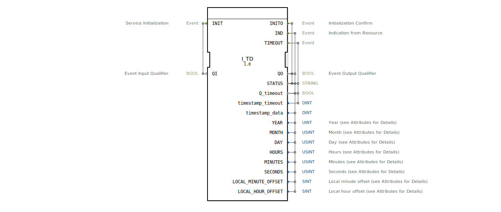

# I_TD

* * * * * * * * * *
## Einleitung

Der Funktionsblock **I_TD** (Time/Date) ist ein spezieller Baustein für den ISOBUS, der die Verarbeitung von Zeit- und Datumsinformationen gemäß dem Standard ISO 11783‑7 (PGN 65254) ermöglicht. Er dient dem Empfang und der Aufbereitung der im ISOBUS‑Netzwerk übertragenen aktuellen Uhrzeit sowie des Datums. Die Ausgangsdaten entsprechen den definierten SPNs (Suspect Parameter Numbers) des Protokolls und werden inklusive der zugehörigen Skalierungen und Offsets bereitgestellt.

## Schnittstellenstruktur

### **Ereignis-Eingänge**

| Ereignis | Mit Variable | Beschreibung |
|----------|-------------|--------------|
| `INIT`   | `QI`        | Initialisierung des Bausteins. |

### **Ereignis-Ausgänge**

| Ereignis   | Mit Variablen | Beschreibung |
|------------|---------------|--------------|
| `INITO`    | `QO`, `STATUS` | Bestätigung der erfolgreichen Initialisierung. |
| `IND`      | `QO`, `timestamp_data`, `STATUS`, `Q_timeout`, `SECONDS`, `MINUTES`, `HOURS`, `MONTH`, `DAY`, `YEAR`, `LOCAL_MINUTE_OFFSET`, `LOCAL_HOUR_OFFSET` | Anzeige eines empfangenen Zeit-/Datums-Telegramms. |
| `TIMEOUT`  | `timestamp_timeout`, `STATUS`, `Q_timeout` | Zeitüberschreitungsereignis, falls kein gültiges Telegramm innerhalb einer erwarteten Frist eintrifft. |

### **Daten-Eingänge**

| Variable | Typ   | Beschreibung |
|----------|-------|--------------|
| `QI`     | BOOL  | Qualifier für die Initialisierung (TRUE = aktivieren). |

### **Daten-Ausgänge**

| Variable              | Typ    | Beschreibung (mit ISOBUS‑Attributen) |
|-----------------------|--------|--------------------------------------|
| `QO`                  | BOOL   | Ausgangsqualifier (TRUE = Betrieb bereit). |
| `STATUS`              | STRING | Statusmeldung (z. B. Fehler oder Erfolg). |
| `Q_timeout`           | BOOL   | Signalisiert, ob ein Timeout aufgetreten ist. |
| `timestamp_timeout`   | DINT   | Zeitstempel des Timeouts (falls aufgetreten). |
| `timestamp_data`      | DINT   | Zeitstempel des empfangenen Datentelegramms. |
| `SECONDS`             | USINT  | Sekunden (Skalierung 0,25 s/bit, Offset 0). |
| `MINUTES`             | USINT  | Minuten (Skalierung 1 min/bit, Offset 0). |
| `HOURS`               | USINT  | Stunden (Skalierung 1 h/bit, Offset 0). |
| `MONTH`               | USINT  | Monat (Skalierung 1 Monat/bit, Offset 0). |
| `DAY`                 | USINT  | Tag (Skalierung 0,25 d/bit, Offset 0). |
| `YEAR`                | UINT   | Jahr (Skalierung 1 y/bit, Offset 1985, Initialwert 0xFFFF = „nicht verfügbar”). |
| `LOCAL_MINUTE_OFFSET` | SINT   | Lokaler Minuten‑Offset (Skalierung 1 min/bit, Offset −125). |
| `LOCAL_HOUR_OFFSET`   | SINT   | Lokaler Stunden‑Offset (Skalierung 1 h/bit, Offset −125). |

### **Adapter**

Keine.

## Funktionsweise

Der Baustein wird über den Ereigniseingang `INIT` mit gesetztem `QI` initialisiert. Nach erfolgreicher Initialisierung wird das Ereignis `INITO` ausgelöst und der Ausgang `QO` auf TRUE gesetzt. Anschließend wartet der FB auf eingehende ISOBUS‑Telegramme (PGN 65254). Trifft ein solches Telegramm ein, wird das Ereignis `IND` erzeugt und alle entsprechenden Daten‑Ausgänge werden mit den dekodierten Werten aktualisiert. Dabei werden die in den Attributen hinterlegten Skalierungen und Offsets automatisch angewendet.

Sollte innerhalb eines nicht näher spezifizierten Zeitrahmens kein gültiges Telegramm empfangen werden, wird das Ereignis `TIMEOUT` ausgelöst und der `Q_timeout`‑Ausgang auf TRUE gesetzt. Der Zeitstempel des Timeouts wird in `timestamp_timeout` abgelegt.

## Technische Besonderheiten

- **ISOBUS‑Konformität:** Der FB implementiert exakt den PGN 65254 der Norm ISO 11783‑7, Teil „Time/Date TD“.
- **Initialwerte:** Viele Daten‑Ausgänge sind mit vordefinierten „nicht verfügbar“‑Werten initialisiert (z. B. YEAR = 0xFFFF), was eine einfache Fehlererkennung erlaubt.
- **Skalierung & Offset:** Alle Größen sind gemäß ISOBUS‑Spezifikation skaliert und mit Offsets versehen. Die Rohwerte der SPNs werden in die physikalischen Einheiten umgerechnet.
- **Lokale Zeitverschiebung:** Die Ausgänge `LOCAL_MINUTE_OFFSET` und `LOCAL_HOUR_OFFSET` erlauben die Angabe der Abweichung zur UTC‑Zeit im Bereich −125 min bis +130 min.
- **Keine Zustandsautomat:** Der FB ist ereignisgesteuert; es gibt keinen expliziten Zustandsautomaten im XML. Die interne Logik basiert auf den IEC‑61499‑Ausführungsregeln.

## Zustandsübersicht

Ein expliziter Zustandsautomat ist im XML nicht definiert. Der FB arbeitet als reaktiver Baustein:

1. **Ruhezustand** – wartet auf INIT.
2. **Initialisierungsphase** – nach `INIT` bei TRUE `QI` wird `INITO` ausgelöst.
3. **Betriebsbereit** – Empfang von Telegrammen → `IND`; bei Ausbleiben → `TIMEOUT`.

## Anwendungsszenarien

- **Landwirtschaftliche Maschinen:** Empfangen von aktuellen Zeit‑ und Datumsdaten aus dem ISOBUS‑Bordnetz, z. B. für Logger, Steuerungen oder Displays.
- **Zeitstempelung:** Verwendung der `timestamp_data`‑Ausgänge zur Synchronisation von Ereignissen in verschiedenen Steuergeräten.
- **Zeitzonenanpassung:** Auswertung der lokalen Offsets zur Darstellung der Ortszeit in Benutzeroberflächen.

## Vergleich mit ähnlichen Bausteinen

Im Vergleich zu allgemeinen IEC‑61499‑Zeitbausteinen (z. B. `E_CYCLE` oder `E_TIME`) ist `I_TD` speziell für die ISOBUS‑Kommunikation ausgelegt. Es dekodiert keine systeminterne Uhrzeit, sondern empfängt externe Telegramme und liefert die Daten in ISOBUS‑konformen Formaten. Ein universeller `I_DATE`‑Baustein (falls vorhanden) wäre für proprietäre Systeme geeignet, bietet jedoch nicht die ISOBUS‑SPN‑Struktur.

## Fazit

Der Funktionsblock `I_TD` ist ein essenzieller Baustein für ISOBUS‑Anwendungen, die auf genaue Zeit‑ und Datumsinformationen aus dem Netzwerk angewiesen sind. Seine vollständige Abbildung der SPNs sowie die eingebaute Timeout‑Behandlung machen ihn robust und normenkonform. Dank der automatischen Skalierung und Offsets können die physikalischen Werte ohne manuelle Umrechnung direkt weiterverarbeitet werden.