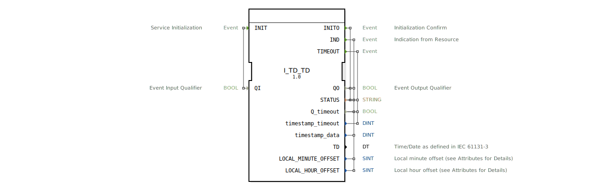

# I_TD_TD

* * * * * * * * * *

## Einleitung

Der Funktionsblock **I_TD_TD** ist ein Wrapper um den Basisbaustein `I_TD` und erzeugt aus den einzelnen Zeit- und Datumskomponenten einen kombinierten IEC 61131-3 Datum/Zeit-Struct (Typ `DT`). Er dient als Schnittstelle zu einem ISOBUS-konformen Zeit-/Datumsdienst (PGN 65254) und liefert die aufbereiteten Zeitinformationen sowie lokale Zeitverschiebungen als separate Ausgänge.

## Schnittstellenstruktur

### **Ereignis-Eingänge**

| Name | Typ | Kommentar |
|------|-----|-----------|
| INIT | EInit | Service-Initialisierung, gesteuert durch Qualifier `QI` |

### **Ereignis-Ausgänge**

| Name | Typ | Mitgeführte Daten |
|------|-----|--------------------|
| INITO | EInit | `QO`, `STATUS` |
| IND | Event | `QO`, `timestamp_data`, `STATUS`, `Q_timeout`, `LOCAL_MINUTE_OFFSET`, `LOCAL_HOUR_OFFSET` |
| TIMEOUT | Event | `timestamp_timeout`, `STATUS`, `Q_timeout` |

### **Daten-Eingänge**

| Name | Typ | Kommentar |
|------|-----|-----------|
| QI | BOOL | Eingangsqualifier (Steuerung des Initialisierungsvorgangs) |

### **Daten-Ausgänge**

| Name | Typ | Kommentar |
|------|-----|-----------|
| QO | BOOL | Ausgangsqualifier (Status der Verarbeitung) |
| STATUS | STRING | Statusmeldung |
| Q_timeout | BOOL | Zeitüberschreitungs-Flag |
| timestamp_timeout | DINT | Zeitstempel der Zeitüberschreitung |
| timestamp_data | DINT | Zeitstempel der gültigen Daten |
| TD | DT | Kombinierte Zeit-/Datum (IEC 61131-3 `DT`) |
| LOCAL_MINUTE_OFFSET | SINT | Lokaler Minutenversatz (SPN 1601, Einheit: 1 min/bit, Offset -125) |
| LOCAL_HOUR_OFFSET | SINT | Lokaler Stundenversatz (SPN 1602, Einheit: 1 h/bit, Offset -125) |

### **Adapter**

Keine Adapter vorhanden.

## Funktionsweise

Der Baustein kapselt die folgenden Schritte:

1. **Initialisierung**  
   Ein Ereignis am Eingang `INIT` startet den internen Funktionsblock `I_TD` (`I_CORE`). Dieser durchläuft seinen eigenen Initialisierungsablauf und bestätigt mit `INITO`. Die Qualifier `QO` und `STATUS` werden dabei an die gleichnamigen Ausgänge weitergegeben.

2. **Zyklische Zeit-/Datumserfassung**  
   Sobald der interne Baustein bereit ist, erzeugt er zyklisch ein `IND`-Ereignis. Dieses Ereignis löst den nachgeschalteten Baustein `F_CONCAT_DT` aus. `F_CONCAT_DT` setzt die vom `I_TD` bereitgestellten Einzelkomponenten (Jahr, Monat, Tag, Stunde, Minute, Sekunde) zu einem `DT`-Struct zusammen. Die Millisekundenkomponente ist fest auf 0 gesetzt. Nach Abschluss der Konkatenation wird ein `CNF`-Ereignis erzeugt, das den äußeren `IND`-Ausgang aktiviert, zusammen mit allen weiteren Datenausgängen (Zeitstempel, Versätze, usw.).

3. **Zeitüberschreitung**  
   Falls der interne Dienst eine Zeitüberschreitung meldet, wird das Ereignis `TIMEOUT` am Ausgang aktiviert. Die zugehörigen Daten (`timestamp_timeout`, `STATUS`, `Q_timeout`) werden direkt vom inneren Baustein übernommen.

4. **Weiterleitung der Rohdaten**  
   Die Ausgänge `timestamp_data`, `timestamp_timeout`, `LOCAL_MINUTE_OFFSET` und `LOCAL_HOUR_OFFSET` werden unverändert vom `I_TD` übernommen.

## Technische Besonderheiten

- **Wrapper-Prinzip**  
  Der Baustein vereinfacht die Handhabung des ISOBUS-Zeitdienstes, indem er die einzelnen Zeitkomponenten zu einem plattformkompatiblen `DT`-Struct zusammenfasst. Der Anwender muss keine eigene Verkettung von Jahr, Monat etc. vornehmen.

- **ISO 11783-7 konform**  
  Der zugrundeliegende Dienst entspricht der PGN-Nummer 65254 und stellt die nach ISO 11783-7 geforderten SPNs (1601, 1602) für lokale Zeitversätze bereit. Die Attributinformationen (Skalierung, Offset) sind in den Ausgangsvariablen vermerkt.

- **Zeitstempel-Handling**  
  Sowohl für gültige Daten als auch für Timeout-Ereignisse werden separate Zeitstempel (`DINT`) zur Verfügung gestellt, sodass die Reihenfolge und Aktualität der Ereignisse nachverfolgt werden kann.

- **Ereignisgesteuerter Ablauf**  
  Die Verarbeitung erfolgt rein ereignisgesteuert. Jeder Zyklus wird durch das `IND` des internen Bausteins initiiert und endet mit dem `IND` des Wrappers.

## Zustandsübersicht

Der Baustein besitzt keinen expliziten internen Zustandsautomaten, der für den Anwender sichtbar wäre. Der Ablauf lässt sich jedoch in folgende Phasen unterteilen:

1. **Ruhezustand** – nach Initialisierung wartet der Baustein auf das erste `IND` des `I_TD`.
2. **Aktive Verarbeitung** – `IND` des `I_TD` löst `F_CONCAT_DT` aus; anschließend wird der äußere `IND` ausgegeben.
3. **Timeout-Zustand** – bei Zeitüberschreitung des `I_TD` wird `TIMEOUT` ausgegeben.
4. **Initialisierungsphase** – während `INIT` und `INITO` erfolgt die Initialisierung des internen Bausteins.

## Anwendungsszenarien

- **ISOBUS-Steuergeräte**  
  Einsatz in landwirtschaftlichen Steuergeräten, die regelmäßig die aktuelle UTC-Zeit und die lokale Zeitverschiebung vom ISOBUS-Bus abfragen und als einheitlichen Datentyp (`DT`) für Anzeige oder Logging benötigen.

- **Zeitsynchronisation**  
  Verwendung in Systemen, die auf eine exakte Zeitbasis angewiesen sind, z. B. Aufzeichnungsgeräte (Logger), GPS-gestützte Anwendungen oder Prozesssteuerungen.

- **Wrapper für IEC 61131-3 Kompatibilität**  
  Wenn nachfolgende Funktionsblöcke keinen Zugriff auf einzelne Zeitkomponenten, sondern nur auf einen `DT`-Struct erwarten, kann `I_TD_TD` als Bindeglied dienen.

## Vergleich mit ähnlichen Bausteinen

- **I_TD (Basisbaustein)**  
  Liefert die Zeitkomponenten als separate Ausgänge (YEAR, MONTH, DAY, usw.). Der Anwender müsste selbst eine Konkatenation zu einem `DT` vornehmen. `I_TD_TD` erledigt dies automatisch und fügt zusätzlich die Rohdaten-Zeitstempel hinzu.

- **Andere Zeit/Datums-Wrapper**  
  Manche Implementierungen nutzen direkte Systemzeit-Funktionen. `I_TD_TD` ist speziell für den Einsatz im ISOBUS-Kontext optimiert und stellt die geforderten SPN-Attribute sowie die Timeout-Behandlung bereit.

## Fazit

`I_TD_TD` erweitert den standardisierten ISOBUS-Zeitbaustein `I_TD` um eine direkte Ausgabe des IEC 61131-3 Datum-Zeit-Typs `DT`. Dadurch wird die Integration in Steuerungsanwendungen erleichtert, die keine separate Datumskonvertierung vornehmen möchten. Die transparente Weitergabe von Rohdaten und Timeout-Informationen sowie die durchgängige Ereignissteuerung machen den Baustein zu einer praktischen und normenkonformen Komponente für ISOBUS-basierte Systeme.