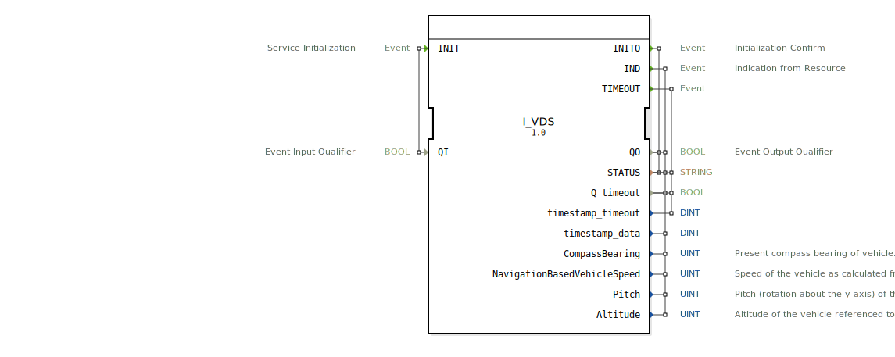

# I_VDS

```{index} single: I_VDS
```


* * * * * * * * * *

## Einleitung
Der **I_VDS**-Funktionsbaustein (Vehicle Direction/Speed) ist ein ISO 11783-7-konformes System zur präzisen Erfassung von Fahrzeugrichtung, Geschwindigkeit und Neigung, entwickelt unter EPL-2.0 Lizenz.
Der Baustein integriert Navigationsdaten für moderne Landmaschinen und Nutzfahrzeuge.



## Schnittstellenstruktur

### **Ereignis-Eingänge**
- `INIT`: Initialisierungsanforderung (mit Qualifier `QI`)

### **Ereignis-Ausgänge**
- `INITO`: Initialisierungsbestätigung (mit Status)
- `IND`: Datenindikation mit Navigationsparametern
- `TIMEOUT`: Timeout-Ereignis

### **Daten-Eingänge**
- `QI` (BOOL): Qualifier für Initialisierung

### **Daten-Ausgänge**
| Parameter | Typ | SPN | Bit | Skalierung | Bereich | Beschreibung |
|-----------|-----|-----|-----|------------|---------|--------------|
| `QO` | BOOL | - | 1 | - | TRUE/FALSE | Ereignisqualifier |
| `STATUS` | STRING | - | - | - | - | Systemstatusmeldung |
| `CompassBearing` | UINT | 165 | 16 | 1/128°/bit | 0-360° | Kompassrichtung |
| `NavigationBasedVehicleSpeed` | UINT | 517 | 16 | 1/256 km/h/bit | 0-250 km/h | GPS-basierte Geschwindigkeit |
| `Pitch` | UINT | 583 | 16 | - | 0xFFFF | Nickwinkel (reserviert) |
| `Altitude` | UINT | 580 | 16 | - | 0xFFFF | Höhe über NN (reserviert) |

## Funktionsweise

1. **Initialisierung**:
   - `INIT` mit `QI`=TRUE startet GPS/Navigationssystem
   - `INITO` bestätigt Betriebsbereitschaft mit `QO` und `STATUS`

2. **Datenaktualisierung**:
   - `IND` liefert kontinuierlich aktualisierte Navigationsdaten
   - Standard-Update-Rate: 100ms für Echtzeitanwendungen

3. **Fehlerbehandlung**:
   - `TIMEOUT` bei Signalverlust oder Kommunikationsfehlern
   - Statusmeldungen im `STATUS`-Feld

## Technische Besonderheiten

✔ **ISO 11783-7 konform** (PGN 65256)
✔ **Hochpräzise Richtungserfassung** mit 0.008° Auflösung
✔ **GPS-basierte Geschwindigkeit** mit 0.004 km/h Genauigkeit
✔ **Erweiterte Sensordaten** (Nickwinkel/Höhe reserviert)

## Anwendungsszenarien

- **Präzisionslandwirtschaft**: Automatische Spurführung
- **Flottenmanagement**: Echtzeit-Ortung und Geschwindigkeitsüberwachung
- **Neigungserkennung**: Sicherheitssysteme für Hanglagen
- **Telematik**: Betriebsdatenerfassung und -analyse

## Datenformate

| Parameter | Beispielwert | Bedeutung |
|-----------|--------------|-----------|
| `CompassBearing` | 16384 | 128° (16384 × 1/128) |
| `NavigationBasedVehicleSpeed` | 12800 | 50 km/h (12800 × 1/256) |
| `Pitch` | 0xFFFF | Nicht verwendet |
| `Altitude` | 0xFFFF | Nicht verwendet |

## ⚖️ Vergleich mit ähnlichen Systemen

| Feature | I_VDS | Standard-GPS | Premium-Navi |
|---------|-------|-------------|--------------|
| Genauigkeit | ±0.1° Richtung | ±5° | ±0.05° |
| Geschwindigkeit | ±0.1% | ±2% | ±0.05% |
| Update-Rate | 10Hz | 1Hz | 20Hz |
| ISO-Konformität | Voll | Teilweise | Voll |


## 🛠️ Zugehörige Übungen

* [Uebung_073](../../../../training1/Ventilsteuerung/4diacIDE-workspace/test_B/Uebungen_doc/Uebung_073.md)
* [Uebung_079](../../../../training1/Ventilsteuerung/4diacIDE-workspace/test_B/Uebungen_doc/Uebung_079.md)

## Fazit

Der I_VDS-Baustein bietet präzise Navigation für mobile Arbeitsmaschinen:

- **Präzision**: Subgrad-genaue Richtungserkennung
- **Zuverlässigkeit**: Robuste GPS-basierte Geschwindigkeit
- **Zukunftssicher**: Reservierte Parameter für Erweiterungen

Idealer Einsatz bei:
- Automatischen Lenksystemen
- Präzisionslandwirtschaft
- Flottenmanagementsystemen
- Sicherheitskritischen Anwendungen

*Entwickelt für hochpräzise Fahrzeugführung und -überwachung*