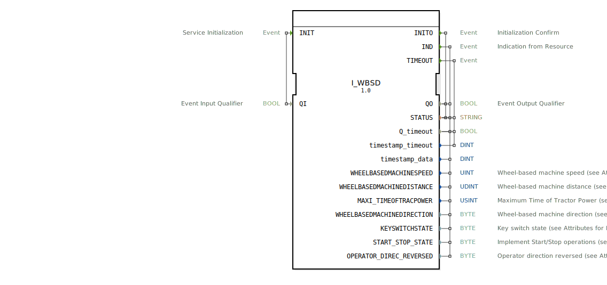

# I_WBSD

```{index} single: I_WBSD
```


* * * * * * * * * *

## Einleitung
Der **I_WBSD**-Funktionsbaustein (Wheel-based Speed and Distance) ist ein ISO 11783-7-konformes System zur Erfassung radbasierter Geschwindigkeits- und Distanzdaten, entwickelt unter EPL-2.0 Lizenz.
Der Baustein ermöglicht die präzise Überwachung von Fahrzeugbewegungen und Betriebszuständen für Land- und Baumaschinen.



## Schnittstellenstruktur

### **Ereignis-Eingänge**
- `INIT`: Initialisierungsanforderung (mit Qualifier `QI`)

### **Ereignis-Ausgänge**
- `INITO`: Initialisierungsbestätigung (mit Status)
- `IND`: Datenindikation mit Bewegungs- und Zustandsparametern
- `TIMEOUT`: Timeout-Ereignis

### **Daten-Eingänge**
- `QI` (BOOL): Qualifier für Initialisierung

### **Daten-Ausgänge**
| Parameter | Typ | SPN | Bit | Skalierung | Bereich | Beschreibung |
|-----------|-----|-----|-----|------------|---------|--------------|
| `QO` | BOOL | - | 1 | - | TRUE/FALSE | Ereignisqualifier |
| `STATUS` | STRING | - | - | - | - | Systemstatusmeldung |
| `WHEELBASEDMACHINESPEED` | UINT | 1862 | 16 | 0.001 m/s/bit | 0-65.535 m/s | Radbasierte Geschwindigkeit |
| `WHEELBASEDMACHINEDISTANCE` | UDINT | 1863 | 32 | 0.001 m/bit | 0-4,294,967 km | Zurückgelegte Distanz |
| `MAXI_TIMEOFTRACPOWER` | USINT | 1866 | 8 | 1 min/bit | 0-255 min | Maximale Betriebszeit |
| `WHEELBASEDMACHINEDIRECTION` | BYTE | 1864 | 2 | 4 Zustände | 0-3 | Fahrtrichtung |
| `KEYSWITCHSTATE` | BYTE | 1865 | 2 | 4 Zustände | 0-3 | Zündschalterzustand |
| `START_STOP_STATE` | BYTE | 5203 | 2 | 4 Zustände | 0-3 | Start/Stop-Status |
| `OPERATOR_DIREC_REVERSED` | BYTE | 5244 | 2 | 4 Zustände | 0-3 | Richtungsumkehr |

## Fahrtrichtungszustände

| Code | Zustand | Beschreibung |
|------|---------|--------------|
| 0 | Stillstand | Keine Bewegung |
| 1 | Vorwärts | Vorwärtsfahrt |
| 2 | Rückwärts | Rückwärtsfahrt |
| 3 | Undefiniert | Richtung nicht bestimmbar |

## Funktionsweise

1. **Initialisierung**:
   - `INIT` mit `QI`=TRUE startet Radsensorkalibrierung
   - `INITO` bestätigt Betriebsbereitschaft mit Systemstatus

2. **Datenbereitstellung**:
   - `IND` liefert kontinuierlich aktualisierte Bewegungsdaten
   - Automatische Anpassung der Update-Rate (100ms bei >0.5 m/s)

3. **Fehlerbehandlung**:
   - `TIMEOUT` bei Signalverlust der Raddrehzahlsensoren
   - Statusmeldungen im `STATUS`-Feld

## Technische Besonderheiten

✔ **ISO 11783-7 konform** (PGN 65096)
✔ **Präzise Geschwindigkeitsmessung** mit 1mm/s Auflösung
✔ **32-bit Distanzzähler** für lange Betriebszeiten
✔ **Integrierte Zustandsüberwachung** (Zündung, Start/Stop)

## Anwendungsszenarien

- **Traktoren**: Geschwindigkeitsregelung für Feldarbeit
- **Erntemaschinen**: Arbeitsstreckenberechnung
- **Flottenmanagement**: Betriebsstundenerfassung
- **Sicherheitssysteme**: Richtungserkennung bei Rückwärtsfahrt

## Zustandscodes

| Parameter | Code | Bedeutung |
|-----------|------|-----------|
| `KEYSWITCHSTATE` | 0 | Aus |
| | 1 | Ein |
| | 2 | Start |
| | 3 | Undefiniert |
| `START_STOP_STATE` | 0 | Stopp |
| | 1 | Start |
| | 2 | Pause |
| | 3 | Reserviert |

## ⚖️ Vergleich mit ähnlichen Systemen

| Feature | I_WBSD | Standard | GPS-basiert |
|---------|--------|----------|-------------|
| Genauigkeit | ±0.5% | ±2% | ±5% |
| Niedriggeschwindigkeit | Gut | Ausgezeichnet | Schlecht |
| Signalstabilität | Hoch | Mittel | Niedrig |
| ISO-Konformität | Voll | Teilweise | Voll |


## 🛠️ Zugehörige Übungen

* [Uebung_070](../../../../training1/Ventilsteuerung/4diacIDE-workspace/test_B/Uebungen_doc/Uebung_070.md)
* [Uebung_071](../../../../training1/Ventilsteuerung/4diacIDE-workspace/test_B/Uebungen_doc/Uebung_071.md)
* [Uebung_071a](../../../../training1/Ventilsteuerung/4diacIDE-workspace/test_B/Uebungen_doc/Uebung_071a.md)
* [Uebung_071b](../../../../training1/Ventilsteuerung/4diacIDE-workspace/test_B/Uebungen_doc/Uebung_071b.md)
* [Uebung_072](../../../../training1/Ventilsteuerung/4diacIDE-workspace/test_B/Uebungen_doc/Uebung_072.md)
* [Uebung_072b](../../../../training1/Ventilsteuerung/4diacIDE-workspace/test_B/Uebungen_doc/Uebung_072b.md)
* [Uebung_079](../../../../training1/Ventilsteuerung/4diacIDE-workspace/test_B/Uebungen_doc/Uebung_079.md)

## Fazit

Der I_WBSD-Baustein bietet zuverlässige Bewegungsdaten für mobile Arbeitsmaschinen:

- **Robust**: Unabhängig von GPS-Signal
- **Präzise**: Millimeter-genaue Distanzmessung
- **Umfassend**: Integrierte Zustandsüberwachung

Idealer Einsatz bei:
- Präzisionslandwirtschaft
- Automatischen Lenksystemen
- Maschinen mit häufigen Richtungswechseln
- Anwendungen mit hohen Genauigkeitsanforderungen

*Entwickelt für den Einsatz unter anspruchsvollen Umgebungsbedingungen*