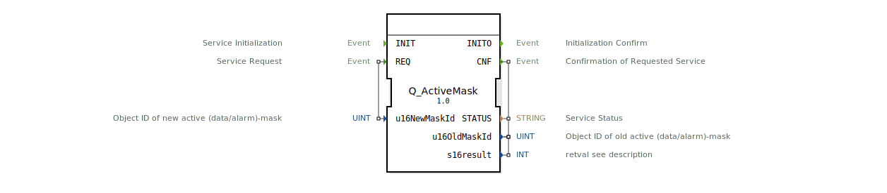

# Q_ActiveMask

* * * * * * * * * *

## Einleitung
Der **Q_ActiveMask** ist ein standardkonformer Funktionsbaustein zur Steuerung aktiver Masken in Virtual Terminals, entwickelt unter EPL-2.0 Lizenz. Die Version 1.0 implementiert die ISO 11783-6 (Teil 6 - F.34) Spezifikation für landwirtschaftliche Steuersysteme.

## Schnittstellenstruktur

### **Ereignis-Eingänge**
- `INIT`: Initialisierungsanforderung
- `REQ`: Maskenwechsel-Anforderung (mit Parametern)

### **Ereignis-Ausgänge**
- `INITO`: Initialisierungsbestätigung
- `CNF`: Maskenwechsel-Bestätigung (mit Ergebnisdaten)

### **Daten-Eingänge**
- `u16NewMaskId` (UINT): Objekt-ID der neuen Maske

!!! note "WorkingSet Object ID fest auf 0"
    Der **WorkingSet Object ID** (`u16WorkSetId`) ist **fest auf 0 gesetzt** durch die Autoren von [logiBUS®](https://www.logibus.tech/). Der Benutzer muss sicherstellen, dass das WorkingSet-Objekt im Objektpool immer Object ID 0 hat. Dies ist die Standardeinstellung in den meisten Tools:

    - [ISO-Designer](https://www.bucherautomation.com/iso-designer/sw10133) von Bucher Automation AG
    - [Isobus Studio](https://isobus-studio.com/) von [to-the-future / Tobias Tenberg](https://www.to-the-future.de/)

    Da das Workingset ein einzelnes Objekt ist und nur 1x existiert, stellt diese Einschränkung kein Problem dar.

### **Daten-Ausgänge**
- `STATUS` (STRING): Betriebsstatusmeldung
- `u16OldMaskId` (UINT): Objekt-ID der vorherigen Maske
- `s16result` (INT): ISO-konformer Ergebniscode

## Funktionsweise

1. **Initialisierung**:
   - `INIT`-Event startet den Baustein
   - `INITO` bestätigt erfolgreiches Setup

2. **Maskenwechsel**:
   - `REQ` mit neuen Maskenparametern auslösen
   - `CNF` liefert Ergebnis und vorherige Masken-ID

3. **Fehlerbehandlung**:
   - ISO-standardisierte Fehlercodes
   - Detaillierte Statusmeldungen

## Technische Besonderheiten

✔ **ISO 11783-6 konform** (F.34)
✔ **Deterministisches** Verhalten
✔ **Multi-Client-fähige** Architektur
✔ **Echtzeitfähige** Ausführung

## Rückgabecodes (s16result)

| Code | Konstante | Bedeutung |
|------|-----------|-----------|
| 0 | VT_E_NO_ERR | Erfolgreich |
| -6 | VT_E_OVERFLOW | Pufferüberlauf |
| -8 | VT_E_NOACT | Ungültiger Zustand |
| -21 | VT_E_NO_INSTANCE | Keine VT-Instanz |

## Anwendungsszenarien

- **Traktorsteuerungen**: Arbeitsmodus-Umschaltung
- **Erntemonitoring**: Datenerfassungsmasken
- **Diagnosesysteme**: Fehleranzeigemasken
- **Multi-Terminal-Betrieb**: Synchronisierte Anzeigen

## ⚖️ Vergleich mit ähnlichen Bausteinen

| Feature        | Q_ActiveMask | VtMaskManager | VtDynamicDisplay |
|---------------|--------------|---------------|------------------|
| ISO-Standard  | ✔            | ✖             | ✖                |
| Fehlercodes   | Standard     | Hersteller    | Teilweise        |
| Zustandsverwaltung | Voll | Basis       | Erweitert        |

## 🛠️ Zugehörige Übungen

* [Uebung_019](../../../../../Uebungen/test_B/Uebungen_doc/Uebung_019.md)
* [Uebung_019a](../../../../../Uebungen/test_B/Uebungen_doc/Uebung_019a.md)
* [Uebung_019b](../../../../../Uebungen/test_B/Uebungen_doc/Uebung_019b.md)
* [Uebung_019c](../../../../../Uebungen/test_B/Uebungen_doc/Uebung_019c.md)

## Fazit

Der Q_ActiveMask-Baustein bietet die Referenzimplementierung für ISOBUS-Maskenwechsel:

- **Standardkonform**: Volle ISO 11783-6 Kompatibilität
- **Robust**: Bewährte Technik in Serienprodukten
- **Flexibel**: Unterstützt komplexe Anzeigeszenarien

Essentiell für:
- Hersteller von ISOBUS-Terminals
- Entwickler landwirtschaftlicher Steuergeräte
- Systemintegratoren in der Agrartechnik