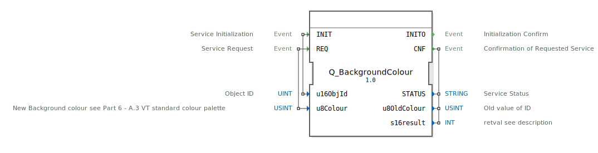

# Q_BackgroundColour

```{index} single: Q_BackgroundColour
```


* * * * * * * * * *

## Einleitung
Der **Q_BackgroundColour** ist ein standardkonformer Funktionsbaustein zur Steuerung von Hintergrundfarben in Virtual Terminals, entwickelt unter EPL-2.0 Lizenz. Die Version 1.0 implementiert die ISO 11783-6 (Teil 6 - F.20) Spezifikation für landwirtschaftliche Steuersysteme.



## Schnittstellenstruktur

### **Ereignis-Eingänge**
- `INIT`: Initialisierungsanforderung (mit Objekt-ID)
- `REQ`: Farbänderungs-Anforderung (mit Farbcode)

### **Ereignis-Ausgänge**
- `INITO`: Initialisierungsbestätigung
- `CNF`: Änderungsbestätigung (mit Ergebnisdaten)

### **Daten-Eingänge**
- `u16ObjId` (UINT): Objektkennung
- `u8Colour` (USINT): Neuer Farbwert (ISO 11783-6 Palette)

### **Daten-Ausgänge**
- `STATUS` (STRING): Betriebsstatusmeldung
- `u8OldColour` (USINT): Vorheriger Farbwert
- `s16result` (INT): ISO-konformer Ergebniscode

## Funktionsweise

1. **Initialisierung**:
   - `INIT` mit Objekt-ID
   - `INITO` bestätigt Betriebsbereitschaft

2. **Farbänderung**:
   - `REQ` mit neuem Farbcode (0-255) auslösen
   - `CNF` liefert Ergebnis und alten Farbwert

3. **Fehlerbehandlung**:
   - ISO-standardisierte Fehlercodes
   - Detaillierte Statusmeldungen

## Technische Besonderheiten

✔ **ISO 11783-6 konform** (F.20 + A.3 Farbpalette)
✔ **8-bit Farbunterstützung** (256 Werte)
✔ **Echtzeitfähige** Verarbeitung
✔ **Zustandserhaltung** (u8OldColour)

## Standardfarbpalette (Auszug)

| Code | Farbe       | RGB-Äquivalent |
|------|-------------|----------------|
| 0    | Schwarz     | #000000        |
| 1    | Rot         | #FF0000        |
| 2    | Grün        | #00FF00        |
| 3    | Gelb        | #FFFF00        |
| 4    | Blau        | #0000FF        |

## Rückgabecodes (s16result)

| Code | Konstante               | Bedeutung                          |
|------|-------------------------|------------------------------------|
| 0    | VT_E_NO_ERR             | Erfolgreich                       |
| -6   | VT_E_OVERFLOW           | Pufferüberlauf                    |
| -8   | VT_E_NOACT              | Ungültiger Zustand                |
| -128 | VT_E_HANDLE_INVALID     | Ungültige Objekt-ID               |

## Anwendungsszenarien

- **Maschinenstatus**: Farbliche Alarmanzeige
- **Nachtmodus**: Dunkle Farbpaletten
- **Markierungen**: Hervorhebung von Objekten
- **Branding**: Hersteller-spezifische Farben

## ⚖️ Vergleich mit ähnlichen Bausteinen

| Feature        | Q_BackgroundColour | VtColourManager | VtDynamicStyle |
|---------------|--------------------|-----------------|----------------|
| ISO-Standard  | ✔                  | ✖               | ✖              |
| Farbpalette   | Standard           | Erweitert       | Benutzerdef.   |
| Objektbindung | Explizit           | Implizit        | Stylesheet     |


## 🛠️ Zugehörige Übungen

* [Uebung_016](../../../../../training1/Ventilsteuerung/4diacIDE-workspace/test_B/Uebungen_doc/Uebung_016.md)
* [Uebung_016a](../../../../../training1/Ventilsteuerung/4diacIDE-workspace/test_B/Uebungen_doc/Uebung_016a.md)

## Fazit

Der Q_BackgroundColour-Baustein bietet die Referenzimplementierung für ISOBUS-Farbsteuerung:

- **Standardkonform**: Volle ISO 11783-6 Kompatibilität
- **Einfache Integration**: Klare Farbpalettendefinition
- **Robust**: Bewährte Feldtauglichkeit

Essentiell für:
- Farbliche Statusanzeigen
- Benutzeroberflächen-Design
- Dynamische Visualisierungen