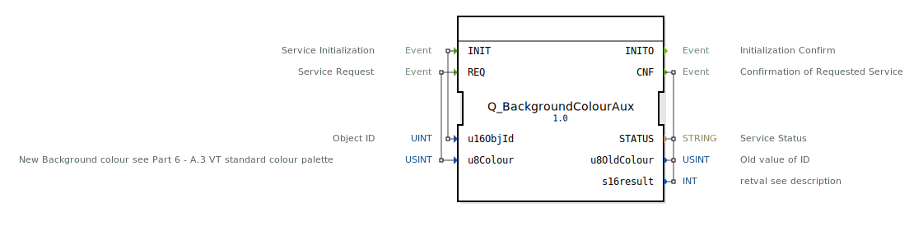

# Q_BackgroundColourAux

```{index} single: Q_BackgroundColourAux
```


* * * * * * * * * *

## Einleitung
Der **Q_BackgroundColourAux** ist ein standardkonformer Funktionsbaustein zur Steuerung von sekundären Hintergrundfarben in Virtual Terminals, entwickelt unter EPL-2.0 Lizenz. Die Version 1.0 implementiert die ISO 11783-6 (Teil 6 - F.20) Spezifikation für Hilfsfarben in landwirtschaftlichen Steuersystemen.



## Schnittstellenstruktur

### **Ereignis-Eingänge**
- `INIT`: Initialisierungsanforderung (mit Objekt-ID)
- `REQ`: Farbänderungs-Anforderung (mit Farbcode)

### **Ereignis-Ausgänge**
- `INITO`: Initialisierungsbestätigung
- `CNF`: Änderungsbestätigung (mit Ergebnisdaten)

### **Daten-Eingänge**
- `u16ObjId` (UINT): Objektkennung
- `u8Colour` (USINT): Neuer Hilfsfarbwert (ISO 11783-6 Palette)

### **Daten-Ausgänge**
- `STATUS` (STRING): Betriebsstatusmeldung
- `u8OldColour` (USINT): Vorheriger Hilfsfarbwert
- `s16result` (INT): ISO-konformer Ergebniscode

## Funktionsweise

1. **Initialisierung**:
   - `INIT` mit Objekt-ID für Hilfselement
   - `INITO` bestätigt Betriebsbereitschaft

2. **Farbänderung**:
   - `REQ` mit neuem Hilfsfarbcode (0-255) auslösen
   - `CNF` liefert Ergebnis und alten Farbwert

3. **Fehlerbehandlung**:
   - ISO-standardisierte Fehlercodes
   - Detaillierte Statusmeldungen

## Technische Besonderheiten

✔ **ISO 11783-6 konform** (F.20 für Hilfsfarben)
✔ **8-bit Farbunterstützung** (256 Werte)
✔ **Kompatibel mit Q_BackgroundColour**
✔ **Zustandserhaltung** (u8OldColour)

## Standard-Hilfsfarben (Auszug)

| Code | Anwendungsbereich      | Typische Farbe  |
|------|------------------------|-----------------|
| 16   | Statusbalken           | Blau            |
| 32   | Sekundärbereiche       | Grau            |
| 48   | Hilfslinien            | Hellblau        |

## Rückgabecodes (s16result)

| Code | Konstante               | Bedeutung                          |
|------|-------------------------|------------------------------------|
| 0    | VT_E_NO_ERR             | Erfolgreich                       |
| -128 | VT_E_HANDLE_INVALID     | Ungültige Objekt-ID               |
| -129 | VT_E_ISO_INSTANCE_INVALID | Ungültige Instanz                |

## Anwendungsszenarien

- **Statusanzeigen**: Sekundärfarben für Balken
- **Gruppierungen**: Farbliche Abgrenzung von Bereichen
- **Editor-Modi**: Hilfslinien in Konfiguratoren
- **Diagnose**: Zusatzinformationen

## ⚖️ Vergleich mit ähnlichen Bausteinen

| Feature        | Q_BackgroundColourAux | Q_BackgroundColour | VtAuxColour |
|---------------|-----------------------|--------------------|-------------|
| ISO-Standard  | ✔                     | ✔                  | ✖           |
| Farbbereich   | Hilfselemente         | Hauptelemente      | Alle        |
| Verwendung    | Sekundär              | Primär             | Universell  |

## Fazit

Der Q_BackgroundColourAux-Baustein ergänzt die ISOBUS-Farbsteuerung für Hilfselemente:

- **Spezialisiert**: Optimiert für sekundäre Anzeigeelemente
- **Konsistent**: Gleiche API wie Q_BackgroundColour
- **Praxisbewährt**: Eingesetzt in modernen Traktor-Displays

Idealer Einsatz bei:
- Komplexen Anzeigelayouts
- Mehrschichtigen Visualisierungen
- Systemen mit erweitertem Farbmanagement