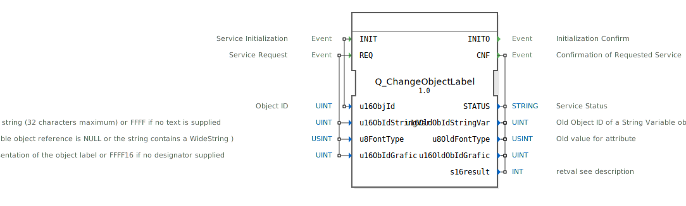

# Q_ChangeObjectLabel

```{index} single: Q_ChangeObjectLabel
```


* * * * * * * * * *

## Einleitung
Der **Q_ChangeObjectLabel** ist ein standardkonformer Funktionsbaustein zur Änderung von Objektbeschriftungen in Virtual Terminals, entwickelt unter EPL-2.0 Lizenz. Die Version 1.0 implementiert die ISO 11783-6 (Teil 6 - F.50) Spezifikation für landwirtschaftliche Steuersysteme.



## Schnittstellenstruktur

### **Ereignis-Eingänge**
- `INIT`: Initialisierungsanforderung (mit Objekt-ID)
- `REQ`: Beschriftungsänderungs-Anforderung (mit Text/Grafik-Parametern)

### **Ereignis-Ausgänge**
- `INITO`: Initialisierungsbestätigung
- `CNF`: Änderungsbestätigung (mit Ergebnisdaten)

### **Daten-Eingänge**
- `u16ObjId` (UINT): Zielobjekt-Kennung
- `u16ObIdStringVar` (UINT): Textvariablen-Objekt-ID (max. 32 Zeichen)
- `u8FontType` (USINT): Schriftart (bei Textbeschriftung)
- `u16ObIdGrafic` (UINT): Grafikobjekt-ID (für Symbolbeschriftung)

### **Daten-Ausgänge**
- `STATUS` (STRING): Betriebsstatusmeldung
- `u16OldObIdStringVar` (UINT): Vorherige Textvariablen-ID
- `u8OldFontType` (USINT): Vorherige Schriftart
- `u16OldObIdGrafic` (UINT): Vorherige Grafikobjekt-ID
- `s16result` (INT): ISO-konformer Ergebniscode

## Funktionsweise

1. **Initialisierung**:
   - `INIT` mit Zielobjekt-ID
   - `INITO` bestätigt Betriebsbereitschaft

2. **Beschriftungsänderung**:
   - `REQ` mit neuen Beschriftungsparametern
   - Unterstützt Text (mit Schriftart) oder Grafiksymbole
   - `CNF` liefert Ergebnis und alte Werte

3. **Fehlerbehandlung**:
   - ISO-standardisierte Fehlercodes
   - Detaillierte Statusmeldungen

## Technische Besonderheiten

✔ **ISO 11783-6 konform** (F.50)
✔ **Flexible Beschriftung**: Text oder Grafik
✔ **Schriftart-Steuerung** (8-bit)
✔ **32-Zeichen Limit** für Textbeschriftungen

## Standardparameter

| Parameter          | NULL-Wert | Beschreibung               |
|--------------------|-----------|----------------------------|
| u16ObIdStringVar   | 0xFFFF    | Kein Text                  |
| u16ObIdGrafic      | 0xFFFF    | Keine Grafik               |

## Rückgabecodes (s16result)

| Code | Konstante               | Bedeutung                          |
|------|-------------------------|------------------------------------|
| 0    | VT_E_NO_ERR             | Erfolgreich                       |
| -6   | VT_E_OVERFLOW           | Pufferüberlauf (Text zu lang)     |
| -128 | VT_E_HANDLE_INVALID     | Ungültige Objekt-ID               |

## Anwendungsszenarien

- **Maschinensteuerung**: Dynamische Schaltflächenbeschriftung
- **Sprachumschaltung**: Mehrsprachige Oberflächen
- **Statusanzeigen**: Symbolwechsel bei Alarmen
- **Personalisierung**: Benutzerdefinierte Labels

## Vergleich mit ähnlichen Bausteinen

| Feature        | Q_ChangeObjectLabel | VtDynamicLabel | VtTextManager |
|---------------|---------------------|----------------|---------------|
| ISO-Standard  | ✔                   | ✖              | ✖             |
| Beschriftung  | Text + Grafik       | Nur Text       | Nur Text      |
| Schriftart    | Steuerbar           | Fest           | Teilweise     |

## Fazit

Der Q_ChangeObjectLabel-Baustein bietet die Referenzimplementierung für ISOBUS-Beschriftungen:

- **Vielseitig**: Kombination von Text und Grafiken
- **Standardkonform**: Volle ISO 11783-6 Kompatibilität
- **Praxisbewährt**: Eingesetzt in modernen Agrarmaschinen

Unverzichtbar für:
- Adaptive Benutzeroberflächen
- Mehrsprachige Systeme
- Symbolgesteuerte Bedienkonzepte