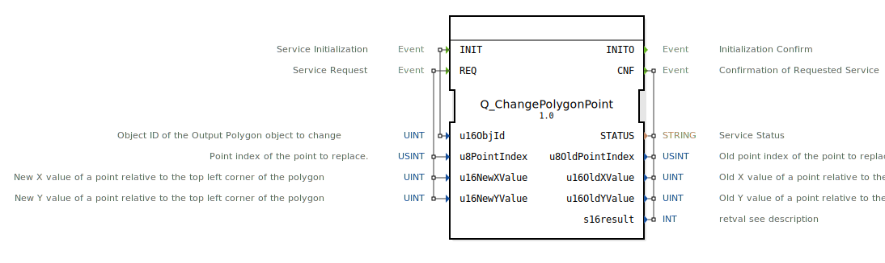

# Q_ChangePolygonPoint

```{index} single: Q_ChangePolygonPoint
```


* * * * * * * * * *

## Einleitung
Der **Q_ChangePolygonPoint** ist ein standardkonformer Funktionsbaustein zur Modifikation von Polygonpunkten in Virtual Terminals, entwickelt unter EPL-2.0 Lizenz. Die Version 1.0 implementiert die ISO 11783-6 (Teil 6 - F.52) Spezifikation für landwirtschaftliche Steuersysteme.



## Schnittstellenstruktur

### **Ereignis-Eingänge**
- `INIT`: Initialisierungsanforderung (mit Polygon-Objekt-ID)
- `REQ`: Punktänderungs-Anforderung (mit Index und Koordinaten)

### **Ereignis-Ausgänge**
- `INITO`: Initialisierungsbestätigung
- `CNF`: Änderungsbestätigung (mit Ergebnisdaten)

### **Daten-Eingänge**
- `u16ObjId` (UINT): Polygon-Objekt-ID
- `u8PointIndex` (USINT): Punktindex (0-basiert)
- `u16NewXValue` (UINT): Neue X-Koordinate (relativ)
- `u16NewYValue` (UINT): Neue Y-Koordinate (relativ)

### **Daten-Ausgänge**
- `STATUS` (STRING): Betriebsstatusmeldung
- `u8OldPointIndex` (USINT): Vorheriger Punktindex
- `u16OldXValue` (UINT): Vorherige X-Koordinate
- `u16OldYValue` (UINT): Vorherige Y-Koordinate
- `s16result` (INT): ISO-konformer Ergebniscode

## Funktionsweise

1. **Initialisierung**:
   - `INIT` mit Polygon-Objekt-ID
   - `INITO` bestätigt Betriebsbereitschaft

2. **Punktänderung**:
   - `REQ` mit Index und neuen Koordinaten
   - Koordinaten relativ zur linken oberen Ecke
   - `CNF` liefert Ergebnis und alte Werte

3. **Fehlerbehandlung**:
   - ISO-standardisierte Fehlercodes
   - Detaillierte Statusmeldungen

## Technische Besonderheiten

✔ **ISO 11783-6 konform** (F.52)
✔ **Präzise Koordinatensteuerung** (16-bit)
✔ **Indexbasierter Zugriff** (0-255 Punkte)
✔ **Echtzeitfähige** Verarbeitung

## Koordinatenbereich

| Parameter | Bereich     | Beschreibung               |
|-----------|------------|----------------------------|
| X-Wert    | 0 - 65535  | Horizontale Position (px)  |
| Y-Wert    | 0 - 65535  | Vertikale Position (px)    |

## Rückgabecodes (s16result)

| Code | Konstante               | Bedeutung                          |
|------|-------------------------|------------------------------------|
| 0    | VT_E_NO_ERR             | Erfolgreich                       |
| -6   | VT_E_OVERFLOW           | Ungültiger Punktindex             |
| -128 | VT_E_HANDLE_INVALID     | Ungültige Polygon-ID              |

## Anwendungsszenarien

- **Maschinenvisualisierung**: Anpassung von Konturen
- **Kartendarstellung**: Dynamische Polygonverformung
- **Diagnoseanzeigen**: Geometrische Hervorhebungen
- **Animierte Elemente**: Bewegte Polygonformen

## Vergleich mit ähnlichen Bausteinen

| Feature        | Q_ChangePolygonPoint | VtGeometryEditor | VtDynamicShape |
|---------------|----------------------|------------------|----------------|
| ISO-Standard  | ✔                    | ✖                | ✖              |
| Genauigkeit   | 16-bit Koordinaten   | 8-bit            | 16-bit         |
| Punktanzahl   | Bis zu 255           | Unbegrenzt       | Begrenzt       |

## Fazit

Der Q_ChangePolygonPoint-Baustein bietet die Referenzimplementierung für dynamische Polygonveränderungen:

- **Präzise**: Millimeter-genaue Positionskontrolle
- **Leistungsstark**: Echtzeitfähige Verarbeitung
- **Standardkonform**: Volle ISO 11783-6 Kompatibilität

Essentiell für:
- Adaptive Geometriedarstellungen
- Technische Zeichnungen
- Interaktive Kartenanwendungen