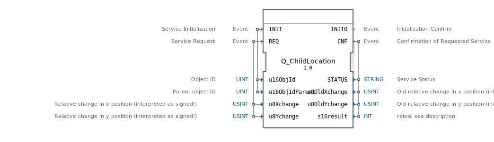

# Q_ChildLocation

```{index} single: Q_ChildLocation
```


* * * * * * * * * *

## Einleitung
Der **Q_ChildLocation** ist ein standardkonformer Funktionsbaustein zur Positionsänderung von Child-Objekten in Virtual Terminals, entwickelt unter EPL-2.0 Lizenz. Die Version 1.0 implementiert die ISO 11783-6 (Teil 6 - F.14) Spezifikation für landwirtschaftliche Steuersysteme.



## Schnittstellenstruktur

### **Ereignis-Eingänge**
- `INIT`: Initialisierungsanforderung (mit Objekt- und Parent-ID)
- `REQ`: Positionsänderungs-Anforderung (mit relativen Koordinaten)

### **Ereignis-Ausgänge**
- `INITO`: Initialisierungsbestätigung
- `CNF`: Änderungsbestätigung (mit Ergebnisdaten)

### **Daten-Eingänge**
- `u16ObjId` (UINT): Child-Objekt-ID
- `u16ObjIdParent` (UINT): Parent-Objekt-ID
- `u8Xchange` (USINT): Relative X-Positionsänderung (-128 bis +127)
- `u8Ychange` (USINT): Relative Y-Positionsänderung (-128 bis +127)

### **Daten-Ausgänge**
- `STATUS` (STRING): Betriebsstatusmeldung
- `u8OldXchange` (USINT): Vorherige X-Änderung
- `u8OldYchange` (USINT): Vorherige Y-Änderung
- `s16result` (INT): ISO-konformer Ergebniscode

## Funktionsweise

1. **Initialisierung**:
   - `INIT` mit Child- und Parent-Objekt-ID
   - `INITO` bestätigt Betriebsbereitschaft

2. **Positionsänderung**:
   - `REQ` mit relativen Koordinatenänderungen
   - Werte werden als signed 8-bit interpretiert
   - `CNF` liefert Ergebnis und alte Werte

3. **Fehlerbehandlung**:
   - ISO-standardisierte Fehlercodes
   - Detaillierte Statusmeldungen

## Technische Besonderheiten

✔ **ISO 11783-6 konform** (F.14)
✔ **Relative Positionsänderung** (relativ zum Parent)
✔ **Signed 8-bit Werte** (-128 bis +127)
✔ **Echtzeitfähige** Verarbeitung

## Positionsänderungsbereich

| Parameter | Bereich     | Beschreibung               |
|-----------|------------|----------------------------|
| X-Änderung| -128 - +127| Horizontale Verschiebung   |
| Y-Änderung| -128 - +127| Vertikale Verschiebung     |

## Rückgabecodes (s16result)

| Code | Konstante               | Bedeutung                          |
|------|-------------------------|------------------------------------|
| 0    | VT_E_NO_ERR             | Erfolgreich                       |
| -6   | VT_E_OVERFLOW           | Ungültige Positionswerte          |
| -128 | VT_E_HANDLE_INVALID     | Ungültige Objekt-ID               |

## Anwendungsszenarien

- **Dynamische Layouts**: Objektpositionierung
- **Animierte Elemente**: Sanfte Bewegungen
- **Responsive Designs**: Anpassung an verschiedene Bildschirmgrößen
- **Gruppierte Objekte**: Gemeinsame Bewegungen

## ⚖️ Vergleich mit ähnlichen Bausteinen

| Feature        | Q_ChildLocation | VtAbsolutePosition | VtGroupMove |
|---------------|-----------------|--------------------|-------------|
| ISO-Standard  | ✔               | ✖                  | ✖           |
| Bewegung      | Relativ         | Absolut            | Gruppen     |
| Wertebereich  | ±127 Pixel      | 0-65535 Pixel      | ±127 Pixel  |

## Fazit

Der Q_ChildLocation-Baustein bietet die Referenzimplementierung für relative Positionsänderungen:

- **Flexibel**: Einfache relative Positionierung
- **Präzise**: Pixelgenaue Steuerung
- **Standardkonform**: Volle ISO 11783-6 Kompatibilität

Idealer Einsatz bei:
- Dynamischen Oberflächen
- Animierten Übergängen
- Parent-Child-Objektbeziehungen