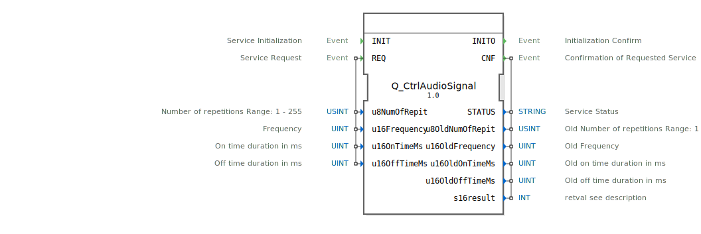

# Q_CtrlAudioSignal

```{index} single: Q_CtrlAudioSignal
```


* * * * * * * * * *

## Einleitung
Der **Q_CtrlAudioSignal** ist ein standardkonformer Funktionsbaustein zur Steuerung von Audiogeräten in Virtual Terminals, entwickelt unter EPL-2.0 Lizenz. Die Version 1.0 implementiert die ISO 11783-6 (Teil 6 - F.10) Spezifikation für landwirtschaftliche Steuersysteme.



## Schnittstellenstruktur

### **Ereignis-Eingänge**
- `INIT`: Initialisierungsanforderung
- `REQ`: Audiosteuerungs-Anforderung (mit Signalparametern)

### **Ereignis-Ausgänge**
- `INITO`: Initialisierungsbestätigung
- `CNF`: Steuerungsbestätigung (mit Ergebnisdaten)

### **Daten-Eingänge**
- `u8NumOfRepit` (USINT): Wiederholungen (1-255)
- `u16Frequency` (UINT): Frequenz in Hz
- `u16OnTimeMs` (UINT): Einschaltdauer in ms
- `u16OffTimeMs` (UINT): Ausschaltdauer in ms

### **Daten-Ausgänge**
- `STATUS` (STRING): Betriebsstatusmeldung
- `u8OldNumOfRepit` (USINT): Vorherige Wiederholungen
- `u16OldFrequency` (UINT): Vorherige Frequenz
- `u16OldOnTimeMs` (UINT): Vorherige Einschaltdauer
- `u16OldOffTimeMs` (UINT): Vorherige Ausschaltdauer
- `s16result` (INT): ISO-konformer Ergebniscode

## Funktionsweise

1. **Initialisierung**:
   - `INIT` ohne Parameter
   - `INITO` bestätigt Betriebsbereitschaft

2. **Audiosteuerung**:
   - `REQ` mit Signalparametern auslösen
   - Erzeugt Ton mit konfigurierbarem Muster
   - `CNF` liefert Ergebnis und alte Werte

3. **Fehlerbehandlung**:
   - ISO-standardisierte Fehlercodes
   - Detaillierte Statusmeldungen

## Technische Besonderheiten

✔ **ISO 11783-6 konform** (F.10)
✔ **Flexible Signalsteuerung**: Frequenz, Dauer, Wiederholungen
✔ **16-bit Zeitauflösung** (0-65535 ms)
✔ **255 Wiederholungen** maximal

## Standardparameterbereiche

| Parameter       | Bereich     | Typischer Wert |
|-----------------|------------|----------------|
| Frequenz        | 0-65535 Hz | 2000 Hz        |
| Einschaltdauer  | 0-65535 ms | 200 ms         |
| Ausschaltdauer  | 0-65535 ms | 100 ms         |
| Wiederholungen  | 1-255      | 3              |

## Rückgabecodes (s16result)

| Code | Konstante               | Bedeutung                          |
|------|-------------------------|------------------------------------|
| 0    | VT_E_NO_ERR             | Erfolgreich                       |
| -6   | VT_E_OVERFLOW           | Ungültige Parameterwerte          |
| -8   | VT_E_NOACT              | VT im falschen Zustand            |
| -128 | VT_E_HANDLE_INVALID     | Ungültige Audio-Konfiguration     |

## Anwendungsszenarien

- **Warnsignale**: Akustische Alarmmeldungen
- **Bestätigungstöne**: Bedienfeedback
- **Sprachansagen**: Voraufgezeichnete Meldungen
- **Maschinenstatus**: Akustische Statusindikatoren

## Vergleich mit ähnlichen Bausteinen

| Feature        | Q_CtrlAudioSignal | VtSoundManager | VtAudioAlert |
|---------------|-------------------|----------------|--------------|
| ISO-Standard  | ✔                 | ✖              | ✖            |
| Parametrierung| Vollständig       | Teilweise      | Einfach      |
| Frequenzkontrolle | Ja           | Nein           | Nein         |


## Zugehörige Übungen

* [Uebung_017](../../../../../training1/Ventilsteuerung/4diacIDE-workspace/test_B/Uebungen_doc/Uebung_017.md)
* [Uebung_018](../../../../../training1/Ventilsteuerung/4diacIDE-workspace/test_B/Uebungen_doc/Uebung_018.md)
* [Uebung_018a](../../../../../training1/Ventilsteuerung/4diacIDE-workspace/test_B/Uebungen_doc/Uebung_018a.md)

## Fazit

Der Q_CtrlAudioSignal-Baustein bietet die Referenzimplementierung für VT-Audiosteuerung:

- **Flexibel**: Voll parametrierbare Tonsignale
- **Standardkonform**: Volle ISO 11783-6 Kompatibilität
- **Robust**: Bewährte Technik in Feldgeräten

Unverzichtbar für:
- Sicherheitskritische Warnsignale
- Benutzerfreundliche akustische Rückmeldungen
- Maschinen mit komplexen Audiostatusmeldungen