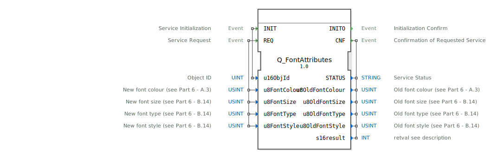

# Q_FontAttributes

```{index} single: Q_FontAttributes
```


* * * * * * * * * *

## Einleitung
Der **Q_FontAttributes** ist ein standardkonformer Funktionsbaustein zur Änderung von Schriftattributen in Virtual Terminals, entwickelt unter EPL-2.0 Lizenz. Die Version 1.0 implementiert die ISO 11783-6 (Teil 6 - F.28) Spezifikation für VT-Systeme.



## Schnittstellenstruktur

### **Ereignis-Eingänge**
- `INIT`: Initialisierungsanforderung (mit Objekt-ID)
- `REQ`: Attributänderungs-Anforderung (mit neuen Schriftattributen)

### **Ereignis-Ausgänge**
- `INITO`: Initialisierungsbestätigung
- `CNF`: Änderungsbestätigung (mit Status und alten Attributen)

### **Daten-Eingänge**
- `u16ObjId` (UINT): Objekt-ID (16-bit)
- `u8FontColour` (USINT): Neue Schriftfarbe
- `u8FontSize` (USINT): Neue Schriftgröße
- `u8FontType` (USINT): Neue Schriftart
- `u8FontStyle` (USINT): Neuer Schriftstil

### **Daten-Ausgänge**
- `STATUS` (STRING): Betriebsstatusmeldung
- `u8OldFontColour` (USINT): Alte Schriftfarbe
- `u8OldFontSize` (USINT): Alte Schriftgröße
- `u8OldFontType` (USINT): Alte Schriftart
- `u8OldFontStyle` (USINT): Alter Schriftstil
- `s16result` (INT): ISO-konformer Ergebniscode

## Funktionsweise

1. **Initialisierung**:
   - `INIT` mit Objekt-ID
   - `INITO` bestätigt Betriebsbereitschaft

2. **Attributänderung**:
   - `REQ` mit neuen Schriftattributen
   - Ändert Schrifteigenschaften des Objekts
   - `CNF` liefert Ergebnisstatus und vorherige Werte

3. **Fehlerbehandlung**:
   - ISO-standardisierte Fehlercodes
   - Detaillierte Statusmeldungen

## Technische Besonderheiten

✔ **ISO 11783-6 konform** (F.28)
✔ **Umfassende Schriftsteuerung** (Farbe, Größe, Art, Stil)
✔ **Rückmeldung alter Werte** für Reversionsmöglichkeit
✔ **Transaktionssicher** (Atomare Ausführung)

## Attribut-Eigenschaften

| Feature        | Beschreibung                     |
|---------------|----------------------------------|
| Farbpalette   | 8-bit Farbindex (ISO 11783-6 A.3)|
| Größen        | Standardisierte Schriftgrößen    |
| Schriftarten  | Vordefinierte Typen              |
| Stile         | Bitfeld für Fett/Kursiv/Unterstrichen |

## Rückgabecodes (s16result)

| Code | Konstante               | Bedeutung                          |
|------|-------------------------|------------------------------------|
| 0    | VT_E_NO_ERR             | Erfolgreiche Änderung             |
| -6   | VT_E_OVERFLOW           | Pufferüberlauf                   |
| -8   | VT_E_NOACT              | VT nicht bereit                   |
| -21  | VT_E_NO_INSTANCE        | Kein VT-Client verfügbar          |
| -129 | VT_E_ISO_INSTANCE_INVALID | Ungültige VT-Instanz             |
| -130 | VT_E_NOT_ALIVE          | VT nicht aktiv                    |

## Anwendungsszenarien

- **Textdarstellung**: Dynamische Schriftanpassungen
- **Warnhinweise**: Farbliche Hervorhebungen
- **Benutzeroberflächen**: Stilwechsel
- **Barrierefreiheit**: Schriftvergrößerungen

## Vergleich mit ähnlichen Bausteinen

| Feature        | Q_FontAttributes | VtTextStyle | VtFontManager |
|---------------|------------------|-------------|---------------|
| ISO-Standard  | ✔                | ✖           | ✖             |
| Farbsteuerung | ✔                | ✔           | ✖             |
| Größensteuerung | ✔              | ✖           | ✔             |
| Stilsteuerung | ✔                | ✔           | ✔             |

## Fazit

Der Q_FontAttributes-Baustein bietet die Standardimplementierung für Schriftattributänderungen:

- **Vielseitig**: Komplette Kontrolle über Schrifteigenschaften
- **Rückverfolgbar**: Rückmeldung vorheriger Werte
- **Robust**: ISO-konforme Fehlerbehandlung

Unverzichtbar für:
- Dynamische Textdarstellungen
- Barrierefreie Anwendungen
- Designflexible VT-Oberflächen