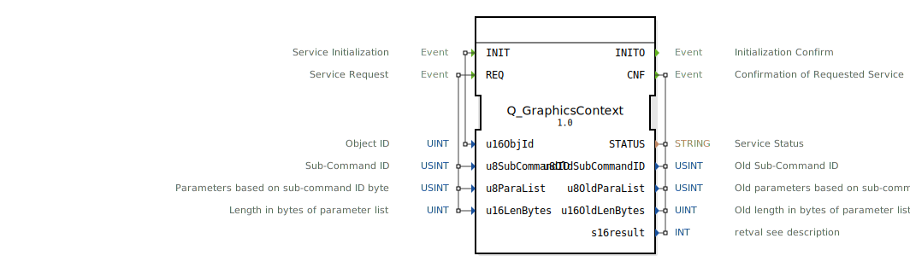

# Q_GraphicsContext

```{index} single: Q_GraphicsContext
```


* * * * * * * * * *

## Einleitung
Der **Q_GraphicsContext** ist ein standardkonformer Funktionsbaustein zur Steuerung von Grafik-Kontextobjekten in Virtual Terminals, entwickelt unter EPL-2.0 Lizenz. Die Version 1.0 implementiert die ISO 11783-6 (Teil 6 - F.56) Spezifikation für VT-Systeme ab Version 4.



## Schnittstellenstruktur

### **Ereignis-Eingänge**
- `INIT`: Initialisierungsanforderung (mit Objekt-ID)
- `REQ`: Konfigurationsanforderung (mit Sub-Command und Parametern)

### **Ereignis-Ausgänge**
- `INITO`: Initialisierungsbestätigung
- `CNF`: Konfigurationsbestätigung (mit Status und vorherigen Werten)

### **Daten-Eingänge**
- `u16ObjId` (UINT): Grafik-Kontext Objekt-ID (16-bit)
- `u8SubCommandID` (USINT): Sub-Befehls-ID (8-bit)
- `u8ParaList` (USINT[5]): Parameterliste (5 Byte Array)
- `u16LenBytes` (UINT): Parameterlänge in Bytes

### **Daten-Ausgänge**
- `STATUS` (STRING): Betriebsstatusmeldung
- `u8OldSubCommandID` (USINT): Vorherige Sub-Befehls-ID
- `u8OldParaList` (USINT[5]): Vorherige Parameterliste
- `u16OldLenBytes` (UINT): Vorherige Parameterlänge
- `s16result` (INT): ISO-konformer Ergebniscode

## Funktionsweise

1. **Initialisierung**:
   - `INIT` mit Grafik-Kontext Objekt-ID
   - `INITO` bestätigt Betriebsbereitschaft

2. **Konfiguration**:
   - `REQ` mit Sub-Befehls-ID und Parameterliste
   - Konfiguriert Grafik-Kontext Eigenschaften
   - `CNF` liefert Ergebnisstatus und vorherige Konfiguration

3. **Fehlerbehandlung**:
   - ISO-standardisierte Fehlercodes
   - Pufferüberlauf-Prüfung

## Technische Besonderheiten

✔ **ISO 11783-6 konform** (F.56)
✔ **Exklusiv für VT Version 4+**
✔ **Flexible Parametrisierung** (5-Byte Parameterarray)
✔ **Rückverfolgbarkeit** (Vorherige Konfiguration)

## Sub-Befehls Referenz

| ID  | Befehl               | Parameterbeschreibung           |
|-----|----------------------|---------------------------------|
| 0x01| Linienstil           | [0]=Stärke, [1]=Typ            |
| 0x02| Füllmuster           | [0]=Muster-ID                  |
| 0x03| Transparenz          | [0]=Alpha-Wert (0-255)         |
| 0x04| Clip-Bereich         | [0-3]=X,Y,W,H Koordinaten      |
| 0x05| Transformationsmatrix| [0-4]=Matrixparameter         |

## Rückgabecodes (s16result)

| Code | Konstante               | Bedeutung                          |
|------|-------------------------|------------------------------------|
| 0    | VT_E_NO_ERR             | Erfolgreiche Ausführung           |
| -6   | VT_E_OVERFLOW           | Parameterpuffer zu klein          |
| -8   | VT_E_NOACT              | VT nicht bereit                   |
| -21  | VT_E_NO_INSTANCE        | Kein VT-Client verfügbar          |
| -129 | VT_E_ISO_INSTANCE_INVALID | Ungültige VT-Instanz             |
| -130 | VT_E_NOT_ALIVE          | VT nicht aktiv                    |

## Anwendungsszenarien

- **Grafikrendering**: Linien- und Füllstile
- **Benutzeroberflächen**: Transparenzeffekte
- **Diagramme**: Clip-Bereiche für Ausschnitte
- **Animationen**: Transformationsmatrizen

## Sicherheitshinweise

⚠ **Puffergröße beachten**:
Parameterlisten dürfen nicht länger als `ISO_VTC_CMD_STR_MAX_LENGTH` sein
⚠ **Sub-Command Validierung**:
Unbekannte Befehls-IDs können zu unerwartetem Verhalten führen

## Fazit

Der Q_GraphicsContext-Baustein bietet leistungsstarke Grafiksteuerung:

- **Präzise Kontrolle**: Über alle Grafikattribute
- **Rückverfolgbar**: Vorherige Zustandsicherung
- **Performant**: Optimierte Befehlslast

Essential für:
- Hochwertige Grafikdarstellungen
- Dynamische Visualisierungen
- Komplexe Benutzeroberflächen