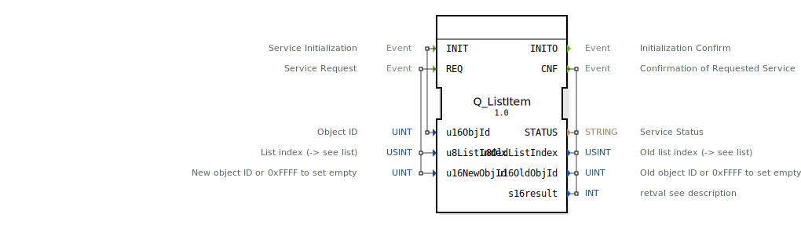

# Q_ListItem

```{index} single: Q_ListItem
```


* * * * * * * * * *

## Einleitung
Der **Q_ListItem** ist ein standardkonformer Funktionsbaustein zur Verwaltung von Listeneinträgen in Virtual Terminals, entwickelt unter EPL-2.0 Lizenz. Die Version 1.0 implementiert die ISO 11783-6 (Teil 6 - F.42) Spezifikation für Listen-Input-Objekte in VT-Systemen.



## Schnittstellenstruktur

### **Ereignis-Eingänge**
- `INIT`: Initialisierungsanforderung (mit Listen-Objekt-ID)
- `REQ`: Änderungsanforderung (mit Index und neuer Objekt-ID)

### **Ereignis-Ausgänge**
- `INITO`: Initialisierungsbestätigung
- `CNF`: Änderungsbestätigung (mit Status und vorherigen Werten)

### **Daten-Eingänge**
- `u16ObjId` (UINT): Listen-Objekt-ID (16-bit)
- `u8ListIndex` (USINT): Listenindex (0-basiert)
- `u16NewObjId` (UINT): Neue Objekt-ID oder 0xFFFF (leerer Eintrag)

### **Daten-Ausgänge**
- `STATUS` (STRING): Betriebsstatusmeldung
- `u8OldListIndex` (USINT): Vorheriger Listenindex
- `u16OldObjId` (UINT): Vorherige Objekt-ID
- `s16result` (INT): ISO-konformer Ergebniscode

## Funktionsweise

1. **Initialisierung**:
   - `INIT` mit Listen-Objekt-ID
   - `INITO` bestätigt Betriebsbereitschaft

2. **Listenänderung**:
   - `REQ` mit Index und neuer Objekt-ID
   - Aktualisiert den Listeneintrag
   - `CNF` liefert Ergebnisstatus und vorherige Werte

3. **Spezialfall**:
   - `u16NewObjId = 0xFFFF` erzeugt leeren Eintrag

## Technische Besonderheiten

✔ **ISO 11783-6 konform** (F.42)
✔ **Dynamische Listenverwaltung** (Echtzeit-Änderungen)
✔ **Rückverfolgbarkeit** (Vorherige Zustandsspeicherung)
✔ **Flexible Leerstellen** (0xFFFF-Sonderwert)

## Index-Referenz

| Index | Beschreibung               |
|-------|----------------------------|
| 0     | Erster Listeneintrag       |
| ...   |                            |
| 255   | Maximaler Index (uint8_t)  |

## Rückgabecodes (s16result)

| Code | Konstante               | Bedeutung                          |
|------|-------------------------|------------------------------------|
| 0    | VT_E_NO_ERR             | Erfolgreiche Änderung             |
| -6   | VT_E_OVERFLOW           | Pufferüberlauf                   |
| -8   | VT_E_NOACT              | VT nicht bereit                   |
| -21  | VT_E_NO_INSTANCE        | Kein VT-Client verfügbar          |
| -129 | VT_E_ISO_INSTANCE_INVALID | Ungültige VT-Instanz             |
| -130 | VT_E_NOT_ALIVE          | VT nicht aktiv                    |

## Anwendungsszenarien

- **Dynamische Menüs**: Kontextabhängige Einträge
- **Geräteauswahl**: Plug-and-Play Gerätelisten
- **Parametereinstellungen**: Auswahloptionen
- **Diagnoselisten**: Fehlercode-Verwaltung

## Vergleich mit ähnlichen Bausteinen

| Feature        | Q_ListItem | VtListManager | VtDynamicMenu |
|---------------|------------|---------------|---------------|
| ISO-Standard  | ✔          | ✖             | ✖             |
| Echtzeitänderung | ✔      | ✔             | ✖             |
| Leereinträge  | ✔          | ✖             | ✔             |
| Indexrückgabe | ✔          | ✖             | ✖             |

## Fazit

Der Q_ListItem-Baustein bietet effiziente Listenverwaltung:

- **Reaktiv**: Sofortige GUI-Aktualisierungen
- **Robust**: Integrierte Fehlerbehandlung
- **Kompatibel**: Volle ISO-Konformität

Essential für:
- Interaktive Auswahlmenüs
- Dynamische Konfiguratoren
- Adaptive Bedienoberflächen