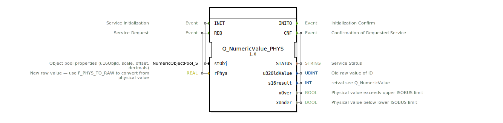

# Q_NumericValue_PHYS

## Einleitung

Der Funktionsblock `Q_NumericValue_PHYS` ist ein zusammengesetzter Baustein nach dem Standard **ISO 11783-6 (ISOBUS)**. Er dient dazu, einen numerischen Wert eines ISOBUS-Objekts durch Angabe eines physikalischen Wertes zu ändern. Die Umrechnung von physikalischen in rohe Datenwerte (Raw‑Value) erfolgt automatisch anhand der in der Objektstruktur `NumericObjectPool_S` hinterlegten Skalierung, Offset und Dezimalstellen.

Der Baustein kapselt drei Unterbausteine:
- **`F_MOVE`** – Zwischenspeicherung der Objektparameter bei Initialisierung
- **`F_PHYS_TO_RAW`** – Umrechnung physikalischer Werte in rohe Ganzzahlen (UDINT)
- **`Q_NumericValue`** – eigentliche ISOBUS‑Schreiboperation auf das numerische Objekt

## Schnittstellenstruktur

### **Ereignis-Eingänge**

| Name | Typ | Kommentar |
|------|-----|-----------|
| `INIT` | EInit | Service‑Initialisierung – lädt die Objektparameter (`stObj`) in den Baustein |
| `REQ` | Event | Service‑Anforderung – wandelt `rPhys` um und schreibt den Wert auf das ISOBUS‑Objekt |

### **Ereignis-Ausgänge**

| Name | Typ | Kommentar |
|------|-----|-----------|
| `INITO` | EInit | Bestätigung der Initialisierung |
| `CNF` | Event | Bestätigung der durchgeführten Wertänderung – enthält Ergebnisdaten |

### **Daten-Eingänge**

| Name | Typ | Kommentar |
|------|-----|-----------|
| `stObj` | `logiBUS::utils::conversion::phys::NumericObjectPool_S` | Struktur mit Objekt‑ID, Skalierung, Offset und Dezimalstellen (Initialwert: ID_NULL, 1.0, 0, 0) |
| `rPhys` | REAL | Physikalischer Wert, der gesetzt werden soll (z.B. Temperatur, Druck) |

### **Daten-Ausgänge**

| Name | Typ | Kommentar |
|------|-----|-----------|
| `STATUS` | STRING | Statusmeldung des Dienstes (z.B. Fehler‑ oder Erfolgsmeldung) |
| `u32OldValue` | UDINT | Alter Rohwert des ISOBUS‑Objekts vor der Änderung |
| `s16result` | INT | Rückgabewert der Schreiboperation (siehe `Q_NumericValue`) |
| `xOver` | BOOL | Wahr, wenn der physikalische Wert die obere Grenze des ISOBUS‑Wertebereichs überschreitet |
| `xUnder` | BOOL | Wahr, wenn der physikalische Wert die untere Grenze des ISOBUS‑Wertebereichs unterschreitet |

### **Adapter**

Keine Adapter vorhanden.

## Funktionsweise

Die Verarbeitung erfolgt in zwei getrennten Abläufen:

1. **Initialisierung (Ereignis `INIT`):**  
   - Der übergebene Parameter `stObj` wird über `F_MOVE` zwischengespeichert.  
   - Nach Abschluss wird `Q_NumericValue.INIT` getriggert, wobei die Objekt‑ID (`u16ObjId`) aus `F_MOVE.OUT` bereitgestellt wird.  
   - Die Initialisierung wird mit `INITO` quittiert.

2. **Wertänderung (Ereignis `REQ`):**  
   - Der physikalische Wert `rPhys` wird zusammen mit der gespeicherten Struktur `stObj` an `F_PHYS_TO_RAW` übergeben.  
   - `F_PHYS_TO_RAW` berechnet den Rohwert (`u32NewValue`) sowie die Grenzen‑Flags `xOver` und `xUnder`.  
   - Anschließend wird `Q_NumericValue.REQ` ausgelöst, der den berechneten Rohwert auf das ISOBUS‑Objekt schreibt.  
   - Die Ergebnisdaten (`STATUS`, `u32OldValue`, `s16result`) werden von `Q_NumericValue` übernommen und am Ausgang bereitgestellt.  
   - Den Abschluss signalisiert das Ereignis `CNF`.

## Technische Besonderheiten

- **Standardkonformität:** Der Baustein setzt die ISO 11783‑6 Spezifikation (Teil 6, Anhang F.22) um – entwickelt für landwirtschaftliche ISOBUS‑Anwendungen.
- **Berechnung der Grenzverletzung:** Die Flags `xOver` / `xUnder` werden bereits in der Umrechnungsstufe (`F_PHYS_TO_RAW`) ermittelt und parallel zum eigentlichen Schreibvorgang ausgegeben. So kann der Anwender frühzeitig erkennen, ob der angeforderte physikalische Wert außerhalb des zulässigen ISOBUS‑Wertebereichs liegt.
- **Typisierung:** Die Objekt‑ID wird als `UINT` (16‑Bit) bereitgestellt, der Rohwert als `UDINT` – dies entspricht der gängigen ISOBUS‑Konvention für numerische Attribute.
- **Wiederverwendung interner Bausteine:** Die Aufteilung in `F_PHYS_TO_RAW` und `Q_NumericValue` erlaubt eine modulare Testbarkeit und Wiederverwendbarkeit der Umrechnungslogik.

## Zustandsübersicht

Der Funktionsblock besitzt keinen expliziten Einstiegs‑Zustandsautomaten, sondern realisiert seine Funktionalität als Datenfluss‑Netzwerk. Der Ablauf ist strikt sequenziell:

- **Initialisierungsphase:**  
  `INIT` → `F_MOVE.REQ` → `F_MOVE.CNF` → `Q_NumericValue.INIT` → `Q_NumericValue.INITO` → `INITO`

- **Betriebsphase (Schreiben):**  
  `REQ` → `F_PHYS_TO_RAW.REQ` → `F_PHYS_TO_RAW.CNF` → `Q_NumericValue.REQ` → `Q_NumericValue.CNF` → `CNF`

Während der Ausführung eines Durchlaufs ist der Baustein nicht für neue Ereignisse vorbereitet – es muss das jeweilige Bestätigungssignal (`INITO` oder `CNF`) abgewartet werden.

## Anwendungsszenarien

- **Fahrzeugterminal mit ISOBUS‑Anbindung:** Einstellen von Sollwerten (z.B. Arbeitshöhe, Dosierrate) über eine Benutzereingabe in physikalischen Einheiten (m, kg/h, °C).
- **Fernsteuerung landwirtschaftlicher Geräte:** Senden physikalischer Werte von einer Steuerung an ein ISOBUS‑Gerät (z.B. Sämaschine) ohne manuelle Rohwert‑Umrechnung.
- **Automatisierte Kalibrierung:** Nachführen von Parametern während des Betriebs, wobei die Skalierung und der Offset aus einer Konfigurations‑Struktur (`NumericObjectPool_S`) stammen.

## Vergleich mit ähnlichen Bausteinen

| Baustein | Funktion | Unterschied zu `Q_NumericValue_PHYS` |
|----------|----------|--------------------------------------|
| `Q_NumericValue` (aus `isobus::UT::Q`) | Schreiben eines rohen (bereits umgerechneten) Werts | Erwartet `u32NewValue` direkt – ohne physikalische Umrechnung und ohne Grenzprüfung |
| `F_PHYS_TO_RAW` | Reine Umrechnung physikalisch → roh | Liefert nur `xOver`, `xUnder` und den Rohwert – keine ISOBUS‑Kommunikation |
| `Q_NumericValue_PHYS` | Kombinierte Umrechnung + Schreibzugriff | Bietet eine vollständige Schnittstelle für physikalische Werte in einem Schritt |

Der vorliegende Baustein vereinfacht die Anwendung, da der Anwender keinen separaten Umrechnungsschritt programmieren muss. Er eignet sich besonders für Steuerungen, die Werte in gebräuchlichen Einheiten verarbeiten.

## Fazit

`Q_NumericValue_PHYS` ist ein praxisorientierter, standardkonformer Funktionsblock für die ISOBUS‑Kommunikation. Er verbindet die Umrechnung physikalischer Werte mit dem Schreibzugriff auf numerische Objekte und reduziert so den Entwicklungsaufwand in der Landtechnik‑Automation. Durch die klare Trennung der Teilaufgaben (Speicherung, Umrechnung, Buszugriff) bleibt der Baustein wartbar und testbar. Die Ausgabe der Grenzverletzungs‑Flags ermöglicht eine robuste Fehlerbehandlung im Anwendungscode.