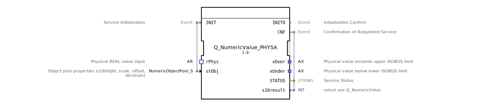

# Q_NumericValue_PHYSA

* * * * * * * * * *
## Einleitung
Der Funktionsblock `Q_NumericValue_PHYSA` dient als **Wrapper** für den Baustein `Q_NumericValue_PHYS`. Er ermöglicht das Setzen eines numerischen Werts, der als physischer `REAL`-Wert über einen **AR-Adapter** (Socket `rPhys`) empfangen wird. Der FB ist nach dem Standard ISO 11783-6 ausgelegt und eignet sich für ISOBUS-Anwendungen, die eine physikalische Wertvorgabe benötigen.

## Schnittstellenstruktur

### **Ereignis-Eingänge**

| Name | Typ | Beschreibung |
|------|-----|--------------|
| `INIT` | `EInit` | Service-Initialisierung; wird mit dem Daten-Eingang `stObj` ausgeführt |

### **Ereignis-Ausgänge**

| Name | Typ | Beschreibung |
|------|-----|--------------|
| `INITO` | `EInit` | Bestätigung der erfolgreichen Initialisierung |
| `CNF` | `Event` | Bestätigung der durchgeführten Wertänderung; ausgegeben zusammen mit `STATUS` und `s16result` |

### **Daten-Eingänge**

| Name | Typ | Beschreibung |
|------|-----|--------------|
| `stObj` | `logiBUS::utils::conversion::phys::NumericObjectPool_S` | Objektpool-Eigenschaften: `u16ObjId` (Objekt-ID), `r32Scale` (Skalierung), `i32Offset` (Offset), `u8Decimals` (Dezimalstellen). Standardwert: `(u16ObjId := ID_NULL, r32Scale := 1.0, i32Offset := 0, u8Decimals := 0)` |

### **Daten-Ausgänge**

| Name | Typ | Beschreibung |
|------|-----|--------------|
| `STATUS` | `STRING` | Statusmeldung des Dienstes |
| `s16result` | `INT` | Rückgabewert (siehe Dokumentation von `Q_NumericValue`) |

### **Adapter**

| Typ | Name | Richtung | Beschreibung |
|-----|------|----------|--------------|
| `adapter::types::unidirectional::AR` | `rPhys` | Socket (Eingang) | Empfängt den physikalischen `REAL`-Wert zur Verarbeitung |
| `adapter::types::unidirectional::AX` | `xOver` | Plug (Ausgang) | Signalisiert, dass der physikalische Wert den oberen ISOBUS-Grenzwert überschreitet |
| `adapter::types::unidirectional::AX` | `xUnder` | Plug (Ausgang) | Signalisiert, dass der physikalische Wert den unteren ISOBUS-Grenzwert unterschreitet |

## Funktionsweise
1. Nach dem **INIT**-Ereignis wird der FB mit den in `stObj` definierten Objektpool-Eigenschaften initialisiert.
2. Sobald ein neuer physischer Wert über den **rPhys**-Adapter (Ereignis `E1` des Sockets) eintrifft, wird dieser intern an den gebundenen **Q_NumericValue_PHYS**-Baustein weitergeleitet.
3. Der `Q_NumericValue_PHYS` verarbeitet den Wert (unter Berücksichtigung von Skalierung, Offset und Dezimalstellen) und löst das **CNF**-Ereignis aus.
4. Über das **CNF**-Ereignis werden gleichzeitig der Status (`STATUS`), der Rückgabewert (`s16result`) sowie die Grenzwertindikatoren `xOver` und `xUnder` ausgegeben.
5. Die Ausgänge `xOver` und `xUnder` werden als AX-Adapter bereitgestellt, um übergeordneten Logiken mitzuteilen, ob der eingegebene Wert außerhalb des zulässigen ISOBUS-Bereichs liegt.

## Technische Besonderheiten
- Der FB ist eine **reine Adapter-Wrapper-Komponente**. Die eigentliche Logik liegt im intern verwendeten `Q_NumericValue_PHYS`.
- Die Parameter für Skalierung und Offset werden über die **Struktur `NumericObjectPool_S`** konfiguriert – dies erlaubt eine flexible Anpassung an verschiedene physikalische Einheiten.
- Die Kommunikation erfolgt **ereignisgesteuert** über die Adapter `AR` (Wert-Eingang) und `AX` (Grenzsignal-Ausgabe). Dies ermöglicht eine modulare Einbindung in bestehende ISOBUS-Kommunikationsabläufe.

## Zustandsübersicht
Der FB selbst besitzt keine explizite Zustandsmaschine. Der initialisierte Zustand wird durch das erste `INIT`-Ereignis hergestellt. Nachfolgende Wertänderungen durch `rPhys.E1` führen direkt zur Verarbeitung und Ausgabe. Fehlerzustände werden über den Ausgang `STATUS` kommuniziert.

## Anwendungsszenarien
- **ISOBUS-APP-Steuerung:** Setzen eines numerischen Werts (z. B. Sollwert für Maschinenparameter) aus einem physikalischen Sensorwert, der über einen Adapter angebunden ist.
- **Wandlung von REAL auf ISOBUS-Format:** Der Baustein übernimmt die Umrechnung von physikalischen Werten auf das interne Ganzzahl-Format unter Verwendung von Skalierung und Offset.
- **Grenzwertüberwachung:** Durch die Ausgänge `xOver` und `xUnder` kann die übergeordnete Steuerung auf Über- oder Unterschreitungen reagieren.

## Vergleich mit ähnlichen Bausteinen

| Baustein | Beschreibung | Unterschied |
|----------|--------------|-------------|
| `Q_NumericValue_PHYS` | Direkter FB für physikalische Werte | `Q_NumericValue_PHYSA` wrappt diesen FB und fügt explizite Adapterausgänge (`xOver`, `xUnder`) für Grenzsignale hinzu |
| `Q_NumericValue` | Basis-FB für numerische Werte (keine physikalische Umrechnung) | `Q_NumericValue_PHYSA` ist speziell für physikalische REAL-Werte ausgelegt und enthält Skalierung/Offset |

## Fazit
Der `Q_NumericValue_PHYSA` vereinfacht die Integration von physikalischen Werten in ISOBUS-Systeme, indem er die Adapter-Kommunikation kapselt und Grenzwerte direkt signalisiert. Durch die Wiederverwendung des erprobten `Q_NumericValue_PHYS` bleibt die Logik robust und standardkonform.