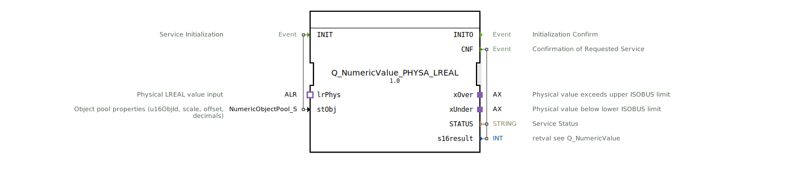

# Q_NumericValue_PHYSA_LREAL

* * * * * * * * * *
## Einleitung
Der Funktionsblock **Q_NumericValue_PHYSA_LREAL** dient als Kommando zum Ändern eines numerischen Werts im ISOBUS-Kontext (ISO 11783-6). Er nimmt einen physikalischen LREAL-Wert über den **ALR**-Adapter entgegen und wickelt die eigentliche Verarbeitung über den eingebetteten Baustein **Q_NumericValue_PHYS_LREAL** ab. Der FB nutzt Adapter-Schnittstellen für die physikalische Werteingabe sowie für die Signalisierung von Über- und Unterschreitungen der zulässigen Bereichsgrenzen.

## Schnittstellenstruktur
### **Ereignis-Eingänge**

| Name  | Typ   | Kommentar                                   |
|-------|-------|---------------------------------------------|
| INIT  | EInit | Initialisierung des Bausteins (mit stObj). |

### **Ereignis-Ausgänge**

| Name  | Typ   | Kommentar                                        |
|-------|-------|--------------------------------------------------|
| INITO | EInit | Bestätigung der erfolgreichen Initialisierung.   |
| CNF   | Event | Bestätigung der angeforderten Wertänderung (enthält STATUS und s16result). |

### **Daten-Eingänge**

| Name  | Typ                                                                | Kommentar                                                                                     |
|-------|--------------------------------------------------------------------|-----------------------------------------------------------------------------------------------|
| stObj | logiBUS::utils::conversion::phys::NumericObjectPool_S               | Eigenschaften des Objektpools (ObjID, Skalierung, Offset, Dezimalstellen). Initial: (u16ObjId := ID_NULL, r32Scale := 1.0, i32Offset := 0, u8Decimals := 0). |

### **Daten-Ausgänge**

| Name      | Typ    | Kommentar                                                                 |
|-----------|--------|---------------------------------------------------------------------------|
| STATUS    | STRING | Statusmeldung des Dienstes.                                               |
| s16result | INT    | Rückgabewert – siehe Q_NumericValue (Ergebnis der Wertänderungsanfrage). |

### **Adapter**
**Sockets (Eingangsadapter)**

| Name   | Typ                     | Kommentar                                                     |
|--------|-------------------------|---------------------------------------------------------------|
| lrPhys | ALR (unidirectional)    | Eingang für den physikalischen LREAL-Wert (wird über E1 getriggert). |

**Plugs (Ausgangsadapter)**

| Name   | Typ                     | Kommentar                                                     |
|--------|-------------------------|---------------------------------------------------------------|
| xOver  | AX (unidirectional)     | Signalisiert, dass der physikalische Wert die obere ISOBUS-Grenze überschreitet. |
| xUnder | AX (unidirectional)     | Signalisiert, dass der physikalische Wert die untere ISOBUS-Grenze unterschreitet. |

## Funktionsweise
1. **Initialisierung** (`INIT`): Der Baustein wird mit den Objektpool-Eigenschaften (`stObj`) initialisiert. Das Ereignis wird direkt an den inneren Baustein `Q_NumericValue_PHYS_LREAL` weitergeleitet. Bei erfolgreicher Initialisierung wird `INITO` ausgelöst.
2. **Wertänderung**: Sobald am Adapter `lrPhys` das Ereignis `E1` eintrifft, wird der physikalische LREAL-Wert über die Datenverbindung `lrPhys.D1` an den inneren Baustein übergeben und das Ereignis `REQ` ausgelöst.
3. **Ergebnis**: Der innere Baustein führt die eigentliche Verarbeitung durch. Über `CNF` werden der Status (`STATUS`) und der Rückgabewert (`s16result`) ausgegeben. Gleichzeitig kann über die Plugs `xUnder` und `xOver` signalisiert werden, ob der eingehende Wert die definierten ISOBUS-Grenzen verletzt.
4. Die Ausgabeevents des inneren Bausteins (`INITO`, `CNF`, `xUnder.E1`, `xOver.E1`) werden direkt an die entsprechenden Ausgänge des `Q_NumericValue_PHYSA_LREAL` weitergeleitet.

## Technische Besonderheiten
- **Wrapper-Design**: Der Baustein kapselt den Funktionsblock `Q_NumericValue_PHYS_LREAL` und stellt über Adapter eine komfortablere, physikalische Schnittstelle bereit.
- **Adapterbasierte Kommunikation**: Die Werteingabe und Grenzsignalisierung erfolgt über unidirektionale Adapter (`ALR`, `AX`), was die Kapselung und Wiederverwendung in unterschiedlichen Kontexten erleichtert.
- **Konfigurierbare Objektpool-Parameter**: Über `stObj` werden Objekt-ID, Skalierung, Offset und Dezimalstellen festgelegt, sodass der Block flexibel auf verschiedene Sensor- oder Aktorwerte angepasst werden kann.
- **Standardkonformität**: Der FB ist gemäß ISO 11783-6 (ISOBUS) entwickelt und für landwirtschaftliche Anwendungen optimiert.

## Zustandsübersicht
Eine explizite Zustandsmaschine ist im XML nicht abgebildet, da der FB als reines Netzwerk aus einem inneren Baustein realisiert ist. Das typische Verhalten folgt jedoch einem einfachen Ablauf:
- **Idle** – wartet auf INIT.
- **Initialisiert** – nach INIT und vor ersten Wertänderungen.
- **Verarbeitung** – nach E1-Trigger (REQ) bis zum Empfang des CNF-Events.
- **Abschluss** – Ausgabe von STATUS/s16result über CNF, gefolgt von erneuter Bereitschaft.

## Anwendungsszenarien
- **ISOBUS-Kommando**: Ändern eines Sollwerts (z.B. Drehzahl, Position, Druck) in einem landwirtschaftlichen Steuergerät, wobei der Wert als physikalische Größe (LREAL) vorliegt.
- **Grenzwertüberwachung**: Einsatz in Anwendungen, die bei Überschreitung der zulässigen Bereichsgrenzen (z.B. bei Sensordaten) zusätzliche Alarme oder Reaktionen auslösen müssen (über `xOver` / `xUnder`).
- **Skalierte Werte**: Verwendung von Skalierungs- und Offsetparametern, um rohe ISOBUS-Werte in benutzerfreundliche physikalische Einheiten umzurechnen.

## Vergleich mit ähnlichen Bausteinen
Im direkten Vergleich zum inneren Baustein **Q_NumericValue_PHYS_LREAL** bietet der **Q_NumericValue_PHYSA_LREAL** eine höhere Abstraktionsebene:
- Statt direkter Ein-/Ausgangssignale wird die Kommunikation über Adapter realisiert – dies erlaubt eine lose Kopplung in modularen Steuerungsarchitekturen.
- Der äußere FB fügt keine eigenständige Logik hinzu, sondern vereinfacht die Einbindung durch die adapterbasierte Schnittstelle (z.B. `ALR`-Eingang).
- Anders als reine Funktionsblöcke mit festen Datenports kann `Q_NumericValue_PHYSA_LREAL` flexibel an verschiedene Umgebungen angepasst werden, ohne die Signalwege im Netzwerk ändern zu müssen.

## Fazit
Der **Q_NumericValue_PHYSA_LREAL** ist ein praktischer Wrapper-Baustein, der die physikalische Wertänderung im ISOBUS-Kontext über Adapter vereinfacht. Er kombiniert die bewährte Logik von `Q_NumericValue_PHYS_LREAL` mit einer komfortablen, adapterbasierten Schnittstelle für LREAL-Eingänge und Grenzsignalisierung. Durch die konfigurierbaren Objektpool-Parameter und die Einhaltung von ISO 11783-6 eignet er sich besonders für den Einsatz in modularen landwirtschaftlichen Steuerungssystemen.