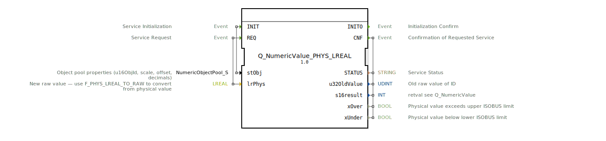

# Q_NumericValue_PHYS_LREAL

* * * * * * * * * *
## Einleitung
Der Funktionsblock **Q_NumericValue_PHYS_LREAL** dient dazu, über ISOBUS (ISO 11783‑6) einen numerischen Wert als physikalische Größe zu setzen. Er nimmt einen physikalischen Wert vom Typ `LREAL` entgegen, konvertiert ihn automatisch in den erforderlichen Rohwert und sendet den entsprechenden Befehl an das angeschlossene Gerät. Dies entspricht der Spezifikation in Teil 6, Anhang F.22.

Der Baustein kapselt die notwendigen Schritte der physikalischen Umrechnung und der eigentlichen Befehlsausführung, sodass der Anwender direkt mit physikalischen Einheiten arbeiten kann.

## Schnittstellenstruktur
### **Ereignis-Eingänge**

| Ereignis | Beschreibung |
|----------|--------------|
| `INIT`   | Initialisiert den Baustein mit den Objekt-Pool-Eigenschaften (`stObj`). |
| `REQ`    | Startet die Verarbeitung: der physikalische Wert (`lrPhys`) wird an das Zielobjekt gesendet. |

### **Ereignis-Ausgänge**

| Ereignis | Beschreibung |
|----------|--------------|
| `INITO`  | Quittiert die erfolgreiche Initialisierung. |
| `CNF`    | Quittiert die Ausführung des Befehls; die Ausgangsdaten sind gültig. |

### **Daten-Eingänge**

| Name   | Typ | Beschreibung |
|--------|-----|--------------|
| `stObj` | `logiBUS::utils::conversion::phys::NumericObjectPool_S` | Objekt-Pool-Eigenschaften (Objekt‑ID, Skalierung, Offset, Dezimalstellen). Standardwert: `(u16ObjId := ID_NULL, r32Scale := 1.0, i32Offset := 0, u8Decimals := 0)`. |
| `lrPhys` | `LREAL` | Der physikalische Wert (z. B. Druck, Temperatur), der gesendet werden soll. Hinweis: Vor der Übergabe sollte der Wert ggf. mit `F_PHYS_LREAL_TO_RAW` umgerechnet werden; der Baustein führt dies intern automatisch durch. |

### **Daten-Ausgänge**

| Name | Typ | Beschreibung |
|------|-----|--------------|
| `STATUS` | `STRING` | Statusmeldung des durchgeführten Dienstes. |
| `u32OldValue` | `UDINT` | Alter Rohwert des Objekts vor der Änderung. |
| `s16result` | `INT` | Rückgabewert (siehe `Q_NumericValue`). |
| `xOver` | `BOOL` | `TRUE`, wenn der physikalische Wert den oberen ISOBUS‑Grenzwert überschreitet. |
| `xUnder` | `BOOL` | `TRUE`, wenn der physikalische Wert den unteren ISOBUS‑Grenzwert unterschreitet. |

### **Adapter**
Keine.

## Funktionsweise
Der Baustein arbeitet intern mit drei untergeordneten Funktionsblöcken zusammen:

1. **F_MOVE** – Bei einem `INIT`-Ereignis wird die übergebene Struktur `stObj` (Objekt‑ID, Skalierung, Offset, Dezimalstellen) in den internen `Q_NumericValue` kopiert.  
2. **F_PHYS_LREAL_TO_RAW** – Bei einem `REQ`-Ereignis wird der physikalische Wert `lrPhys` unter Verwendung der in `stObj` hinterlegten Parameter in einen ISOBUS‑Rohwert umgerechnet.  
3. **Q_NumericValue** – Der erzeugte Rohwert wird anschließend zusammen mit der Objekt‑ID an den eigentlichen Befehlsbaustein übergeben, der den Befehl auf dem Bus ausführt.

Die Ausgänge `STATUS`, `u32OldValue` und `s16result` stammen direkt von `Q_NumericValue`. Die Über‑/Unterlauf‑Meldungen (`xOver`, `xUnder`) werden von der Umrechnungsfunktion bereitgestellt.

## Technische Besonderheiten
- **Automatische Umrechnung**: Der Anwender muss physikalische Werte nicht manuell in Rohwerte konvertieren; dies erfolgt transparent im Inneren des Bausteins.
- **Standardwerte**: Falls keine spezifischen Objekt‑Pool‑Eigenschaften übergeben werden, verwendet der Baustein sinnvolle Vorgaben (Skalierung 1.0, Offset 0, keine Dezimalstellen). Die Objekt‑ID ist dann `ID_NULL`.
- **Grenzwertprüfung**: Die Ausgänge `xOver` und `xUnder` signalisieren, ob der übergebene physikalische Wert außerhalb des für ISOBUS zulässigen Bereichs liegt. So können Anwendungen frühzeitig reagieren.
- **Zwischenspeicherung**: Die Initialisierung (`INIT`) kopiert die Objekt‑Eigenschaften nur einmal und bewahrt sie für spätere `REQ`-Aufrufe auf.

## Zustandsübersicht
Der Baustein besitzt keinen expliziten Zustandsautomaten im Sinne einer ECC, sondern arbeitet ereignisgesteuert nach folgender Logik:

| Zustand / Ablauf | Beschreibung |
|------------------|--------------|
| **Initialisierung** | Nach einem `INIT`-Ereignis werden die Objekt‑Eigenschaften intern gespeichert. Anschließend wird `INITO` gesendet. |
| **Befehl senden** | Nach einem `REQ`-Ereignis wird der physikalische Wert umgerechnet, der Befehl abgesetzt und nach Abschluss `CNF` mit den Ergebnisdaten gesendet. |
| **Fehlerbehandlung** | Tritt bei der Umrechnung ein Über‑/Unterlauf auf, werden `xOver` bzw. `xUnder` bereits vor dem Absetzen des Befehls gesetzt. Ein fehlerhafter Befehl wird durch `s16result` und die Statusmeldung signalisiert. |

## Anwendungsszenarien
- **Steuerung von ISOBUS‑Geräten**: Setzen von Sollwerten für Aktoren (z. B. Ventile, Antriebe) in physikalischen Einheiten wie Druck (bar, kPa), Temperatur (°C) oder Füllstand.
- **Landwirtschaftliche Maschinen**: Ändern von Arbeitsparametern (z. B. Ausbringmenge, Geschwindigkeit) direkt aus einer Steuerungsapplikation.
- **Test- und Simulationsumgebungen**: Einfaches Senden von physikalischen Werten, ohne sich um die Rohwertkonvertierung kümmern zu müssen.

## Vergleich mit ähnlichen Bausteinen
- **`Q_NumericValue` (ohne PHYS)**: Erwartet den Rohwert (UDINT) direkt. Der Anwender muss die Umrechnung selbst vornehmen. `Q_NumericValue_PHYS_LREAL` kapselt diesen Schritt und erhöht die Lesbarkeit und Wartbarkeit von Applikationen, die mit physikalischen Größen arbeiten.
- **`Q_NumericValue_PHYS_REAL`** (analog für REAL‑Typ): Funktioniert identisch, jedoch mit einfacher Genauigkeit. Für Anwendungen, die höhere Genauigkeit benötigen (LREAL), ist der vorliegende Baustein die richtige Wahl.

## Fazit
`Q_NumericValue_PHYS_LREAL` ist ein praxisorientierter und standardkonformer Funktionsblock, der die Anbindung an das ISOBUS‑System vereinfacht. Durch die Integration der physikalischen Umrechnung entfällt manuelle Konvertierungslogik, was die Fehleranfälligkeit reduziert und die Wiederverwendbarkeit erhöht. Der Baustein eignet sich besonders für Steuerungsanwendungen, bei denen physikalische Werte in hoher Genauigkeit übertragen werden müssen.