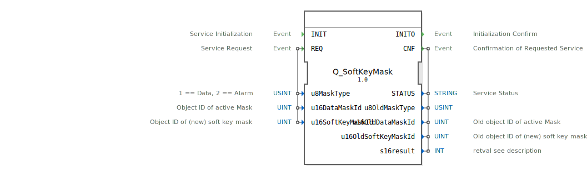

# Q_SoftKeyMask

```{index} single: Q_SoftKeyMask
```


* * * * * * * * * *

## Einleitung
Der **Q_SoftKeyMask** ist ein standardkonformer Funktionsbaustein zur Verwaltung von Softkey-Masken in Virtual Terminals, entwickelt unter EPL-2.0 Lizenz. Die Version 1.0 implementiert die ISO 11783-6 (Teil 6 - F.36) Spezifikation für VT-Systeme.



## Schnittstellenstruktur

### **Ereignis-Eingänge**
- `INIT`: Initialisierungsanforderung
- `REQ`: Maskenwechsel-Anforderung

### **Ereignis-Ausgänge**
- `INITO`: Initialisierungsbestätigung
- `CNF`: Wechselbestätigung

### **Daten-Eingänge**
- `u8MaskType` (USINT): Maskentyp (1=Daten, 2=Alarm)
- `u16DataMaskId` (UINT): Objekt-ID der aktiven Maske
- `u16SoftKeyMaskId` (UINT): Objekt-ID der neuen Softkey-Maske

### **Daten-Ausgänge**
- `STATUS` (STRING): Betriebsstatusmeldung
- `u8OldMaskType` (USINT): Vorheriger Maskentyp
- `u16OldDataMaskId` (UINT): Vorherige Datenmasken-ID
- `u16OldSoftKeyMaskId` (UINT): Vorherige Softkey-Masken-ID
- `s16result` (INT): ISO-konformer Ergebniscode

## Funktionsweise

1. **Initialisierung**:
   - `INIT` ohne Parameter
   - `INITO` bestätigt Betriebsbereitschaft

2. **Maskenwechsel**:
   - `REQ` mit Maskentyp, Datenmasken-ID und neuer Softkey-Maske
   - Verknüpft Softkeys mit der aktiven Maske
   - `CNF` liefert Betriebsstatus und vorherige Konfiguration

3. **Maskentypen**:
   - `1`: Datenmasken-Verknüpfung
   - `2`: Alarmmasken-Verknüpfung

## Technische Besonderheiten

✔ **ISO 11783-6 konform** (F.36)
✔ **Duale Maskentypen** (Daten/Alarme)
✔ **Dynamische Neuzuordnung**
✔ **Rückverfolgbarkeit** (Vorherige Konfiguration)

## Maskentyp-Referenz

| Wert | Typ       | Beschreibung               |
|------|-----------|----------------------------|
| 1    | Data      | Normale Datenmaske         |
| 2    | Alarm     | Alarmmasken-Verknüpfung    |

## Rückgabecodes (s16result)

| Code | Konstante               | Bedeutung                          |
|------|-------------------------|------------------------------------|
| 0    | VT_E_NO_ERR             | Erfolgreicher Wechsel             |
| -6   | VT_E_OVERFLOW           | Pufferüberlauf                   |
| -8   | VT_E_NOACT              | VT nicht bereit                   |
| -21  | VT_E_NO_INSTANCE        | Kein VT-Client verfügbar          |
| -129 | VT_E_ISO_INSTANCE_INVALID | Ungültige VT-Instanz             |
| -130 | VT_E_NOT_ALIVE          | VT nicht aktiv                    |

## Anwendungsszenarien

- **Kontextsensitive Softkeys**: Funktionswechsel
- **Alarmmanagement**: Spezielle Alarm-Softkeys
- **Maskenhierarchien**: Dynamische Tastenbelegungen
- **Benutzerführung**: Adaptive Bedienoberflächen

## ⚖️ Vergleich mit ähnlichen Bausteinen

| Feature        | Q_SoftKeyMask | VtKeyMapping | VtMaskLinker |
|---------------|---------------|--------------|--------------|
| ISO-Standard  | ✔             | ✖            | ✖            |
| Maskentypen   | 2 (Data/Alarm)| 1 (Universal)| 1 (Data)     |
| Rückmeldung   | ✔             | ✖            | ✔            |
| Echtzeitwechsel | ✔          | ✔            | ✖            |

## Fazit

Der Q_SoftKeyMask-Baustein bietet flexible Softkey-Steuerung:

- **Kontextsensitiv**: Unterschiedliche Maskentypen
- **Dynamisch**: Sofortige Neuzuordnung
- **Zuverlässig**: ISO-konforme Implementierung

Unverzichtbar für:
- Professionelle Bedienkonzepte
- Komplexe Maskenhierarchien
- Adaptive VT-Anwendungen