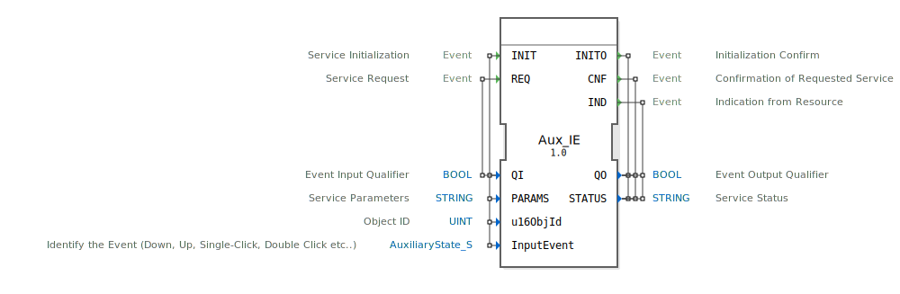

# Aux_IE

```{index} single: Aux_IE
```


* * * * * * * * * *

## Einleitung
Der Aux_IE Funktionsblock ist ein Eingabeservice-Interface-Funktionsblock für Ereigniseingabedaten. Er dient zur Verarbeitung von Hilfseingaben (Auxiliary Inputs) und ermöglicht die Erkennung verschiedener Eingabeereignisse wie Drücken, Loslassen, Einfachklick, Doppelklick etc.



## Schnittstellenstruktur

### **Ereignis-Eingänge**
- **INIT**: Service-Initialisierung
  - Verknüpft mit: QI, PARAMS, u16ObjId, InputEvent
- **REQ**: Service-Anfrage
  - Verknüpft mit: QI

### **Ereignis-Ausgänge**
- **INITO**: Initialisierungsbestätigung
  - Verknüpft mit: QO, STATUS
- **CNF**: Bestätigung der angeforderten Service-Anfrage
  - Verknüpft mit: QO, STATUS
- **IND**: Anzeige von der Ressource
  - Verknüpft mit: QO, STATUS

### **Daten-Eingänge**
- **QI** (BOOL): Ereignis-Eingabe-Qualifizierer
- **PARAMS** (STRING): Service-Parameter
- **u16ObjId** (UINT): Objekt-ID, Initialwert: ID_NULL
- **InputEvent** (AuxiliaryState_S): Identifiziert das Ereignis (Down, Up, Single-Click, Double-Click etc.), Initialwert: Invalid

### **Daten-Ausgänge**
- **QO** (BOOL): Ereignis-Ausgabe-Qualifizierer
- **STATUS** (STRING): Service-Status

### **Adapter**
Keine Adapter-Schnittstellen vorhanden.

## Funktionsweise
Der Aux_IE Block verarbeitet Hilfseingabeereignisse und bietet eine standardisierte Schnittstelle für die Kommunikation mit Eingabegeräten. Bei der Initialisierung (INIT) werden die Service-Parameter und Objekt-ID konfiguriert. Über REQ-Ereignisse können Service-Anfragen gestellt werden, während IND-Ereignisse eingehende Signale von der Ressource anzeigen.

## Technische Besonderheiten
- Verwendet spezifische ISOBUS-Datentypen für die Landtechnik
- Unterstützt verschiedene Eingabeereignis-Typen über die AuxiliaryState-Struktur
- Initialisierung mit standardisierten NULL-Werten (ID_NULL)
- String-basierte Statusrückmeldungen

## Zustandsübersicht
Der Block verfügt über einen Initialisierungszustand (INIT/INITO) und operative Zustände für Service-Anfragen (REQ/CNF) sowie Ressourcen-Anzeigen (IND).

## Anwendungsszenarien
- Steuerung von landwirtschaftlichen Maschinen über Hilfseingaben
- Verarbeitung von Benutzerinteraktionen in ISOBUS-Systemen
- Erkennung komplexer Eingabemuster (Einzelklick, Doppelklick)
- Integration in Steuerungssysteme für Agrartechnik

## ⚖️ Vergleich mit ähnlichen Bausteinen
Im Vergleich zu einfachen digitalen Eingangsblöcken bietet Aux_IE erweiterte Funktionalität für die Erkennung komplexerer Eingabeereignisse und ist speziell für ISOBUS-Umgebungen optimiert.


## 🛠️ Zugehörige Übungen

* [Uebung_010b3](../../../../../../../training1/Ventilsteuerung/4diacIDE-workspace/test_B/Uebungen_doc/Uebung_010b3.md)
* [Uebung_010b3_AX](../../../../../../../training1/Ventilsteuerung/4diacIDE-workspace/test_AX/Uebungen_doc/Uebung_010b3_AX.md)
* [Uebung_010bA2](../../../../../../../training1/Ventilsteuerung/4diacIDE-workspace/test_B/Uebungen_doc/Uebung_010bA2.md)
* [Uebung_010bA2_AX](../../../../../../../training1/Ventilsteuerung/4diacIDE-workspace/test_AX/Uebungen_doc/Uebung_010bA2_AX.md)
* [Uebung_010bA3](../../../../../../../training1/Ventilsteuerung/4diacIDE-workspace/test_B/Uebungen_doc/Uebung_010bA3.md)
* [Uebung_010bA3_AX](../../../../../../../training1/Ventilsteuerung/4diacIDE-workspace/test_AX/Uebungen_doc/Uebung_010bA3_AX.md)
* [Uebung_010bA4](../../../../../../../training1/Ventilsteuerung/4diacIDE-workspace/test_B/Uebungen_doc/Uebung_010bA4.md)
* [Uebung_010bA4_AX](../../../../../../../training1/Ventilsteuerung/4diacIDE-workspace/test_AX/Uebungen_doc/Uebung_010bA4_AX.md)

## Fazit
Der Aux_IE Funktionsblock stellt eine leistungsfähige Schnittstelle für die Verarbeitung von Hilfseingabeereignissen in ISOBUS-basierten Steuerungssystemen dar und ermöglicht die zuverlässige Erkennung verschiedener Benutzerinteraktionen.