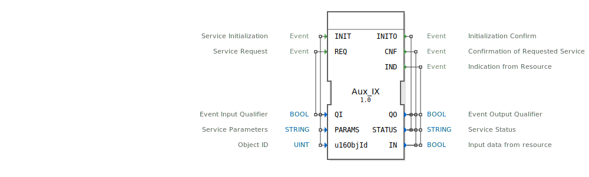

# Aux_IX

```{index} single: Aux_IX
```


* * * * * * * * * *

## Einleitung
Der Aux_IX Funktionsblock ist ein Service-Interface-Funktionsblock für boolesche Eingangsdaten. Er dient als Schnittstelle für Eingabedienste und ermöglicht die Kommunikation mit Ressourcen zur Abfrage von digitalen Eingangssignalen.



## Schnittstellenstruktur

### **Ereignis-Eingänge**
- **INIT**: Service-Initialisierung - Initialisiert den Funktionsblock mit den Parametern QI, PARAMS und u16ObjId
- **REQ**: Service-Anfrage - Löst eine Service-Anfrage mit dem Qualifier QI aus

### **Ereignis-Ausgänge**
- **INITO**: Initialisierungsbestätigung - Bestätigt die Initialisierung mit QO und STATUS
- **CNF**: Bestätigung der angeforderten Service-Anfrage - Liefert QO, STATUS und IN-Daten
- **IND**: Indikation von der Ressource - Signalisiert Datenverfügbarkeit mit QO, STATUS und IN-Daten

### **Daten-Eingänge**
- **QI**: BOOL - Event Input Qualifier (Ereignis-Eingangsqualifier)
- **PARAMS**: STRING - Service-Parameter
- **u16ObjId**: UINT - Objekt-ID mit Initialwert ID_NULL

### **Daten-Ausgänge**
- **QO**: BOOL - Event Output Qualifier (Ereignis-Ausgangsqualifier)
- **STATUS**: STRING - Service-Status
- **IN**: BOOL - Eingangsdaten von der Ressource

### **Adapter**
Keine Adapter-Schnittstellen vorhanden.

## Funktionsweise
Der Aux_IX Funktionsblock arbeitet als Eingabeservice-Schnittstelle für boolesche Daten. Bei der Initialisierung (INIT) werden die Service-Parameter und die Objekt-ID konfiguriert. Service-Anfragen (REQ) lösen die Abfrage der Eingangsdaten von der zugehörigen Ressource aus. Die Daten werden über die CNF- und IND-Ereignisse zurückgemeldet, wobei der STATUS-Ausgang Informationen über den Erfolg oder Fehler der Operation liefert.

## Technische Besonderheiten
- Verwendet spezifische TypeHash-Identifikation für 4diac
- Initialisiert die Objekt-ID mit einem Standardwert (ID_NULL)
- Unterstützt parametrierbare Service-Konfiguration über STRING-Parameter
- Bietet sowohl anforderungsbasierte (CNF) als auch ereignisbasierte (IND) Datenausgabe

## Zustandsübersicht
Der Funktionsblock durchläuft folgende Zustände:
1. **Nicht initialisiert**: Vor der INIT-Verarbeitung
2. **Initialisiert**: Nach erfolgreicher INIT-Verarbeitung mit INITO-Bestätigung
3. **Bereit**: Kann REQ-Anfragen verarbeiten
4. **Aktiv**: Während der Datenabfrage von der Ressource

## Anwendungsszenarien
- Abfrage von digitalen Eingangssignalen in Steuerungssystemen
- Integration von Hardware-Eingängen in IEC 61499-Applikationen
- Überwachung von Schalterzuständen und Sensoren
- Implementierung von standardisierten Eingabeschnittstellen in verteilten Systemen

## ⚖️ Vergleich mit ähnlichen Bausteinen
Im Vergleich zu einfachen digitalen Eingangsblöcken bietet Aux_IX erweiterte Service-Funktionalität mit parametrierbarer Konfiguration, Statusrückmeldungen und sowohl anforderungs- als auch ereignisgesteuerter Datenbereitstellung.


## 🛠️ Zugehörige Übungen

* [Uebung_010b1](../../../../../../../training1/Ventilsteuerung/4diacIDE-workspace/test_B/Uebungen_doc/Uebung_010b1.md)

## Fazit
Der Aux_IX Funktionsblock stellt eine robuste und flexible Lösung für die Integration von booleschen Eingangsdaten in IEC 61499-basierte Steuerungssysteme dar. Durch seine Service-orientierte Architektur und umfangreiche Statusrückmeldungen eignet er sich besonders für anspruchsvolle Industrieanwendungen mit hohen Anforderungen an Zuverlässigkeit und Diagnosefähigkeit.