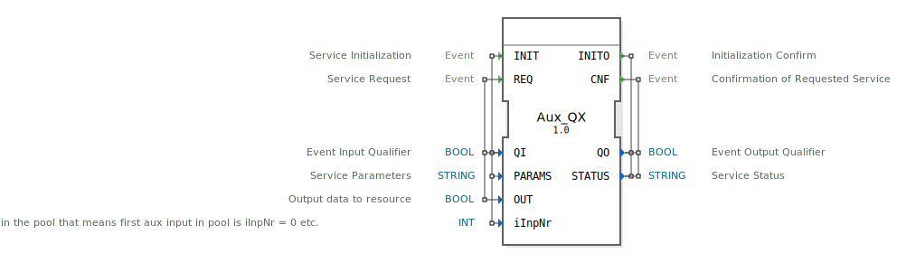

# Aux_QX

```{index} single: Aux_QX
```


* * * * * * * * * *

## Einleitung
Der Aux_QX Funktionsblock ist ein Ausgabeservice-Interface-Funktionsblock für boolesche Ausgabedaten. Er dient als Schnittstelle zu Auxiliary-Ausgabegeräten und ermöglicht die Steuerung von booleschen Ausgabesignalen über einen definierten Service-Mechanismus.



## Schnittstellenstruktur

### **Ereignis-Eingänge**
- **INIT**: Service-Initialisierungsereignis
- **REQ**: Service-Anfrageereignis

### **Ereignis-Ausgänge**
- **INITO**: Initialisierungsbestätigung
- **CNF**: Bestätigung der angeforderten Service-Operation

### **Daten-Eingänge**
- **QI** (BOOL): Ereignis-Eingangsqualifizierer
- **PARAMS** (STRING): Service-Parameter
- **OUT** (BOOL): Ausgabedaten zur Ressource
- **iInpNr** (INT): Nummer des Auxiliary-Arrays - entspricht der Reihenfolge im Pool (erster Aux-Eingang im Pool hat iInpNr = 0, etc.)

### **Daten-Ausgänge**
- **QO** (BOOL): Ereignis-Ausgangsqualifizierer
- **STATUS** (STRING): Service-Status

## Funktionsweise
Der Aux_QX Funktionsblock implementiert ein standardisiertes Service-Interface für boolesche Ausgabedaten. Bei Empfang eines INIT-Ereignisses wird der Service initialisiert, wobei die Parameter PARAMS und iInpNr zur Konfiguration verwendet werden. Das REQ-Ereignis triggert die Ausgabe des booleschen Wertes an die spezifizierte Auxiliary-Ressource. Jede Operation wird durch entsprechende Bestätigungsereignisse (INITO, CNF) quittiert.

## Technische Besonderheiten
- Unterstützt die Adressierung von Auxiliary-Ausgängen über den iInpNr-Parameter
- Flexible Parameterkonfiguration über STRING-Parameter
- Vollständige Statusrückmeldung über STATUS-Ausgang
- Qualifizierte Ereignisbehandlung durch QI/QO-Signale

## Zustandsübersicht
Der Funktionsblock folgt einem typischen Service-Interface-Muster mit Initialisierungs- und Betriebszuständen. Nach erfolgreicher Initialisierung (INIT → INITO) können Service-Anfragen (REQ → CNF) verarbeitet werden.

## Anwendungsszenarien
- Steuerung von Auxiliary-Ausgabegeräten in ISOBUS-Umgebungen
- Anbindung von booleschen Aktoren in landwirtschaftlichen Maschinen
- Integration in Steuerungssysteme für Hilfsfunktionen
- Universelle boolesche Ausgabeschnittstelle in verteilten Automatisierungssystemen

## ⚖️ Vergleich mit ähnlichen Bausteinen
Im Vergleich zu einfachen booleschen Ausgabeblöcken bietet Aux_QX erweiterte Service-Funktionalität mit Initialisierungssequenzen, Parameterkonfiguration und detailliertem Statusmanagement. Die spezifische Adressierung über iInpNr ermöglicht die Integration in komplexe Gerätepools.


## 🛠️ Zugehörige Übungen

* [Uebung_003c_sub](../../../../../../../training1/Ventilsteuerung/4diacIDE-workspace/test_B/Uebungen_doc/Uebung_003c_sub.md)

## Fazit
Der Aux_QX Funktionsblock stellt eine robuste und standardisierte Lösung für die Ansteuerung von booleschen Auxiliary-Ausgängen dar. Durch sein vollständiges Service-Interface und die flexible Konfigurierbarkeit eignet er sich besonders für den Einsatz in professionellen Automatisierungsumgebungen mit ISOBUS-Kompatibilität.