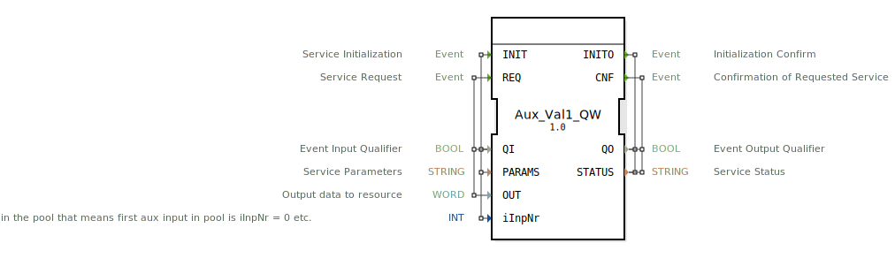

# Aux_Val1_QW

```{index} single: Aux_Val1_QW
```


* * * * * * * * * *
## Einleitung
Der Aux_Val1_QW ist ein Ausgabeservice-Schnittstellen-Funktionsblock für Wort-Ausgabedaten. Dieser Baustein dient als Schnittstelle zu Auxiliary-Output-Ressourcen und ermöglicht die Ausgabe von 16-Bit-Datenwörtern an externe Peripheriegeräte.



## Schnittstellenstruktur

### **Ereignis-Eingänge**
- **INIT**: Service-Initialisierungsereignis
- **REQ**: Service-Anforderungsereignis

### **Ereignis-Ausgänge**
- **INITO**: Initialisierungsbestätigung
- **CNF**: Bestätigung der angeforderten Serviceausführung

### **Daten-Eingänge**
- **QI** (BOOL): Ereignis-Eingangsqualifizierer
- **PARAMS** (STRING): Service-Parameter
- **OUT** (WORD): Ausgabedaten zur Ressource
- **iInpNr** (INT): Nummer des Auxiliary-Arrays - entspricht der Reihenfolge im Pool (erster Aux-Eingang im Pool hat iInpNr = 0, etc.)

### **Daten-Ausgänge**
- **QO** (BOOL): Ereignis-Ausgangsqualifizierer
- **STATUS** (STRING): Service-Status

### **Adapter**
Keine Adapter-Schnittstellen vorhanden.

## Funktionsweise
Der Funktionsblock initialisiert und steuert Auxiliary-Ausgabegeräte über den ISOBUS-UT-Protokollstack. Bei der Initialisierung (INIT-Event) werden die Service-Parameter konfiguriert und das Auxiliary-Gerät entsprechend eingerichtet. Bei Service-Anforderungen (REQ-Event) werden die WORD-Daten an das konfigurierte Ausgabegerät gesendet. Der Baustein unterstützt verschiedene Auxiliary-Typen und bietet eine Statusrückmeldung über den Erfolg oder Fehler der Operationen.

## Technische Besonderheiten
- Unterstützt Auxiliary-Typen: 0, 1, 2, 3, 4, 6, 11, 12, 13
- Verwendet WORD-Datentyp (16-Bit) für Ausgabedaten
- Implementiert ISOBUS-UT-Protokoll für Auxiliary-IO
- Bietet detaillierte Statusinformationen über STRING-Ausgabe
- Ermöglicht Konfiguration mehrerer Auxiliary-Geräte über iInpNr-Parameter

## Zustandsübersicht
Der Baustein verfügt über zwei Hauptbetriebszustände:
1. **Initialisierungszustand**: Verarbeitung der INIT-Anforderung und Konfiguration des Auxiliary-Geräts
2. **Service-Zustand**: Verarbeitung von REQ-Anforderungen und Datenausgabe an das konfigurierte Gerät

## Anwendungsszenarien
- Steuerung von Auxiliary-Ausgabegeräten in mobilen Arbeitsmaschinen
- ISOBUS-konforme Peripherieansteuerung
- Landwirtschaftliche und baumaschinenspezifische Anwendungen
- Anbindung von Wort-basierten Ausgabegeräten über UT-Protokoll

## Vergleich mit ähnlichen Bausteinen
Im Vergleich zu einfachen digitalen Ausgabeblöcken bietet Aux_Val1_QW erweiterte Funktionen für ISOBUS-Umgebungen, einschließlich Parametrierbarkeit, Statusrückmeldungen und Unterstützung verschiedener Auxiliary-Gerätetypen. Die WORD-Datenbreite ermöglicht die Ansteuerung komplexerer Peripheriegeräte im Vergleich zu einfachen BOOL-Ausgabeblöcken.

## Fazit
Der Aux_Val1_QW Funktionsblock stellt eine robuste und standardkonforme Lösung für die Ansteuerung von Auxiliary-Wort-Ausgabegeräten in ISOBUS-Umgebungen dar. Seine flexible Konfigurierbarkeit und umfassende Statusrückmeldung machen ihn besonders geeignet für anspruchsvolle industrielle und mobile Anwendungen.