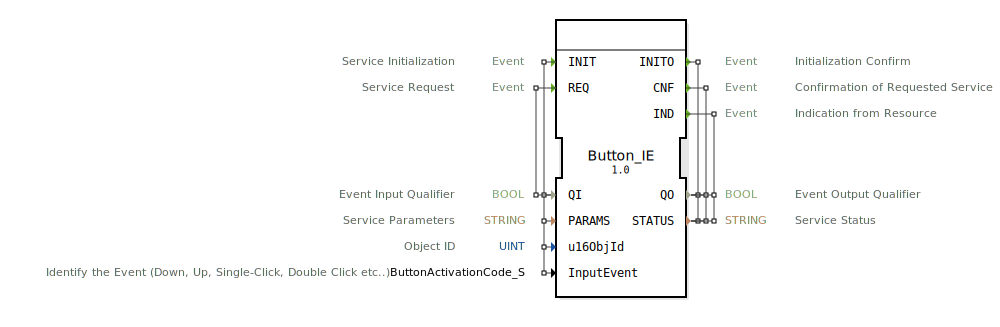

# Button_IE

```{index} single: Button_IE
```


* * * * * * * * * *

## Einleitung
Der Button_IE Funktionsblock ist ein Eingabeservice-Interface-Funktionsblock für Ereigniseingabedaten. Er dient als Schnittstelle für Taster-Ereignisse in Steuerungssystemen und ermöglicht die Verarbeitung verschiedener Tasteraktivitäten wie Drücken, Loslassen oder Mehrfachklicks.



## Schnittstellenstruktur

### **Ereignis-Eingänge**
- **INIT**: Service-Initialisierung
- **REQ**: Service-Anfrage

### **Ereignis-Ausgänge**
- **INITO**: Initialisierungsbestätigung
- **CNF**: Bestätigung der angeforderten Service-Anfrage
- **IND**: Indikation von der Ressource

### **Daten-Eingänge**
- **QI** (BOOL): Ereignis-Eingangsqualifizierer
- **PARAMS** (STRING): Service-Parameter
- **u16ObjId** (UINT): Objekt-ID (Initialwert: ID_NULL)
- **InputEvent** (ButtonActivationCode_S): Identifiziert das Ereignis (Down, Up, Single-Click, Double-Click etc.) mit Initialwert "Invalid"

### **Daten-Ausgänge**
- **QO** (BOOL): Ereignis-Ausgangsqualifizierer
- **STATUS** (STRING): Service-Status

### **Adapter**
Keine Adapter-Schnittstellen vorhanden.

## Funktionsweise
Der Button_IE Funktionsblock verarbeitet Tasterereignisse über das ISOBUS-UT-Protokoll. Bei Initialisierung (INIT) werden die Service-Parameter und Objekt-ID konfiguriert. Der Block kann verschiedene Tasteraktivitäten wie Einfachklick, Doppelklick, Drücken und Loslassen erkennen und entsprechend verarbeiten. Über die IND-Ausgabe werden eingehende Ereignisse von der Hardware-Ressource gemeldet.

## Technische Besonderheiten
- Verwendet ISOBUS-UT-spezifische Datentypen für Tasteraktivierungscodes
- Unterstützt Initialisierung mit spezifischen Objekt-IDs
- Bietet umfassende Statusrückmeldungen über den STATUS-Ausgang
- Implementiert qualifizierte Ereignisverarbeitung über QI/QO-Signale

## Zustandsübersicht
Der Funktionsblock verfügt über einen Initialisierungszustand (INIT/INITO) und operative Zustände für Service-Anfragen (REQ/CNF) sowie asynchrone Ereignisindikationen (IND). Die genaue Zustandsmaschine ist implementierungsabhängig.

## Anwendungsszenarien
- Landwirtschaftliche Steuerungssysteme mit ISOBUS-Kompatibilität
- Bedienpanels mit Tastereingaben
- Maschinensteuerungen mit Ereignis-basierten Eingaben
- Systeme, die verschiedene Tasteraktivitäten unterscheiden müssen

## Vergleich mit ähnlichen Bausteinen
Im Vergleich zu einfachen digitalen Eingangsblöcken bietet Button_IE erweiterte Funktionalität für Tasterspezifische Ereignisse wie Mehrfachklicks und unterscheidet zwischen verschiedenen Aktivierungszuständen. Die ISOBUS-Integration macht ihn speziell für landwirtschaftliche Anwendungen geeignet.


## Zugehörige Übungen

* [Uebung_010b7](../../../../../../training1/Ventilsteuerung/4diacIDE-workspace/test_B/Uebungen_doc/Uebung_010b7.md)
* [Uebung_010b7_AX](../../../../../../training1/Ventilsteuerung/4diacIDE-workspace/test_AX/Uebungen_doc/Uebung_010b7_AX.md)
* [Uebung_010b8](../../../../../../training1/Ventilsteuerung/4diacIDE-workspace/test_B/Uebungen_doc/Uebung_010b8.md)
* [Uebung_010b8_AX](../../../../../../training1/Ventilsteuerung/4diacIDE-workspace/test_AX/Uebungen_doc/Uebung_010b8_AX.md)
* [Uebung_010b9](../../../../../../training1/Ventilsteuerung/4diacIDE-workspace/test_B/Uebungen_doc/Uebung_010b9.md)
* [Uebung_010b9_AX](../../../../../../training1/Ventilsteuerung/4diacIDE-workspace/test_AX/Uebungen_doc/Uebung_010b9_AX.md)
* [Uebung_010bA](../../../../../../training1/Ventilsteuerung/4diacIDE-workspace/test_B/Uebungen_doc/Uebung_010bA.md)
* [Uebung_010bA_AX](../../../../../../training1/Ventilsteuerung/4diacIDE-workspace/test_AX/Uebungen_doc/Uebung_010bA_AX.md)

## Fazit
Button_IE ist ein spezialisierter Funktionsblock für die Verarbeitung von Tasterereignissen in ISOBUS-Umgebungen. Seine Fähigkeit, verschiedene Tasteraktivitäten zu unterscheiden und umfassende Statusinformationen bereitzustellen, macht ihn besonders geeignet für anspruchsvolle Steuerungsanwendungen in der Agrartechnik und verwandten Bereichen.