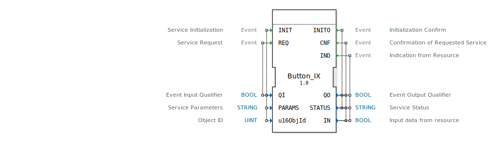

# Button_IX

```{index} single: Button_IX
```


* * * * * * * * * *

## Einleitung
Der Button_IX ist ein Service-Interface-Funktionsblock für boolesche Eingabedaten, der speziell für die Verarbeitung von Tasteneingaben in 4diac-Systemen entwickelt wurde. Dieser Baustein dient als Schnittstelle zwischen der Anwendungslogik und physikalischen Eingabegeräten wie Tastern oder Schaltern.



## Schnittstellenstruktur

### **Ereignis-Eingänge**
- **INIT**: Service-Initialisierungsereignis
- **REQ**: Service-Anfrageereignis

### **Ereignis-Ausgänge**
- **INITO**: Initialisierungsbestätigung
- **CNF**: Bestätigung der angeforderten Service-Anfrage
- **IND**: Indikation vom Ressourcen-Interface

### **Daten-Eingänge**
- **QI** (BOOL): Ereignis-Eingangsqualifizierer
- **PARAMS** (STRING): Service-Parameter
- **u16ObjId** (UINT): Objekt-ID mit Initialwert ID_NULL

### **Daten-Ausgänge**
- **QO** (BOOL): Ereignis-Ausgangsqualifizierer
- **STATUS** (STRING): Service-Statusinformation
- **IN** (BOOL): Eingabedaten von der Ressource

### **Adapter**
Keine Adapter-Schnittstellen vorhanden.

## Funktionsweise
Der Button_IX-Funktionsblock verwaltet den gesamten Lebenszyklus einer Tasteneingabe. Bei der Initialisierung (INIT-Ereignis) werden die Service-Parameter konfiguriert und das System für den Betrieb vorbereitet. Das REQ-Ereignis löst eine aktuelle Abfrage des Eingabezustands aus, während das IND-Ereignis asynchrone Zustandsänderungen der Tasteneingabe signalisiert.

## Technische Besonderheiten
- Unterstützt ISOBUS-konforme Kommunikation
- Verwendet spezifische TypeHash-Identifikation für 4diac
- Integriert Objekt-ID-Verwaltung für Geräteidentifikation
- Bietet umfangreiche Statusrückmeldungen über den STATUS-Ausgang

## Zustandsübersicht
Der Funktionsblock durchläuft folgende Hauptzustände:
1. **Nicht initialisiert**: Wartet auf INIT-Ereignis
2. **Initialisiert**: Bereit für REQ- und IND-Ereignisse
3. **Aktiv**: Verarbeitet Eingabeanfragen und -indikationen
4. **Fehler**: Bei ungültigen Parametern oder Kommunikationsproblemen

## Anwendungsszenarien
- Bedienpulte in industriellen Steuerungen
- Maschinensteuerung mit Tastereingaben
- ISOBUS-kompatible Landmaschinensteuerungen
- Sicherheitskritische Eingabesysteme mit Statusüberwachung

## ⚖️ Vergleich mit ähnlichen Bausteinen
Im Vergleich zu einfachen digitalen Eingabeblöcken bietet Button_IX erweiterte Funktionalitäten wie:
- Parametrierbare Service-Konfiguration
- Detaillierte Statusrückmeldungen
- ISOBUS-Integration
- Asynchrone Ereignisbehandlung


## 🛠️ Zugehörige Übungen

* [Uebung_010a2](../../../../../../training1/Ventilsteuerung/4diacIDE-workspace/test_B/Uebungen_doc/Uebung_010a2.md)
* [Uebung_010a3](../../../../../../training1/Ventilsteuerung/4diacIDE-workspace/test_B/Uebungen_doc/Uebung_010a3.md)

## Fazit
Der Button_IX-Funktionsblock stellt eine robuste und flexible Lösung für die Integration von Tasteneingaben in 4diac-basierten Steuerungssystemen dar. Seine umfangreiche Schnittstelle und Statusverwaltung machen ihn besonders geeignet für anspruchsvolle industrielle Anwendungen, die zuverlässige und überwachbare Eingabeverarbeitung erfordern.