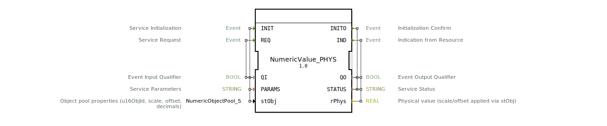

# NumericValue_PHYS

(Bild nicht vorhanden)

* * * * * * * * * *
## Einleitung
Der Funktionsblock **NumericValue_PHYS** ist ein Eingangs-Service-Interface-Baustein nach ISO 11783-6. Er liefert einen physikalischen REAL-Wert, indem er einen rohen Digitalwert (DWORD) aus dem ISOBUS-Objektpool ausliest und unter Berücksichtigung einer vorgegebenen Skalierung und eines Offsets in einen physikalischen Wert umrechnet. Dabei wird die Konvertierung vollständig in Software (innerhalb des FBs) durchgeführt.

## Schnittstellenstruktur
### **Ereignis-Eingänge**

| Ereignis | Typ | Mit Variablen | Kommentar |
|----------|-----|---------------|-----------|
| INIT | EInit | QI, PARAMS, stObj | Initialisierung des Bausteins |
| REQ | Event | QI | Anforderung eines neuen physikalischen Wertes |

### **Ereignis-Ausgänge**

| Ereignis | Typ | Mit Variablen | Kommentar |
|----------|-----|---------------|-----------|
| INITO | EInit | QO, STATUS | Bestätigung der Initialisierung |
| IND | Event | QO, STATUS, rPhys | Ausgabe des berechneten physikalischen Wertes |

### **Daten-Eingänge**

| Variable | Typ | Kommentar |
|----------|-----|-----------|
| QI | BOOL | Eingangsqualifikator (aktiviert die Verarbeitung) |
| PARAMS | STRING | Service-Parameter (z. B. Konfigurationszeichenfolge) |
| stObj | logiBUS::utils::conversion::phys::NumericObjectPool_S | Objektpool-Eigenschaften: Objekt-ID (16 Bit), Skalierung, Offset, Dezimalstellen |

### **Daten-Ausgänge**

| Variable | Typ | Kommentar |
|----------|-----|-----------|
| QO | BOOL | Ausgangsqualifikator (Status der Verarbeitung) |
| STATUS | STRING | Statusmeldung (Fehler- oder Erfolgsmeldung) |
| rPhys | REAL | Physikalischer Wert nach Anwendung von Skalierung/Offset |

### **Adapter**
Keine Adapter vorhanden.

## Funktionsweise
Der interne Ablauf wird über die Ereignisse INIT und REQ gesteuert und nutzt vier Sub-FBs:

1. **INIT**  
   - Der übergebene Strukturparameter `stObj` wird über den Sub-Baustein `F_MOVE` (vom Typ `iec61131::selection::F_MOVE`) kopiert.  
   - Der kopierte Wert (`stObj.u16ObjId`) wird an den Sub-Baustein `NumericValue_ID` weitergeleitet, der damit initialisiert wird (`NumericValue_ID.INIT`).

2. **REQ** (oder erneute Ausgabe nach INIT)  
   - Der Sub-Baustein `NumericValue_ID` wird mit `REQ` ausgelöst. Er liefert über seinen Ausgang `IN` einen rohen DWORD-Wert aus dem ISOBUS-Objektpool.  
   - Dieser DWORD-Wert wird über `F_DWORD_TO_UDINT` in einen vorzeichenlosen 32‑Bit-Integer (`UDINT`) umgewandelt.  
   - Der Sub-Baustein `F_RAW_TO_PHYS` erhält den Integer-Wert und die Original-Struktur `stObj` (Skalierung, Offset, Dezimalstellen) und berechnet daraus den physikalischen REAL-Wert (`rPhys`).  
   - Schließlich wird der Ausgang `IND` aktiviert und der berechnete Wert am Datenausgang `rPhys` ausgegeben.

Die Verkettung gewährleistet, dass bei jedem REQ der aktuelle rohe Wert aus dem Objektpool gelesen und kalkuliert wird.

## Technische Besonderheiten
- **Standardkonformität**: Der Baustein folgt dem ISO-11783-6-Standard (ISOBUS).  
- **Software‑Skalierung**: Im Gegensatz zu reinen Hardware-Interfaces wird die Umrechnung (Skalierung/Offset) innerhalb des FBs durchgeführt, was eine flexible Anpassung ohne Änderung der Peripherie erlaubt.  
- **Wiederverwendbare Sub‑Bausteine**: Die verwendeten Sub-FBs (`NumericValue_ID`, `F_DWORD_TO_UDINT`, `F_RAW_TO_PHYS`, `F_MOVE`) sind standardisierte logiBUS- oder IEC‑61131‑Bausteine und können in anderen Zusammenhängen eingesetzt werden.  
- **Objektpool‑Struktur**: Die Eingabestruktur `stObj` enthält alle notwendigen Parameter (ObjektID, Skalierung, Offset, Dezimalstellen) und kann zentral verwaltet werden.

## Zustandsübersicht
Der Baustein besitzt keine explizite Zustandsmaschine, sondern reagiert rein ereignisgesteuert. Der Ablauf gliedert sich in zwei Hauptphasen:

- **Initialisierungsphase** (Ereignis `INIT` → `INITO`):  
  Übernahme und Speicherung der Konfiguration (`stObj`), Initialisierung von `NumericValue_ID`.

- **Betriebsphase** (Ereignis `REQ` → `IND`):  
  Auslesen des Rohwertes, Konvertierung und Ausgabe des physikalischen Wertes.

Nach einer erfolgreichen Initialisierung kann `REQ` beliebig oft wiederholt werden.

## Anwendungsszenarien
- **ISOBUS‑Fahrzeugsteuerung**: Einlesen von Sensordaten (z. B. Drehzahl, Druck, Temperatur) aus dem ISOBUS‑Objektpool und Umwandlung in physikalische Einheiten.  
- **Landwirtschaftliche Automatisierung**: Verarbeitung von Messwerten von ISOBUS‑kompatiblen Geräten (Traktoren, Anbaugeräte) zur weiteren Steuerung oder Visualisierung.  
- **Test‑ und Simulationsumgebungen**: Ersatz realer Hardware‑Bausteine durch Software‑Emulation mit definierten Skalierungen.

## Vergleich mit ähnlichen Bausteinen
- **NumericValue_ID**: Liefert nur den rohen DWORD-Wert ohne Skalierung/Offset. `NumericValue_PHYS` erweitert diesen um die physikalische Umrechnung.  
- **Analoge Eingangsbausteine** (z. B. `AI_SCALED`) in SPS‑Systemen: Diese skalieren oft direkt im Hardwaretreiber. `NumericValue_PHYS` hingegen arbeitet rein softwarebasiert und ist dadurch flexibler hinsichtlich Parametrierung.  
- **logiBUS‑Bausteine wie `F_RAW_TO_PHYS`**: Werden von `NumericValue_PHYS` intern genutzt; dieser FB kapselt die gesamte Kette von der ID‑Abfrage bis zur finalen Ausgabe.

## Fazit
Der Funktionsblock `NumericValue_PHYS` bietet eine saubere und standardkonforme Möglichkeit, ISOBUS‑Objekte mit integrierter Skalierung und Offset-Korrektur in physikalische Werte umzuwandeln. Durch die Nutzung modularer Sub‑Bausteine und die Parametrierung über eine Strukturvariable ist er wartungsfreundlich und wiederverwendbar. Er eignet sich insbesondere für Anwendungen, bei denen softwaregesteuerte Umrechnungen gefordert sind, ohne die Hardware‑Konfiguration zu beeinflussen.