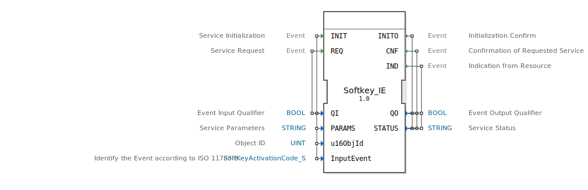

# Softkey_IE

```{index} single: Softkey_IE
```
## 🎧 Podcast

* [ISO 11783-6: Softkeys und das Virtual Terminal verstehen – Dein Schlüssel zur Landmaschinen-Mechatronik](https://podcasters.spotify.com/pod/show/isobus-vt-objects/episodes/ISO-11783-6-Softkeys-und-das-Virtual-Terminal-verstehen--Dein-Schlssel-zur-Landmaschinen-Mechatronik-e36a8b0)

## Einleitung
Der Softkey_IE Funktionsblock ist ein Eingabeservice-Schnittstellen-Funktionsblock für Ereigniseingabedaten, der speziell für die Verarbeitung von Softkey-Ereignissen gemäß ISO 11783-6 entwickelt wurde. Er dient als Schnittstelle zwischen der Anwendungslogik und den physikalischen Softkey-Eingabegeräten in landwirtschaftlichen und mobilen Arbeitsmaschinen.



## Schnittstellenstruktur

### **Ereignis-Eingänge**
- **INIT**: Service-Initialisierung mit Parametern QI, PARAMS, u16ObjId und InputEvent
- **REQ**: Service-Anfrage mit Parameter QI

### **Ereignis-Ausgänge**
- **INITO**: Initialisierungsbestätigung mit Parametern QO und STATUS
- **CNF**: Bestätigung der angeforderten Service-Anfrage mit Parametern QO und STATUS
- **IND**: Indikation von der Ressource mit Parametern QO und STATUS

### **Daten-Eingänge**
- **QI** (BOOL): Ereignis-Eingangsqualifizierer
- **PARAMS** (STRING): Service-Parameter
- **u16ObjId** (UINT): Objekt-ID mit Initialwert ID_NULL
- **InputEvent** (SoftKeyActivationCode_S): Identifiziert das Ereignis gemäß ISO 11783-6 mit Initialwert "Invalid"

### **Daten-Ausgänge**
- **QO** (BOOL): Ereignis-Ausgangsqualifizierer
- **STATUS** (STRING): Service-Status

### **Adapter**
Keine Adapter-Schnittstellen vorhanden.

## Funktionsweise
Der Softkey_IE Funktionsblock verwaltet die Kommunikation mit Softkey-Eingabegeräten gemäß dem ISO-Bus-Standard 11783-6. Bei der Initialisierung (INIT) werden die Service-Parameter und Objekt-ID konfiguriert. Service-Anfragen (REQ) lösen die entsprechende Funktionalität aus, während Indikationen (IND) eingehende Ereignisse von den physikalischen Softkeys signalisieren.

## Technische Besonderheiten
- Unterstützt ISO 11783-6 Standard für landwirtschaftliche Fahrzeuge
- Verwendet spezifische SoftKeyActivationCode-Struktur zur Ereignisidentifikation
- Integriert Objekt-ID-Verwaltung für Geräteidentifikation
- Bietet umfassende Statusrückmeldungen über STRING-Parameter

## Zustandsübersicht
Der Funktionsblock verfügt über einen initialisierten und einen Betriebszustand. Nach erfolgreicher INIT-Initialisierung wechselt der Block in den Betriebszustand, in dem REQ-Anfragen verarbeitet und IND-Ereignisse empfangen werden können.

## Anwendungsszenarien
- Steuerung von Bedienpanels in landwirtschaftlichen Maschinen
- Implementierung von Softkey-Funktionalitäten in mobilen Arbeitsgeräten
- ISO-Bus-konforme Eingabeverarbeitung in Fahrzeugen
- Benutzerschnittstellen für komplexe Maschinensteuerungen

## ⚖️ Vergleich mit ähnlichen Bausteinen
Im Vergleich zu generischen Eingabebausteinen bietet Softkey_IE spezifische ISO 11783-6-Konformität und ist optimiert für die Anforderungen landwirtschaftlicher und mobiler Arbeitsmaschinen. Die Integration von SoftKeyActivationCode ermöglicht eine standardisierte Ereignisbehandlung.


## 🛠️ Zugehörige Übungen

* [Uebung_010b2](../../../../../../training1/Ventilsteuerung/4diacIDE-workspace/test_B/Uebungen_doc/Uebung_010b2.md)
* [Uebung_010b2_AX](../../../../../../training1/Ventilsteuerung/4diacIDE-workspace/test_AX/Uebungen_doc/Uebung_010b2_AX.md)
* [Uebung_010b6](../../../../../../training1/Ventilsteuerung/4diacIDE-workspace/test_B/Uebungen_doc/Uebung_010b6.md)
* [Uebung_010b6_AX](../../../../../../training1/Ventilsteuerung/4diacIDE-workspace/test_AX/Uebungen_doc/Uebung_010b6_AX.md)
* [Uebung_013](../../../../../../training1/Ventilsteuerung/4diacIDE-workspace/test_B/Uebungen_doc/Uebung_013.md)
* [Uebung_013_AX](../../../../../../training1/Ventilsteuerung/4diacIDE-workspace/test_AX/Uebungen_doc/Uebung_013_AX.md)
* [Uebung_014](../../../../../../training1/Ventilsteuerung/4diacIDE-workspace/test_B/Uebungen_doc/Uebung_014.md)
* [Uebung_015](../../../../../../training1/Ventilsteuerung/4diacIDE-workspace/test_B/Uebungen_doc/Uebung_015.md)
* [Uebung_015a](../../../../../../training1/Ventilsteuerung/4diacIDE-workspace/test_B/Uebungen_doc/Uebung_015a.md)
* [Uebung_016](../../../../../../training1/Ventilsteuerung/4diacIDE-workspace/test_B/Uebungen_doc/Uebung_016.md)
* [Uebung_016a](../../../../../../training1/Ventilsteuerung/4diacIDE-workspace/test_B/Uebungen_doc/Uebung_016a.md)
* [Uebung_017](../../../../../../training1/Ventilsteuerung/4diacIDE-workspace/test_B/Uebungen_doc/Uebung_017.md)
* [Uebung_018](../../../../../../training1/Ventilsteuerung/4diacIDE-workspace/test_B/Uebungen_doc/Uebung_018.md)
* [Uebung_018a](../../../../../../training1/Ventilsteuerung/4diacIDE-workspace/test_B/Uebungen_doc/Uebung_018a.md)
* [Uebung_019a](../../../../../../training1/Ventilsteuerung/4diacIDE-workspace/test_B/Uebungen_doc/Uebung_019a.md)
* [Uebung_019b](../../../../../../training1/Ventilsteuerung/4diacIDE-workspace/test_B/Uebungen_doc/Uebung_019b.md)
* [Uebung_021](../../../../../../training1/Ventilsteuerung/4diacIDE-workspace/test_B/Uebungen_doc/Uebung_021.md)
* [Uebung_022](../../../../../../training1/Ventilsteuerung/4diacIDE-workspace/test_B/Uebungen_doc/Uebung_022.md)
* [Uebung_023](../../../../../../training1/Ventilsteuerung/4diacIDE-workspace/test_B/Uebungen_doc/Uebung_023.md)
* [Uebung_024](../../../../../../training1/Ventilsteuerung/4diacIDE-workspace/test_B/Uebungen_doc/Uebung_024.md)
* [Uebung_025](../../../../../../training1/Ventilsteuerung/4diacIDE-workspace/test_B/Uebungen_doc/Uebung_025.md)
* [Uebung_026](../../../../../../training1/Ventilsteuerung/4diacIDE-workspace/test_B/Uebungen_doc/Uebung_026.md)
* [Uebung_039](../../../../../../training1/Ventilsteuerung/4diacIDE-workspace/test_B/Uebungen_doc/Uebung_039.md)
* [Uebung_039a](../../../../../../training1/Ventilsteuerung/4diacIDE-workspace/test_B/Uebungen_doc/Uebung_039a.md)
* [Uebung_039a_sub_Outputs](../../../../../../training1/Ventilsteuerung/4diacIDE-workspace/test_B/Uebungen_doc/Uebung_039a_sub_Outputs.md)

## Fazit
Der Softkey_IE Funktionsblock stellt eine spezialisierte Lösung für die Softkey-Ereignisverarbeitung in ISO 11783-6-konformen Systemen dar. Durch seine standardisierte Schnittstelle und umfassende Statusrückmeldungen eignet er sich ideal für den Einsatz in komplexen mobilen Arbeitsmaschinen-Steuerungen.