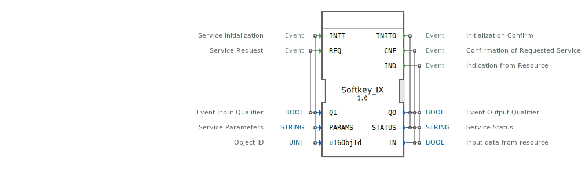

# Softkey_IX

```{index} single: Softkey_IX
```
## 🎧 Podcast

* [ISO 11783-6: Softkeys und das Virtual Terminal verstehen – Dein Schlüssel zur Landmaschinen-Mechatronik](https://podcasters.spotify.com/pod/show/isobus-vt-objects/episodes/ISO-11783-6-Softkeys-und-das-Virtual-Terminal-verstehen--Dein-Schlssel-zur-Landmaschinen-Mechatronik-e36a8b0)

## Einleitung
Der Softkey_IX ist ein Service-Interface-Funktionsblock für boolesche Eingabedaten, der als Eingabeschnittstelle für Softkey-Funktionalitäten dient. Dieser Baustein ermöglicht die Kommunikation mit Ressourcen und die Verarbeitung von Tastatureingaben in Steuerungssystemen.



## Schnittstellenstruktur

### **Ereignis-Eingänge**
- **INIT**: Service-Initialisierung
  - Verknüpft mit: QI, PARAMS, u16ObjId
- **REQ**: Service-Anfrage
  - Verknüpft mit: QI

### **Ereignis-Ausgänge**
- **INITO**: Initialisierungsbestätigung
  - Verknüpft mit: QO, STATUS
- **CNF**: Bestätigung der angeforderten Service-Funktion
  - Verknüpft mit: QO, STATUS, IN
- **IND**: Indikation von der Ressource
  - Verknüpft mit: QO, STATUS, IN

### **Daten-Eingänge**
- **QI**: BOOL - Ereignis-Eingangsqualifizierer
- **PARAMS**: STRING - Service-Parameter
- **u16ObjId**: UINT - Objekt-ID (Initialwert: ID_NULL)

### **Daten-Ausgänge**
- **QO**: BOOL - Ereignis-Ausgangsqualifizierer
- **STATUS**: STRING - Service-Status
- **IN**: BOOL - Eingabedaten von der Ressource

### **Adapter**
Keine Adapter-Schnittstellen vorhanden.

## Funktionsweise
Der Softkey_IX-Funktionsblock dient als Vermittler zwischen der Anwendungslogik und physischen oder virtuellen Eingabegeräten. Bei der Initialisierung (INIT) werden die Service-Parameter konfiguriert. Über REQ-Ereignisse können Service-Anfragen gestellt werden, die mit CNF-Ereignissen bestätigt werden. IND-Ereignisse signalisieren asynchrone Eingaben von der Ressource.

## Technische Besonderheiten
- Verwendet ISOBUS-kompatible Objekt-Identifikation
- Unterstützt parametrierbare Service-Konfiguration über STRING-Parameter
- Bietet sowohl synchrone (CNF) als auch asynchrone (IND) Betriebsmodi
- Initialisierung mit standardisierter Objekt-ID (ID_NULL)

## Zustandsübersicht
Der Funktionsblock durchläuft folgende Hauptzustände:
1. **Nicht initialisiert**: Vor der INIT-Verarbeitung
2. **Initialisiert**: Nach erfolgreicher INIT-Verarbeitung
3. **Bereit**: Kann Service-Anfragen verarbeiten
4. **Aktiv**: Verarbeitet aktuelle Eingaben

## Anwendungsszenarien
- Bedienpanels in mobilen Arbeitsmaschinen
- Virtuelle Tastaturen in Industrieanlagen
- Softkey-Implementierungen in Fahrzeugsystemen
- Benutzerschnittstellen für ISOBUS-kompatible Geräte

## Vergleich mit ähnlichen Bausteinen
Im Vergleich zu einfachen digitalen Eingangsbausteinen bietet Softkey_IX erweiterte Service-Funktionalitäten mit parametrierbaren Konfigurationen und ISOBUS-Kompatibilität. Die IND-Funktionalität ermöglicht asynchrone Ereignisbehandlung, was bei reinen Abfrage-basierten Bausteinen nicht verfügbar ist.


## Zugehörige Übungen

* [Uebung_010](../../../../../../training1/Ventilsteuerung/4diacIDE-workspace/test_B/Uebungen_doc/Uebung_010.md)
* [Uebung_010a](../../../../../../training1/Ventilsteuerung/4diacIDE-workspace/test_B/Uebungen_doc/Uebung_010a.md)
* [Uebung_010a4](../../../../../../training1/Ventilsteuerung/4diacIDE-workspace/test_B/Uebungen_doc/Uebung_010a4.md)
* [Uebung_010b4_sub](../../../../../../training1/Ventilsteuerung/4diacIDE-workspace/test_B/Uebungen_doc/Uebung_010b4_sub.md)
* [Uebung_010b5_sub](../../../../../../training1/Ventilsteuerung/4diacIDE-workspace/test_B/Uebungen_doc/Uebung_010b5_sub.md)
* [Uebung_010c](../../../../../../training1/Ventilsteuerung/4diacIDE-workspace/test_B/Uebungen_doc/Uebung_010c.md)
* [Uebung_010c2](../../../../../../training1/Ventilsteuerung/4diacIDE-workspace/test_B/Uebungen_doc/Uebung_010c2.md)
* [Uebung_010c3_sub](../../../../../../training1/Ventilsteuerung/4diacIDE-workspace/test_B/Uebungen_doc/Uebung_010c3_sub.md)
* [Uebung_010c4_sub](../../../../../../training1/Ventilsteuerung/4diacIDE-workspace/test_B/Uebungen_doc/Uebung_010c4_sub.md)
* [Uebung_039_sub_Outputs](../../../../../../training1/Ventilsteuerung/4diacIDE-workspace/test_B/Uebungen_doc/Uebung_039_sub_Outputs.md)
* [Uebung_039b](../../../../../../training1/Ventilsteuerung/4diacIDE-workspace/test_B/Uebungen_doc/Uebung_039b.md)

## Fazit
Der Softkey_IX-Funktionsblock stellt eine flexible und standardisierte Lösung für Softkey-Eingaben in industriellen Steuerungssystemen dar. Seine ISOBUS-Kompatibilität und die umfangreiche Service-Schnittstelle machen ihn besonders geeignet für anspruchsvolle Anwendungen in mobilen Arbeitsmaschinen und Industrieanlagen.