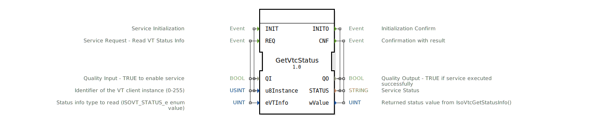

# GetVtcStatus

* * * * * * * * * *

## Einleitung

Der Funktionsblock **GetVtcStatus** ist ein Service Interface Block (SIFB), der die Funktion `IsoVtcGetStatusInfo()` aus dem ISOBUS-Treiber kapselt. Er ermöglicht das Auslesen verschiedener Statusinformationen eines VT‑Clients sowie des angeschlossenen Virtual Terminals (VT). Der Baustein wurde gemäß dem Standard ISO 11783‑6 entwickelt und eignet sich für die Integration in ISOBUS‑Anwendungen.

## Schnittstellenstruktur

### **Ereignis-Eingänge**

| Ereignis | Typ | Beschreibung | Mitgeführte Daten |
|----------|-----|--------------|-------------------|
| `INIT` | EInit | Initialisiert den Baustein. | `QI`, `u8Instance` |
| `REQ` | Event | Fordert das Auslesen eines Statuswertes an. | `QI`, `u8Instance`, `eVTInfo` |

### **Ereignis-Ausgänge**

| Ereignis | Typ | Beschreibung | Mitgeführte Daten |
|----------|-----|--------------|-------------------|
| `INITO` | EInit | Bestätigung der Initialisierung. | `QO`, `STATUS` |
| `CNF` | Event | Bestätigung der Leseanforderung mit Ergebnis. | `QO`, `STATUS`, `wValue` |

### **Daten-Eingänge**

| Name | Typ | Anfangswert | Beschreibung |
|------|-----|-------------|--------------|
| `QI` | BOOL | – | Qualitätseingang: TRUE aktiviert den Dienst. |
| `u8Instance` | USINT | – | Identifikator der VT‑Client‑Instanz (0–255). |
| `eVTInfo` | UINT | 0 | Art der abzufragenden Statusinformation (Werte aus der Enumeration `ISOVT_STATUS_e`). |

### **Daten-Ausgänge**

| Name | Typ | Beschreibung |
|------|-----|--------------|
| `QO` | BOOL | Qualitätsausgang: TRUE bei erfolgreicher Ausführung. |
| `STATUS` | STRING | Dienststatus – enthält eine textuelle Rückmeldung. |
| `wValue` | UINT | Der von `IsoVtcGetStatusInfo()` zurückgegebene Wert (abhängig von `eVTInfo`). |

### **Adapter**

Keine Adapter vorhanden.

## Funktionsweise

1. **Initialisierung**  
   Durch das Ereignis `INIT` wird der Baustein aktiviert. Der Parameter `QI` muss auf TRUE gesetzt sein, damit der Dienst gestartet werden kann. Die zu verwendende VT‑Client‑Instanz wird über `u8Instance` festgelegt. Nach erfolgreicher Initialisierung wird das Ereignis `INITO` mit den Ausgabedaten `QO` und `STATUS` gesendet.

2. **Auslesen einer Statusinformation**  
   Mit dem Ereignis `REQ` wird eine konkrete Abfrage gestartet. Dabei muss über `eVTInfo` der gewünschte Statuswert aus der Enumeration `ISOVT_STATUS_e` ausgewählt werden (siehe Liste in den technischen Besonderheiten). Der Baustein ruft intern die Funktion `IsoVtcGetStatusInfo()` auf und sendet nach Abschluss das Ereignis `CNF`. Die Ausgänge enthalten:
   - `QO` = TRUE bei erfolgreichem Lesevorgang,
   - `STATUS` = Beschreibung des Ergebnisses,
   - `wValue` = der ausgelesene Zahlenwert.

   Falls `QI` während des REQ‑Aufrufs FALSE ist, wird der Dienst nicht ausgeführt und ein entsprechender Fehlerstatus zurückgegeben.

## Technische Besonderheiten

- Der Baustein ist als **Service Interface Block** (SIFB) realisiert und greift auf die systemnahe ISOBUS‑Treiberbibliothek zu.
- Die möglichen Werte für `eVTInfo` (ISOVT_STATUS_e) sind:

| Wert | Bezeichnung | Beschreibung |
|------|-------------|--------------|
| 0 | VT_SOURCE_ADDRESS | Quelladresse des VT |
| 2 | VT_HND | CF‑Handle des VT |
| 3 | CF_SOURCE_ADDRESS | Quelladresse des VT‑Client |
| 4 | CF_HND | CF‑Handle des VT‑Client |
| 6 | ID_VISIBLE_DATA_MASK | Auf dem VT geöffnete Datenmaske |
| 7 | ID_VISIBLE_SOFTKEY_MASK | Auf dem VT geöffnete Softkey‑Maske |
| 8 | VT_BUSY_CODE | Busy‑Code der VT‑Statusmeldung |
| 9 | AUXUNITS_TYPE1_ONBUS | TRUE, wenn Hilfsgerät Typ 1 am Bus ist |
| 11 | VT_ALIVE | VT seit mehr als 3 Sekunden nicht erreichbar |
| 12 | VT_DOWNLOAD_FINISHED | Vollständiges Announcing abgeschlossen |
| 13 | VT_POOL_ACTIVE_onVT | Pool (ausgewählt) auf dem VT aktiv |
| 14 | VT_STATEOFANNOUNCING | Zustand des Announcing |
| 15 | WS_VERSION_NR | Versionsnummer des Working Set |
| 16 | VT_NUMBOFVERSIONSTRINGS | Anzahl der gesendeten Versionsstrings des VT |
| 17 | VT_NAVSOFTKEYS | Navigations‑Softkeys (Version 4) |
| 18 | VT_SOFTKEYXDOT | Softkey‑Bezeichner – Pixel X |
| 19 | VT_SOFTKEYYDOT | Softkey‑Bezeichner – Pixel Y |
| 20 | VT_VIRTUALSOFTKEYS | Anzahl der virtuellen Softkeys |
| 21 | VT_PHYSICALSOFTKEYS | Anzahl der physischen Softkeys |
| 25 | VT_BOOTTIME | Bootzeit des VT |
| 26 | VT_GRAPHICTYPE | Grafiktyp der VT‑Hardware |
| 29 | VT_VERSIONNR | Version des Working Set VT |

- Der Baustein unterstützt sowohl die Initialisierung als auch den wiederholten Aufruf von Leseoperationen, sodass in einer Schleife verschiedene Statuswerte abgefragt werden können.

## Zustandsübersicht

Der Baustein implementiert eine einfache zustandsgesteuerte Logik:

1. **Startzustand** – Der Baustein wartet auf das Ereignis `INIT`.
2. **Initialisierung** – Nach Erhalt von `INIT` (mit gültigem QI) wird der Dienst initialisiert. Im Erfolgsfall wird `INITO` mit QO=TRUE gesendet. Bei Fehler wird QO=FALSE und ein entsprechender STATUS gesendet.
3. **Bereit** – Nach erfolgreicher Initialisierung können beliebig viele `REQ`-Ereignisse verarbeitet werden. Jedes `REQ` führt zu einem Aufruf von `IsoVtcGetStatusInfo()` und dem anschließenden Senden von `CNF`.
4. **Fehlerbehandlung** – Tritt während eines REQ ein interner Fehler auf, wird `CNF` mit QO=FALSE und einer Fehlerbeschreibung in `STATUS` ausgegeben.

## Anwendungsszenarien

- **Diagnose und Überwachung** eines ISOBUS‑Systems: Auslesen der aktuellen VT‑Adresse, des Grafiktyps oder der Bootzeit.
- **Erkennung der VT‑Verfügbarkeit** durch Abfrage von `VT_ALIVE` und `VT_DOWNLOAD_FINISHED`.
- **Steuerung der Softkey‑Konfiguration** durch Abfrage der Anzahl physikalischer und virtueller Softkeys (`VT_PHYSICALSOFTKEYS`, `VT_VIRTUALSOFTKEYS`).
- **Abgleich der Working‑Set‑Version** zwischen verschiedenen Komponenten mithilfe von `VT_VERSIONNR` und `WS_VERSION_NR`.

## Vergleich mit ähnlichen Bausteinen

Ähnliche Bausteine wie `GetVtPool` oder `GetVtObject` fokussieren auf das Lesen von Pool‑ oder Objektdaten. Der `GetVtcStatus`‑Baustein hingegen ist speziell für den Zugriff auf den allgemeinen VT‑Client‑Status ausgelegt. Er bietet eine direkte Schnittstelle zu den Systemstatuseigenschaften der ISOBUS‑Spezifikation und ergänzt Bausteine, die auf Masken‑ oder Softkey‑Informationen zugreifen.

## Fazit

Der Funktionsblock `GetVtcStatus` stellt eine kompakte und standardkonforme Möglichkeit dar, um auf die systemnahen Statusdaten eines ISOBUS‑Virtual Terminals zuzugreifen. Seine klare Schnittstelle und die vielfältigen Abfragemöglichkeiten machen ihn zu einem wertvollen Werkzeug für die Implementierung von Diagnose‑, Überwachungs‑ und Konfigurationsfunktionen in landwirtschaftlichen Steuerungssystemen.