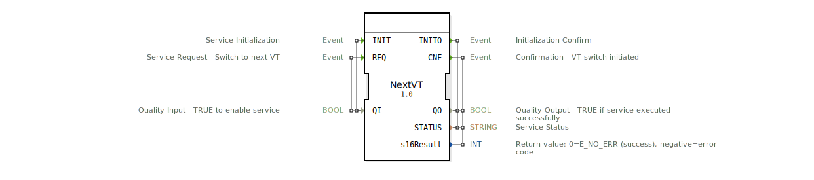

# NextVT

* * * * * * * * * *
## Einleitung
Der Funktionsblock **NextVT** ist ein Service-Interface-Block, der das Umschalten zum nächsten verfügbaren Virtual Terminal (VT) in einem ISOBUS-Netzwerk (ISO 11783-6) ermöglicht. Er kapselt die Funktionalität von `VTC_NextVTButtonPressed()` aus den ISOBUS-Treiberbeispielen und ermöglicht eine nahtlose Umschaltung zwischen mehreren VT-Geräten.

## Schnittstellenstruktur
### **Ereignis-Eingänge**

| Ereignis | Datentyp | Mit Variablen | Beschreibung |
|----------|----------|---------------|---------------|
| INIT     | EInit    | QI            | Service-Initialisierung. Wird ausgelöst, um den Baustein zu konfigurieren. |
| REQ      | Event    | QI            | Service-Anforderung. Startet den Vorgang zum Umschalten zum nächsten verfügbaren VT. |

### **Ereignis-Ausgänge**

| Ereignis | Datentyp | Mit Variablen | Beschreibung |
|----------|----------|---------------|---------------|
| INITO    | EInit    | QO, STATUS    | Bestätigung der Initialisierung. Signalisiert, ob die Initialisierung erfolgreich war. |
| CNF      | Event    | QO, STATUS, s16Result | Bestätigung des Umschaltvorgangs. Wird ausgegeben, sobald der Wechsel zum nächsten VT initiiert wurde. |

### **Daten-Eingänge**

| Variable | Typ   | Beschreibung |
|----------|-------|---------------|
| QI       | BOOL  | Qualitätseingang. TRUE aktiviert den Dienst. Bei FALSE werden keine Aktionen ausgeführt. |

### **Daten-Ausgänge**

| Variable  | Typ    | Beschreibung |
|-----------|--------|---------------|
| QO        | BOOL   | Qualitätsausgang. TRUE, wenn der Dienst erfolgreich ausgeführt wurde. |
| STATUS    | STRING | Statusmeldung zum Ergebnis des letzten Vorgangs. |
| s16Result | INT    | Rückgabewert: 0 = E\_NO\_ERR (erfolgreich), negativer Wert = Fehlercode. |

### **Adapter**
Keine Adapter vorhanden.

## Funktionsweise
Der Block führt beim Empfang eines **REQ**-Ereignisses folgende Schritte durch:

1.  **Liste aller VTs ermitteln** – Mittels `IsoClientsReadListofExtHandles()` werden alle im ISOBUS-Netzwerk verfügbaren Virtual Terminals erfasst.
2.  **Aktuell verbundenes VT finden** – Über `IsoVtcGetStatusInfo(VT_HND)` wird das aktuell genutzte VT identifiziert.
3.  **Nächstes VT bestimmen** – Aus der Liste wird der nächste Eintrag nach dem aktuellen VT ausgewählt (zyklische Reihenfolge).
4.  **Umschaltung durchführen** – Der Wechsel zum nächsten VT wird mittels `IsoVtcMultipleNextVT()` angestoßen.

-   **Fehlerfall:** Falls nur ein VT am Bus vorhanden ist oder der Wechsel fehlschlägt, wird ein negativer Rückgabewert (`s16Result`) sowie eine entsprechende Statusmeldung ausgegeben.
-   **Wichtiger Hinweis:** Die Anwendung muss nach dem Aufruf dieses Blocks in einen sicheren Zustand übergehen, da die Verbindung zum aktuellen VT während des Übergangs verloren geht.

## Technische Besonderheiten
-   **Standardkonformität:** Der Block basiert auf ISO 11783-6 (ISOBUS) und implementiert die VT-Umschaltfunktion gemäß dem Standard.
-   **Service-Interface-Block:** Die Ausführung erfolgt asynchron; das Ereignis **CNF** signalisiert den Abschluss des Umschaltvorgangs.
-   **Initialisierung:** Vor der ersten Nutzung muss der Block über das **INIT**-Ereignis initialisiert werden, um interne Ressourcen zu belegen.

## Zustandsübersicht
Der Baustein besitzt keine expliziten Zustände in der XML-Definition. Das Verhalten wird durch die ereignisgesteuerte Abarbeitung bestimmt:

-   **Initialisierungsphase:** Nach **INIT** mit `QI=TRUE` wird die Initialisierung durchgeführt, quittiert durch **INITO**.
-   **Betriebsphase:** Nach **REQ** mit `QI=TRUE` wird der Umschaltvorgang gestartet. Nach Abschluss erfolgt das Ereignis **CNF**.
-   **Fehlerbehandlung:** Bei Fehlern werden `QO=FALSE` und ein entsprechender Fehlercode in `s16Result` gesetzt.

## Anwendungsszenarien
-   **ISOBUS-Maschinenbedienung:** Wechsel zwischen mehreren Virtual Terminals in landwirtschaftlichen Fahrzeugen, um z. B. zwischen Display und Bordcomputer umzuschalten.
-   **Multimonitor-Systeme:** Umschaltung der aktiven Anzeige auf ein anderes VT-Gerät im Netzwerk.
-   **Diagnose und Test:** Simulieren des Druckes der „Next VT“-Taste während der Entwicklung von ISOBUS-konformen Anwendungen.

## Vergleich mit ähnlichen Bausteinen
-   **VTSelection** (hypothetisch): Ein Block, der ein bestimmtes VT-Objekt auswählt, anstatt einfach zum nächsten zu springen. NextVT ist einfacher und folgt der Standardtastenlogik.
-   **VTConnect** (hypothetisch): Stellt eine direkte Verbindung zu einem benannten VT her. NextVT hingegen arbeitet automatisch und benötigt keine Zieladresse.

## Fazit
Der **NextVT**-Funktionsblock ist ein spezialisierter Service-Interface-Block für ISOBUS-Anwendungen, der die standardkonforme Umschaltung zum nächsten verfügbaren Virtual Terminal ermöglicht. Durch die einfache Schnittstelle (INIT, REQ) und die klare Fehlerrückmeldung eignet er sich hervorragend für die Integration in Steuerungssoftware, die eine flexible VT-Auswahl benötigt. Die Anwendung muss jedoch die kurze Verbindungsunterbrechung berücksichtigen.