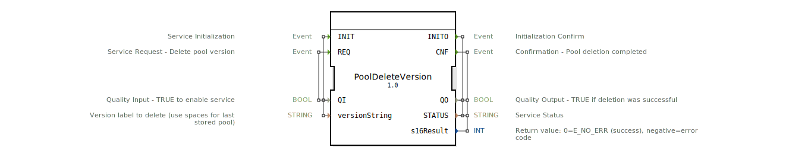

# PoolDeleteVersion

* * * * * * * * * *

## Einleitung

Der Service Interface Block `PoolDeleteVersion` löscht eine gespeicherte Objekt-Pool-Version aus dem nichtflüchtigen Speicher eines Virtual Terminals (VT). Er kapselt die Funktion `VTC_PoolDeleteVersion()` aus dem ISOBUS-Treiber. Der Block ruft `IsoVtcCmd_DeleteVersion()` auf, um die angegebene Pool-Version zu entfernen.

## Schnittstellenstruktur

### **Ereignis-Eingänge**

| Name | Typ | Kommentar |
|------|-----|-----------|
| INIT | EInit | Service-Initialisierung |
| REQ  | Event | Service-Anforderung – Pool-Version löschen |

### **Ereignis-Ausgänge**

| Name  | Typ  | Kommentar |
|-------|------|-----------|
| INITO | EInit | Initialisierungsbestätigung |
| CNF   | Event | Bestätigung – Löschvorgang abgeschlossen |

### **Daten-Eingänge**

| Name            | Typ    | Kommentar                                         | Initialwert          |
|-----------------|--------|---------------------------------------------------|----------------------|
| QI              | BOOL   | Qualitätseingang – TRUE aktiviert den Dienst      |                      |
| versionString   | STRING | Zu löschende Versionsbezeichnung (Leerzeichen für letzte gespeicherte Version) | `'       '` |

### **Daten-Ausgänge**

| Name      | Typ    | Kommentar                                             |
|-----------|--------|-------------------------------------------------------|
| QO        | BOOL   | Qualitätsausgang – TRUE bei erfolgreichem Löschvorgang |
| STATUS    | STRING | Dienststatus                                          |
| s16Result | INT    | Rückgabewert: 0 = E_NO_ERR (Erfolg), negativ = Fehlercode |

### **Adapter**

Keine.

## Funktionsweise

Der Block wird über den Ereigniseingang `INIT` initialisiert, wobei die zu löschende Versionsbezeichnung (`versionString`) übergeben wird. Nach erfolgreicher Initialisierung löst ein `REQ`-Ereignis den Löschvorgang aus. Der Block ruft die systemnahe Funktion `IsoVtcCmd_DeleteVersion()` auf, die die angegebene Pool-Version aus dem Flash-Speicher des VT entfernt. Das Ergebnis wird über die Ausgänge `QO`, `STATUS` und `s16Result` signalisiert und ein entsprechendes Bestätigungsereignis (`CNF` oder `INITO`) ausgelöst.

## Technische Besonderheiten

- Der `versionString` muss nullterminiert sein oder genau 32 Byte lang sein (ISO V11+).
- Wird ein String aus Leerzeichen (`'       '`) übergeben, löscht die Funktion die zuletzt gespeicherte Pool-Version.
- Maximale Länge des Versionseintrags: 32 Byte.
- Der Block ist als Service Interface Block (SIB) für die ISOBUS-Kommunikation (ISO 11783-6) ausgelegt.

## Zustandsübersicht

Der Block besitzt keine explizit in der XML definierten Zustände. Die Steuerung erfolgt ereignisgesteuert über `INIT` und `REQ`:

1. **Initialisierung** (INIT) → Bestätigung (INITO)
2. **Anforderung** (REQ) → Bestätigung (CNF) mit Ergebnis

Fehlerhafte Initialisierung oder fehlgeschlagene Löschung werden durch `QO=FALSE` und entsprechende `STATUS`-Meldung signalisiert.

## Anwendungsszenarien

- Löschen alter Pool-Versionen vor dem Hochladen einer neuen Version
- Freigeben von Flash-Speicherplatz auf dem VT
- Entfernen beschädigter oder nicht mehr benötigter Pool-Versionen
- Zurücksetzen auf die werkseitig gespeicherte Version durch Löschen aller benutzerdefinierten Versionen

## Vergleich mit ähnlichen Bausteinen

Es liegt kein direkter Vergleich zu anderen Funktionsblöcken vor. Der Block ist spezifisch für die Verwaltung von ISOBUS-Objektpools in VT-Flash-Speichern.

## Fazit

`PoolDeleteVersion` bietet eine standardisierte und zuverlässige Möglichkeit, gespeicherte Objektpool-Versionen aus dem Flash-Speicher eines Virtual Terminals zu löschen. Durch die einfache ereignisgesteuerte Schnittstelle lässt er sich gut in Automatisierungs- und Steuerungsanwendungen integrieren. Die Berücksichtigung der ISO-Vorgaben (Version String-Länge, Leerzeichen für letzte Version) macht den Block besonders robust für den Einsatz in landwirtschaftlichen Maschinen nach ISO 11783.