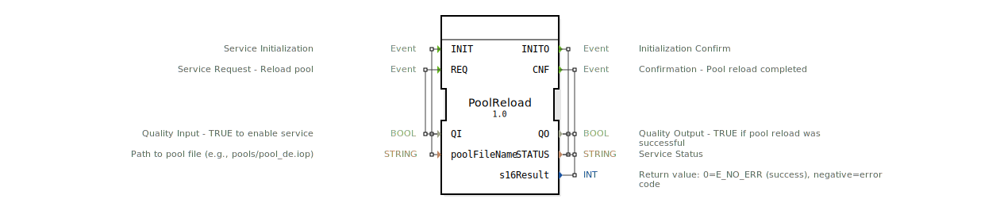

# PoolReload

* * * * * * * * * *
## Einleitung
Der Funktionsblock `PoolReload` ist ein Service-Interface-Baustein gemäß ISO 11783-6 (ISOBUS). Er ermöglicht das Nachladen oder Aktualisieren des Objektpools eines Virtual Terminals (VT) während der Laufzeit der Applikation. Typischerweise wird dieser Baustein eingesetzt, um z. B. zwischen verschiedenen Sprachvarianten umzuschalten oder geänderte Pool-Dateien dynamisch einzuspielen, ohne das Gesamtsystem neu starten zu müssen.

## Schnittstellenstruktur
### **Ereignis-Eingänge**
| Ereignis | Typ | Kommentar |
|----------|-----|-----------|
| `INIT` | `EInit` | Initialisierung des Dienstes (mit den Parametern `QI` und `poolFileName`) |
| `REQ` | `Event` | Dienstaufforderung – führt das Nachladen des Pools aus (mit `QI`) |

### **Ereignis-Ausgänge**
| Ereignis | Typ | Kommentar |
|----------|-----|-----------|
| `INITO` | `EInit` | Bestätigung der Initialisierung (gibt `QO` und `STATUS` aus) |
| `CNF` | `Event` | Bestätigung – Pool-Nachladen abgeschlossen (gibt `QO`, `STATUS` und `s16Result` aus) |

### **Daten-Eingänge**
| Name | Typ | Kommentar |
|------|-----|-----------|
| `QI` | `BOOL` | Quality Input: `TRUE` schaltet den Dienst aktiv |
| `poolFileName` | `STRING` | Pfad zur Pool-Datei (z. B. `pools/pool_de.iop`) |

### **Daten-Ausgänge**
| Name | Typ | Kommentar |
|------|-----|-----------|
| `QO` | `BOOL` | Quality Output: `TRUE`, wenn das Nachladen erfolgreich war |
| `STATUS` | `STRING` | Dienststatus (z. B. Fehlermeldung oder Erfolgsmeldung) |
| `s16Result` | `INT` | Rückgabewert: `0` = `E_NO_ERR` (Erfolg), negative Werte entsprechen Fehlercodes |

### **Adapter**
Keine Adapter vorhanden.

## Funktionsweise
Der Baustein kapselt die ISOBUS-Funktion `VTC_PoolReload()`. Der Ablauf gliedert sich in folgende Schritte:

1. **Initialisierung (`INIT`)**  
   - Die Pool-Daten werden aus der unter `poolFileName` angegebenen Datei geladen.
   - Der Pool wird für die konfigurierte Farbtiefe geöffnet.
   - Nach erfolgreichem Laden liefert der Baustein eine Bestätigung über `INITO`.

2. **Dienstausführung (`REQ`)**  
   - Der Baustein ruft `IsoVtcPoolUpdate()` auf, um den Pool auf dem VT zu aktualisieren.
   - Optional können ID-Bereichsmodi für die Pool-Manipulation angewendet werden.
   - Nach Abschluss des Vorgangs wird ein `CNF`-Ereignis ausgelöst, das den Erfolg oder Fehler (über `s16Result`) meldet.

## Technische Besonderheiten
- **Standardkonformität**: Der Baustein folgt der ISOBUS-Norm ISO 11783-6 (Landwirtschaftliche Fahrzeuge – Virtual Terminal).
- **Dateipfad**: Standardmäßig wird die Pool-Datei unter `pools/pool_de.iop` erwartet. Der Pfad kann jedoch über den Eingang `poolFileName` konfiguriert werden.
- **Laufzeitaktualisierung**: Im Gegensatz zu einem statischen Pool-Import erlaubt dieser FB ein dynamisches Update, ohne die Applikation neu starten zu müssen.
- **Fehlerbehandlung**: Der Ausgang `s16Result` gibt den detaillierten ISOBUS-Fehlercode zurück (0 = Erfolg, negative Werte = Fehler).

## Zustandsübersicht
Der Baustein kann folgende grundlegende Zustände durchlaufen:

| Zustand | Beschreibung |
|---------|--------------|
| **IDLE** | Warten auf ein INIT-Ereignis. |
| **INIT_PENDING** | Initialisierung wird ausgeführt; nach Abschluss wird `INITO` gesendet. |
| **READY** | Nach erfolgreicher Initialisierung bereit für `REQ`. |
| **REQ_PENDING** | Pool-Nachladen läuft; nach Abschluss wird `CNF` gesendet. |
| **ERROR** | Bei fehlgeschlagener Initialisierung oder Nachladen wird ein Fehlerstatus gemeldet und der Baustein verharrt im Fehlerzustand, bis ein erneutes INIT erfolgt. |

## Anwendungsszenarien
- **Sprachumschaltung**: Während der Laufzeit kann zwischen verschiedenen Sprachvarianten (z. B. Deutsch, Englisch) durch Austausch der Pool-Datei umgeschaltet werden.
- **Dynamische Pool-Updates**: Neue Masken oder Symbole können eingespielt werden, ohne das gesamte VT neu zu starten – nützlich für Firmware-Updates oder Anpassungen im Feld.
- **Last-Minute-Änderungen**: Während der Inbetriebnahme können geänderte Pool-Dateien schnell geladen werden.

## Vergleich mit ähnlichen Bausteinen
| Baustein | Beschreibung |
|----------|--------------|
| `PoolLoader` | Lädt den Pool nur beim Systemstart; kein Nachladen zur Laufzeit. |
| `PoolActivate` | Schaltet zwischen bereits geladenen Pools um, erfordert aber vorheriges Laden. |
| **`PoolReload`** | Vereint Laden und Aktualisieren in einem Schritt und ermöglicht dynamisches Nachladen während der Laufzeit. |

## Fazit
Der `PoolReload`-Funktionsblock ist ein spezialisierter Service-Interface-Baustein für ISOBUS-Virtual-Terminals, der das flexible Nachladen und Aktualisieren von Objektpools zur Laufzeit ermöglicht. Er vereinfacht Sprachumschaltungen, dynamische Updates und erleichtert die Wartung von VT-Anwendungen. Durch die klare Ereignisschnittstelle und die detaillierte Fehlerrückmeldung eignet er sich gut für den Einsatz in landwirtschaftlichen Steuerungssystemen.