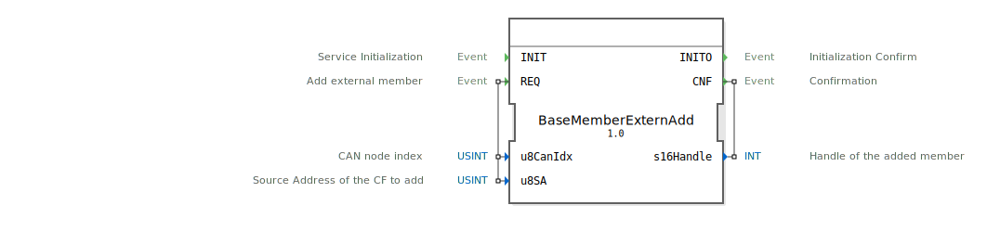

# BaseMemberExternAdd

```{index} single: BaseMemberExternAdd
```

Adds an external member to the network list manually.

The use of this function is not ISO 11783 Part 5 conform.
Use this function only if you must communicate with an external CF,
that does not send a address claimed message.
An address claimed message of an external CF with the same source address
will replace this manual added member entry.
The function works independent from the configuration of the #CFG_PARAM_EXTERNAL_ADDR_CLAIM parameter.
The added CF will be set to announced in the next iso_DlCyclicGlobal() run.

## Interface

### Event Inputs

| Name | Comment | With |
| :--- | :--- | :--- |
| INIT | Service Initialization | |
| REQ | Add external member | u8SA, u8CanIdx |

### Event Outputs

| Name | Comment | With |
| :--- | :--- | :--- |
| INITO | Initialization Confirm | |
| CNF | Confirmation | s16Handle |

### Input Vars

| Name | Type | Initial Value | Comment |
| :--- | :--- | :--- | :--- |
| u8CanIdx | USINT | NODE1 | CAN node index |
| u8SA | USINT | | Source Address of the CF to add |

### Output Vars

| Name | Type | Comment |
| :--- | :--- | :--- |
| s16Handle | INT | Handle of the added member |


## Zugehörige Übungen

* [Uebung_134](../../../../training1/Ventilsteuerung/4diacIDE-workspace/test_B/Uebungen_doc/Uebung_134.md)

