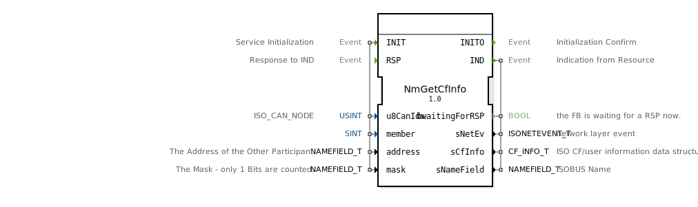

# NmGetCfInfo

```{index} single: NmGetCfInfo
```


* * * * * * * * * *
## Einleitung
Der Funktionsblock `NmGetCfInfo` dient innerhalb eines ISOBUS-Netzwerks dazu, Informationen über verbundene Kommunikationspartner (Connected CFs) abzurufen. Er ermöglicht es, sowohl interne als auch externe Teilnehmer im Netzwerk zu identifizieren und deren Details zu erfassen. Der Baustein ist Teil der ISOBUS-PGN-Kommunikation und wird typischerweise für Netzwerkmanagement-Aufgaben eingesetzt.



## Schnittstellenstruktur

### **Ereignis-Eingänge**
*   **INIT (Typ: EInit)**: Initialisiert den Dienst. Bei Auslösung werden die konfigurierten Daten-Eingänge übernommen und der Initialisierungsprozess gestartet.
*   **RSP (Typ: Event)**: Bestätigt den Empfang einer Indikation (`IND`). Dieses Ereignis signalisiert dem Baustein, dass eine zuvor gesendete Indikation verarbeitet wurde.

### **Ereignis-Ausgänge**
*   **INITO (Typ: EInit)**: Bestätigt den erfolgreichen Abschluss der Initialisierung.
*   **IND (Typ: Event)**: Wird ausgelöst, um eine empfangene Netzwerkindikation (z.B. gefundene Kommunikationspartner) an die Anwendung weiterzugeben.

### **Daten-Eingänge**
*   **u8CanIdx (Typ: USINT, Initialwert: ISO_CAN_NODE::INVALID)**: Identifiziert den verwendeten CAN-Knoten (CAN-Controller-Index).
*   **member (Typ: SINT, Initialwert: ISOUSERHOME_e::notdef)**: Definiert die Mitgliedschaft oder Rolle des anfragenden Teilnehmers im Netzwerk.
*   **address (Typ: isobus::pgn::NAMEFIELD_T)**: Die Adresse des anderen Netzwerkteilnehmers, für den Informationen abgerufen werden sollen.
*   **mask (Typ: isobus::pgn::NAMEFIELD_T)**: Eine Bitmaske, die angibt, welche Teile der Adresse bei der Suche berücksichtigt werden sollen. Nur gesetzte Bits (1) werden ausgewertet.

### **Daten-Ausgänge**
*   **bwaitingForRSP (Typ: BOOL)**: Zeigt an, ob der Funktionsblock aktuell auf eine Antwort (`RSP`) auf eine gesendete Indikation wartet.
*   **sNetEv (Typ: isobus::pgn::ISONETEVENT_T)**: Enthält Details zum aufgetretenen Netzwerkereignis (z.B. Fehler oder Status).
*   **sCfInfo (Typ: isobus::pgn::CF_INFO_T)**: Die abgerufenen Informationen über den gefundenen Kommunikationspartner (CF = Communication Function).
*   **sNameField (Typ: isobus::pgn::NAMEFIELD_T)**: Der ISOBUS-Name des gefundenen Kommunikationspartners.

### **Adapter**
Dieser Funktionsblock verwendet keine Adapter-Schnittstellen.

## Funktionsweise
1.  **Initialisierung**: Durch das Auslösen des `INIT`-Ereignisses wird der Baustein konfiguriert. Die übergebenen Parameter (`u8CanIdx`, `member`, `address`, `mask`) definieren den Kontext und das Ziel der Abfrage. Nach erfolgreicher Initialisierung wird `INITO` ausgegeben.
2.  **Abfrage und Indikation**: Nach der Initialisierung beginnt der Baustein, basierend auf der `address` und `mask`, nach passenden Kommunikationspartnern im Netzwerk zu suchen. Wird ein Teilnehmer gefunden, löst der Baustein das `IND`-Ereignis aus und stellt die gefundenen Informationen in den Daten-Ausgängen `sCfInfo` und `sNameField` bereit. Gleichzeitig wird `bwaitingForRSP` auf `TRUE` gesetzt.
3.  **Antwortverarbeitung**: Die übergeordnete Anwendung bestätigt den Empfang der Indikation durch das Senden des `RSP`-Ereignisses. Daraufhin setzt der Baustein `bwaitingForRSP` auf `FALSE` zurück. Dieser Handshake-Mechanismus stellt eine sichere Übertragung sicher.

## Technische Besonderheiten
*   Der Baustein implementiert ein Request-Response-Protokoll (`IND`/`RSP`) für zuverlässige Kommunikation.
*   Die Verwendung einer Bit-`mask` ermöglicht flexible Suchanfragen, z.B. nach Teilnehmern einer bestimmten Geräteklasse.
*   Die Datentypen (`ISONETEVENT_T`, `CF_INFO_T`, `NAMEFIELD_T`) sind spezifisch für die ISOBUS-PGN-Kommunikation und enthalten strukturierte Informationen gemäß dem ISO 11783-Standard.

## Zustandsübersicht
1.  **Inaktiv**: Vor der Initialisierung.
2.  **Initialisiert**: Nach `INITO`. Der Baustein ist betriebsbereit und kann Anfragen bearbeiten.
3.  **Wartend auf RSP**: Nach dem Auslösen von `IND`. Der Baustein wartet auf die Bestätigung (`RSP`) der Anwendung, bevor er weitere Aktionen durchführt.

## Anwendungsszenarien
*   **Netzwerk-Discovery**: Beim Start eines Geräts, um alle aktiven Teilnehmer im ISOBUS-Netzwerk zu identifizieren.
*   **Diagnose und Monitoring**: Zur Überwachung, ob bestimmte erwartete Steuergeräte (z.B. eines Anbaugeräts) verbunden und erreichbar sind.
*   **Dynamische Konfiguration**: Um Informationen über neu hinzugekommene Geräte zu erhalten und die Applikation entsprechend anzupassen.

## ⚖️ Vergleich mit ähnlichen Bausteinen
Im Gegensatz zu einfachen Lese- oder Abfrage-Bausteinen ist `NmGetCfInfo` speziell auf die Abfrage von ISOBUS-spezifischen Netzwerkinformationen ausgelegt. Er bietet mehr Kontext (durch `member`, `address`, `mask`) und strukturierte Ergebnisdaten (`CF_INFO_T`) als ein generischer Kommunikationsbaustein. Bausteine wie `E_SWITCH` oder `E_DEMUX` leiten nur Ereignisse weiter, während `NmGetCfInfo` aktive Netzwerkkommunikation und Protokollhandlung durchführt.


## 🛠️ Zugehörige Übungen

* [Uebung_120](../../../../training1/Ventilsteuerung/4diacIDE-workspace/test_B/Uebungen_doc/Uebung_120.md)
* [Uebung_121](../../../../training1/Ventilsteuerung/4diacIDE-workspace/test_B/Uebungen_doc/Uebung_121.md)
* [Uebung_122](../../../../training1/Ventilsteuerung/4diacIDE-workspace/test_B/Uebungen_doc/Uebung_122.md)
* [Uebung_122b](../../../../training1/Ventilsteuerung/4diacIDE-workspace/test_B/Uebungen_doc/Uebung_122b.md)
* [Uebung_123](../../../../training1/Ventilsteuerung/4diacIDE-workspace/test_B/Uebungen_doc/Uebung_123.md)
* [Uebung_124](../../../../training1/Ventilsteuerung/4diacIDE-workspace/test_B/Uebungen_doc/Uebung_124.md)
* [Uebung_125](../../../../training1/Ventilsteuerung/4diacIDE-workspace/test_B/Uebungen_doc/Uebung_125.md)
* [Uebung_126](../../../../training1/Ventilsteuerung/4diacIDE-workspace/test_B/Uebungen_doc/Uebung_126.md)
* [Uebung_126b](../../../../training1/Ventilsteuerung/4diacIDE-workspace/test_B/Uebungen_doc/Uebung_126b.md)
* [Uebung_126b2](../../../../training1/Ventilsteuerung/4diacIDE-workspace/test_B/Uebungen_doc/Uebung_126b2.md)
* [Uebung_127](../../../../training1/Ventilsteuerung/4diacIDE-workspace/test_B/Uebungen_doc/Uebung_127.md)
* [Uebung_128](../../../../training1/Ventilsteuerung/4diacIDE-workspace/test_B/Uebungen_doc/Uebung_128.md)
* [Uebung_128b](../../../../training1/Ventilsteuerung/4diacIDE-workspace/test_B/Uebungen_doc/Uebung_128b.md)
* [Uebung_130](../../../../training1/Ventilsteuerung/4diacIDE-workspace/test_B/Uebungen_doc/Uebung_130.md)
* [Uebung_131](../../../../training1/Ventilsteuerung/4diacIDE-workspace/test_B/Uebungen_doc/Uebung_131.md)
* [Uebung_132](../../../../training1/Ventilsteuerung/4diacIDE-workspace/test_B/Uebungen_doc/Uebung_132.md)
* [Uebung_133](../../../../training1/Ventilsteuerung/4diacIDE-workspace/test_B/Uebungen_doc/Uebung_133.md)
* [Uebung_134](../../../../training1/Ventilsteuerung/4diacIDE-workspace/test_B/Uebungen_doc/Uebung_134.md)

## Fazit
Der `NmGetCfInfo`-Funktionsblock ist ein essenzielles Werkzeug für das Management von ISOBUS-Netzwerken. Er abstrahiert die komplexe Protokollkommunikation zur Erkennung von Netzwerkteilnehmern in eine einfach zu verwendende, ereignisgesteuerte Schnittstelle. Seine Fähigkeit, gezielt nach Teilnehmern zu suchen und detaillierte Informationen zurückzuliefern, macht ihn wertvoll für robuste und intelligente landwirtschaftliche Steuerungssysteme.