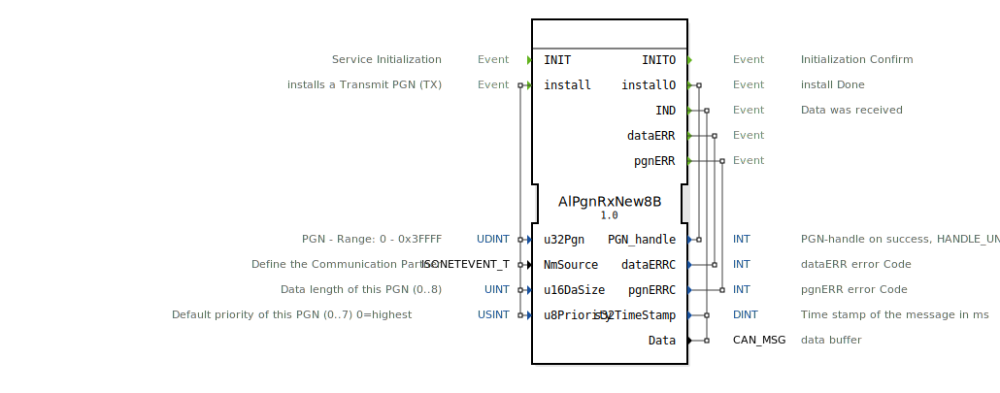

# AlPgnRxNew8B

```{index} single: AlPgnRxNew8B
```


* * * * * * * * * *
## Einleitung
Der Funktionsblock `AlPgnRxNew8B` dient dem Empfang von Daten über ein CAN-Netzwerk nach dem ISOBUS-Standard (ISO 11783). Sein Hauptzweck ist die Installation und Verwaltung von Parameter Group Numbers (PGNs) für den Empfang von Nachrichten sowie die Bereitstellung empfangener Daten an die Anwendung. Er ist Teil einer spezialisierten Bibliothek für ISOBUS-Kommunikation.



## Schnittstellenstruktur

### **Ereignis-Eingänge**
*   **`INIT`**: Startet die Initialisierung des Funktionsblocks. Bestätigung erfolgt über `INITO`.
*   **`install`**: Löst die Installation einer neuen zu empfangenden PGN (Transmit PGN, TX) aus. Erwartet die zugehörigen Parameter `u32Pgn`, `NmSource`, `u16DaSize` und `u8Priority`. Die Bestätigung oder das Ergebnis wird über `installO` gemeldet.

### **Ereignis-Ausgänge**
*   **`INITO`**: Bestätigt den Abschluss der Initialisierung (`INIT`).
*   **`installO`**: Meldet den Abschluss einer Installationsanfrage. Liefert den `PGN_handle` (positiv bei Erfolg, `HANDLE_UNVALID` im Fehlerfall).
*   **`IND`**: Wird ausgelöst, wenn neue Daten für eine installierte PGN empfangen wurden. Liefert die empfangenen `Data` und einen Zeitstempel `s32TimeStamp`.
*   **`dataERR`**: Wird bei einem Fehler im Datenempfang ausgelöst. Liefert einen Fehlercode `dataERRC`.
*   **`pgnERR`**: Wird bei einem Fehler im Zusammenhang mit der PGN-Verwaltung (z.B. Installation) ausgelöst. Liefert einen Fehlercode `pgnERRC`.

### **Daten-Eingänge**
*   **`u32Pgn`** (UDINT): Die zu installierende oder zu überwachende Parameter Group Number (PGN). Gültiger Bereich: 0 bis 0x3FFFF.
*   **`NmSource`** (isobus::pgn::ISONETEVENT_T): Definiert den Kommunikationspartner (z.B. eine bestimmte Node-Adresse oder einen Broadcast).
*   **`u16DaSize`** (UINT): Die zu erwartende Datenlänge der PGN in Bytes (0..8).
*   **`u8Priority`** (USINT): Die Standard-Priorität dieser PGN (0..7), wobei 0 die höchste Priorität darstellt. Initialwert ist 7 (niedrigste Priorität).

### **Daten-Ausgänge**
*   **`PGN_handle`** (INT): Ein Handle (Referenznummer) für die erfolgreich installierte PGN. Im Fehlerfall enthält es den Wert `HANDLE_UNVALID`.
*   **`dataERRC`** (INT): Fehlercode, der bei Auslösen des `dataERR`-Ereignisses gesetzt wird.
*   **`pgnERRC`** (INT): Fehlercode, der bei Auslösen des `pgnERR`-Ereignisses gesetzt wird.
*   **`s32TimeStamp`** (DINT): Zeitstempel der empfangenen Nachricht in Millisekunden. Initialwert ist -1.
*   **`Data`** (isobus::pgn::CAN_MSG): Der Puffer, der die empfangenen CAN-Nachrichtendaten enthält.

### **Adapter**
Dieser Funktionsblock verwendet keine Adapter-Schnittstellen.

## Funktionsweise
1.  **Initialisierung**: Durch das `INIT`-Ereignis wird der Funktionsblock betriebsbereit gemacht. Nach Abschluss wird `INITO` ausgelöst.
2.  **PGN-Installation**: Über das `install`-Ereignis können eine oder mehrere PGNs für den Empfang registriert werden. Der Block konfiguriert interne Filter im CAN-Stack basierend auf den übergebenen Parametern (PGN, Quelle, Länge, Priorität). Das Ergebnis (Handle oder Fehler) wird via `installO` zurückgemeldet.
3.  **Datenempfang**: Sobald eine Nachricht für eine installierte PGN eintrifft, wird das `IND`-Ereignis ausgelöst. Die empfangenen Daten (`Data`) und ein Zeitstempel (`s32TimeStamp`) stehen dann an den Ausgängen zur Verfügung.
4.  **Fehlerbehandlung**: Treten während des Empfangs (`dataERR`) oder bei der PGN-Verwaltung (`pgnERR`) Fehler auf, werden die entsprechenden Ereignisse mit einem Fehlercode ausgelöst.

## Technische Besonderheiten
*   Der Block ist für den Empfang von PGNs mit einer Datenlänge von bis zu 8 Bytes ausgelegt (daher "8B" im Namen).
*   Er verwendet spezifische ISOBUS-Datentypen (`isobus::pgn::CAN_MSG`, `isobus::pgn::ISONETEVENT_T`), die eine Integration in einen ISOBUS-spezifischen Software-Stack voraussetzen.
*   Die Fehlerbehandlung ist in zwei separate Kanäle unterteilt: `dataERR` für Laufzeitfehler beim Empfang und `pgnERR` für Konfigurationsfehler.

## Zustandsübersicht
Der Block verfügt über implizite Zustände:
*   **Nicht initialisiert**: Vor dem ersten `INIT`-Ereignis.
*   **Bereit**: Nach erfolgreicher Initialisierung (`INITO`). Kann `install`-Anfragen entgegennehmen.
*   **Aktiv/Empfangend**: Nach erfolgreicher Installation mindestens einer PGN. Kann `IND`-Ereignisse für empfangene Daten auslösen.
*   **Fehler**: Bei Auftreten eines Fehlers (`pgnERR` oder `dataERR`). Der Block kann je nach Implementierung im Fehlerzustand verbleiben oder nach Behebung der Ursache wieder funktionsfähig sein.

## Anwendungsszenarien
*   **Landmaschinensteuerung**: Empfang von Arbeitsgerätedaten (z.B. Drillmaschinen, Düngerstreuer) im ISOBUS-Netzwerk eines Traktors.
*   **Anhängerkommunikation**: Empfang von Statusinformationen (Bremsdruck, Beleuchtung, Türkontakte) von einem intelligenten Anhänger.
*   **Implementüberwachung**: Empfang von Echtzeitdaten von Sensoren an einem Gerät (z.B. Saatgutfluss, Arbeitsbreite).

## ⚖️ Vergleich mit ähnlichen Bausteinen
*   **Generische CAN-Empfangsblöcke**: Im Gegensatz zu generischen `CAN_RX`-Blöcken, die Roh-CAN-IDs und Daten verarbeiten, abstrahiert `AlPgnRxNew8B` die ISOBUS-spezifische PGN-Adressierung und -Verwaltung.
*   **`E_SR` (Service Interface Function Block)**: Während `E_SR` ein generisches Server-Request-Muster für Dienste bereitstellt, ist `AlPgnRxNew8B` speziell auf den zyklischen oder ereignisgesteuerten Empfang von ISOBUS-Nachrichten ausgelegt.
*   **Blöcke für andere Protokolle**: Ähnliche Blöcke existieren für andere höhere Protokolle (z.B. J1939), unterscheiden sich aber in den spezifischen Adressierungs- und Nachrichtenformaten.


## 🛠️ Zugehörige Übungen

* [Uebung_130](../../../../../training1/Ventilsteuerung/4diacIDE-workspace/test_B/Uebungen_doc/Uebung_130.md)
* [Uebung_134](../../../../../training1/Ventilsteuerung/4diacIDE-workspace/test_B/Uebungen_doc/Uebung_134.md)

## Fazit
Der `AlPgnRxNew8B` ist ein essentieller Baustein für die Entwicklung von ISOBUS-kompatiblen Empfangsanwendungen in der 4diac IDE. Er kapselt die Komplexität der PGN-Filterung und -Verwaltung und bietet der Anwendung eine saubere, ereignisgesteuerte Schnittstelle für den Empfang von CAN-Nachrichten nach dem ISO 11783-Standard. Seine klare Trennung von Konfiguration (`install`), Datentransfer (`IND`) und Fehlerbehandlung macht ihn robust und einfach in übergeordnete Steuerungslogiken zu integrieren.