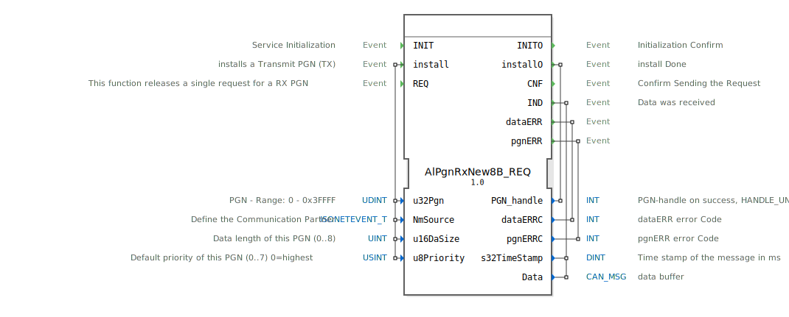

# AlPgnRxNew8B_REQ

```{index} single: AlPgnRxNew8B_REQ
```


* * * * * * * * * *
## Einleitung
Der Funktionsblock `AlPgnRxNew8B_REQ` dient zur Anforderung (Request) von Daten über ein ISOBUS-Netzwerk. Er ermöglicht die Installation eines Empfangsparametersatzes (RX PGN) und das Auslösen einer einmaligen Anfrage für diesen Parameter. Der Baustein ist Teil einer ISOBUS-spezifischen Kommunikationsbibliothek und behandelt die Interaktion mit dem CAN-Netzwerkprotokoll nach ISO 11783.



## Schnittstellenstruktur

### **Ereignis-Eingänge**
*   **INIT**: Initialisiert den Funktionsblock.
*   **install**: Installiert einen Empfangsparametersatz (RX PGN) für die spätere Datenanforderung. Wird mit den Daten `u32Pgn`, `NmSource`, `u16DaSize` und `u8Priority` ausgelöst.
*   **REQ**: Löst eine einmalige Anforderung für den zuvor installierten RX PGN aus.

### **Ereignis-Ausgänge**
*   **INITO**: Bestätigt die abgeschlossene Initialisierung.
*   **installO**: Bestätigt die abgeschlossene Installation eines PGN. Liefert den zugewiesenen `PGN_handle`.
*   **CNF**: Bestätigt das erfolgreiche Absenden der Anforderung (Request) an das Netzwerk.
*   **IND**: Wird ausgelöst, wenn die angeforderte Daten-Nachricht empfangen wurde. Liefert die `Data` und einen `s32TimeStamp`.
*   **dataERR**: Signalisiert einen Fehler bei der Datenverarbeitung. Liefert den Fehlercode `dataERRC`.
*   **pgnERR**: Signalisiert einen Fehler bei der PGN-Verarbeitung (z.B. bei der Installation). Liefert den Fehlercode `pgnERRC`.

### **Daten-Eingänge**
*   **u32Pgn** (UDINT): Die Parameter Group Number (PGN) im Bereich 0 bis 0x3FFFF.
*   **NmSource** (isobus::pgn::ISONETEVENT_T): Definiert den Kommunikationspartner im Netzwerk.
*   **u16DaSize** (UINT): Die zu erwartende Datenlänge der PGN (0..8 Byte).
*   **u8Priority** (USINT): Die Standard-Priorität dieser PGN (0..7, wobei 0 die höchste Priorität ist). Initialwert ist 7.

### **Daten-Ausgänge**
*   **PGN_handle** (INT): Ein Handle zur Identifikation des erfolgreich installierten PGN. Im Fehlerfall wird ein ungültiger Handle-Wert (`HANDLE_UNVALID`) zurückgegeben.
*   **dataERRC** (INT): Fehlercode, der bei Auslösen des `dataERR`-Ereignisses gesetzt wird.
*   **pgnERRC** (INT): Fehlercode, der bei Auslösen des `pgnERR`-Ereignisses gesetzt wird.
*   **s32TimeStamp** (DINT): Zeitstempel der empfangenen Nachricht in Millisekunden. Initialwert ist -1.
*   **Data** (isobus::pgn::CAN_MSG): Der Puffer, der die empfangenen CAN-Nachrichtendaten enthält.

### **Adapter**
Dieser Funktionsblock verwendet keine Adapter-Schnittstellen.

## Funktionsweise
Der Funktionsblock arbeitet in zwei Hauptphasen: Installation und Anforderung.
1.  **Installation**: Durch das `install`-Ereignis werden die Parameter für einen zu empfangenden PGN (Nummer, Quelle, Größe, Priorität) konfiguriert. Der Block registriert diese Anforderung im zugrunde liegenden ISOBUS-Stack und gibt einen `PGN_handle` über `installO` zurück. Dieser Handle wird für spätere Referenzen benötigt.
2.  **Anforderung**: Das `REQ`-Ereignis löst eine einmalige Anfrage für den zuletzt installierten PGN im Netzwerk aus. Nach erfolgreichem Versand der Anfrage wird `CNF` ausgelöst. Wenn die angeforderte Nachricht vom definierten `NmSource` eintrifft, wird sie im `Data`-Puffer abgelegt und zusammen mit einem Zeitstempel über das `IND`-Ereignis ausgegeben.

Fehler während der Installation (z.B. ungültige PGN) führen zum `pgnERR`-Ausgang. Fehler beim Empfang oder der Verarbeitung der Daten führen zum `dataERR`-Ausgang.

## Technische Besonderheiten
*   Der Block ist für die Verarbeitung von PGNs mit einer Datenlänge von bis zu 8 Byte ausgelegt (`u16DaSize` 0..8).
*   Die Prioritätsverwaltung (`u8Priority`) folgt dem ISOBUS-Standard.
*   Die Daten werden in einem typsicheren `CAN_MSG`-Puffer bereitgestellt.
*   Die Fehlerbehandlung ist über dedizierte Ereignisausgänge (`pgnERR`, `dataERR`) strukturiert.

## Zustandsübersicht
1.  **Nicht initialisiert**: Vor dem ersten `INIT`-Ereignis.
2.  **Initialisiert / Bereit**: Nach `INITO`. Der Block kann `install`-Ereignisse entgegennehmen.
3.  **PGN installiert**: Nach erfolgreichem `installO`. Der Block ist bereit, `REQ`-Ereignisse zu verarbeiten.
4.  **Anforderung ausstehend**: Nach `REQ` und vor `CNF`. Die Netzwerkanfrage wurde gestellt.
5.  **Datenempfangsbereit**: Nach `CNF`. Der Block wartet auf die eingehende Nachricht und wird bei Empfang `IND` auslösen.

## Anwendungsszenarien
Typische Anwendungen liegen in der landwirtschaftlichen oder mobilen Arbeitsmaschinensteuerung (ISO 11783 / ISOBUS):
*   Abfrage von Maschinenparametern (z.B. Drehzahl, Temperatur) von einem Anbaugerät.
*   Einmaliges Anfordern von Konfigurationsdaten von einem Steuergerät im Netzwerk.
*   Implementierung von Diagnose- oder Service-Tools, die spezifische PGNs abfragen müssen.

## Vergleich mit ähnlichen Bausteinen
Im Vergleich zu generischen CAN-Empfangsblöcken ist `AlPgnRxNew8B_REQ` speziell auf das ISOBUS-Protokoll und dessen PGN-Konzept zugeschnitten. Er abstrahiert die niedrigleveligen CAN-Details (wie ID-Filterung) und bietet eine saubere Schnittstelle auf PGN-Ebene. Blöcke wie `E_CYCLE` oder `E_DELAY` könnten verwendet werden, um periodische Anfragen zu realisieren, während `AlPgnRxNew8B_REQ` selbst nur Einzelanfragen behandelt.


## Zugehörige Übungen

* [Uebung_132](../../../../../training1/Ventilsteuerung/4diacIDE-workspace/test_B/Uebungen_doc/Uebung_132.md)

## Fazit
Der `AlPgnRxNew8B_REQ` ist ein spezialisierter Funktionsblock für die bedarfsgesteuerte (on-demand) Kommunikation in ISOBUS-Netzwerken. Durch die Trennung von Installation (`install`) und Ausführung (`REQ`) ermöglicht er eine flexible und kontrollierte Datenanforderung. Seine integrierte Fehlerbehandlung und typsichere Datenschnittstelle machen ihn zu einem robusten Baustein für anspruchsvolle Embedded-Steuerungen in der Agrartechnik.